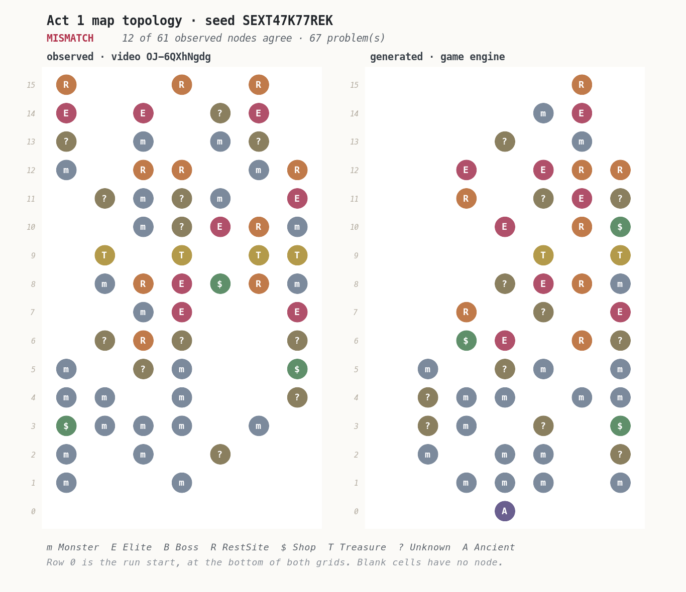

# Deterministic replay of a Slay the Spire 2 run, checked against the video

*2026-09-02T08:30:16Z by Showboat 0.6.1*
<!-- showboat-id: 72eb1ada-1408-4f95-bca6-a683ae5b9885 -->

This document runs the prototype and records what it actually printed. Every code
block below was executed; the output under it is that run's output, not a
transcription. `showboat verify DEMO.md` re-runs the lot and diffs.

**The claim being tested.** Given a video of somebody else's run, can that run be
reconstructed and replayed through the real game engine so exactly that the engine
agrees with everything the video shows — including hidden state no video can show?
And when the reconstruction is wrong, does the arbiter say so, rather than producing
something plausible?

The subject is one NaveGreed run, video `OJ-6QXhNgdg`, on Slay the Spire 2
`v0.111.0`. No footage from it is stored anywhere in this repository. What is stored
is facts read from it, each carrying the timestamp that lets anyone open the public
video and check.

Two premises this work started from turned out to be false. Both are shown below
being caught, rather than quietly corrected. The last section separates what is
proved from what is assumed, and the assumptions do real work.

## Setting up

The game is a read-only input. The bootstrap copies the installed assemblies into a
gitignored working directory, hashes the installation before and after, and fails if
a byte moved. No game content is committed here, and none of this works without
owning the game.

A note on the output below. Loading the real game assembly means the game's own
logger writes to the console — save-format versions, asset-cache misses, a Sentry
initialiser that finds no native extension. None of it is the arbiter's report, so
the commands filter it out, and the filter is visible in each command rather than
applied silently.

## Before any of that: is this a recording of the run it says it is?

One gate has to run before an engine is started, because no amount of replaying can
stand in for it.

This creator plays with three mods. Two are harmless to a reconstruction — a stream
overlay exporter and the community modding framework. The third resumes a past run
from a chosen floor in run history, and **a resumed run has the same seed, build,
content hash and acts as a fresh one.** Every environment gate below would pass. The
replay would run cleanly. It would reconstruct a different run, because the recording
does not start where the history says it does.

So the manifest records what the recording shows about its own beginning, and a
second reading of the environment taken from the end-of-run screen 2,038 seconds
later. Both are checked before anything else runs. This command needs no game.

```bash
./scripts/arbiter validate manifests/navegreed-OJ-6QXhNgdg.replay.json --show-rejections --out build/evidence
```

```output
manifest : navegreed-OJ-6QXhNgdg
structure: VALID

ingestion gates, fed inputs that should be refused:

resumed-from-run-history
  corruption : Marks the recording as having been entered from the run history screen.
  why it matters: One of the three mods in this creator's environment resumes a past run from a chosen floor. A resumed run has the same seed, build, content hash and acts as a fresh one, so every environment gate passes and the replay runs cleanly - against a recording that does not start where the history says it does. Nothing downstream can see this.
  verdict    : REFUSED
  because    : source.run_start says the run was entered from run history. That is a resumed run, not a run from its start, and an ordered history replayed from run start would reconstruct a different run.

recording-starts-mid-run
  corruption : Sets the first observed run timer to fifteen minutes and the first floor to 12.
  why it matters: The fingerprint a resumed run leaves even when nobody saw the history screen: the timer carries the original run's accumulated time instead of starting near zero.
  verdict    : REFUSED
  because    : source.run_start observes floor 12 first. A run recorded from its start is on floor 1 when it first becomes visible.

ends-on-a-different-run
  corruption : Changes the seed read from the end-of-run screen, leaving the opening reading alone.
  why it matters: What a recording spliced from two runs looks like, and what a reading that drifted looks like. One reading cannot catch either; two readings taken most of an hour apart can.
  verdict    : REFUSED
  because    : source.run_summary reads seed as 'MMWN3B7J2JL3' where environment.seed is 'SFXT47K77RFK'. The two ends of the recording disagree, so at least one reading is wrong or the recording covers more than one run.

unidentified-mod
  corruption : Drops one mod from the environment while leaving the reported count at three.
  why it matters: An unidentified mod is precisely the gap the content hash cannot close, so a shortfall has to be visible rather than rounded away by a list that looks complete.
  verdict    : REFUSED
  because    : environment.mods lists 2 mod(s) but reports 3 were loaded. An unidentified mod is exactly the gap the content hash cannot close, so the shortfall has to be visible rather than rounded away.

all 4 damaged provenance records were refused; the real one is valid
```

The four rejections are the interesting half. The first two are the resumed run,
caught two different ways — the history screen, and the fingerprint it leaves even
when nobody saw that screen: the run timer carrying the original run's accumulated
time instead of starting near zero. The third is a recording spliced from two runs,
which one reading of the environment cannot catch and two readings most of an hour
apart can. The fourth is an unidentified mod, which is precisely the gap the content
hash cannot close.

The selected recording reads `00:04` on floor 1, with no history screen and no resume
dialog, so it passes.

## The environment has to be the right one

A replay in the wrong environment does not fail. It succeeds at producing a
different run, and everything checked afterwards then compares the wrong things
confidently. So the first thing the arbiter does is refuse.

One line is filtered out of every engine transcript below, and it is worth saying
why rather than hiding it. The arbiter points the engine's data directory at a
sandbox inside this worktree, so the game cannot reach the player's real save
directory. It therefore finds no stored progress, tries to write a fresh profile,
and fails — the file layer underneath it is deliberately inert. That failure is
the read-only boundary working. It is also why the profile this host reads is empty,
which matters below: `--progress local-profile` genuinely reads a profile, and here
that profile is the sandbox's rather than the player's Steam save, which the host
never opens.

```bash
./scripts/arbiter preflight manifests/navegreed-OJ-6QXhNgdg.replay.json 2>&1 | grep -vE '^\[INFO\]|^SentryGodotInitializer|^\[WARN\] Asset not cached|Failed to save progress|^ +at ' | sed '/./,$!d'
```

```output
manifest : navegreed-OJ-6QXhNgdg
progress : AllUnlocked - UnlockState.all, supplied by the host in place of the source player's profile

  ok   build_version          manifest=v0.111.0                       local=v0.111.0
  ok   build_date_utc         manifest=2026.08.14                     local=2026.08.14
  ok   content_hash           manifest=1568834832                     local=1568834832
  ok   seed_alphabet          manifest=legal                          local=legal
  ok   game_mode_supported    manifest=standard                       local=standard
  ok   mod_environment        manifest=navegreed-2026-08 (3 mod(s))   local=audited source tooling
  ok   loaded_mod_environment manifest=no active local mods except this loaded non-gameplay Runmobile host local=none discovered
  ok   unlocks_requirement    manifest=complete                       local=UnlockState.all, supplied by the host in place of the source player's profile
  ok   unlocks_characters     manifest=5                              local=5
  ok   unlocks_cards          manifest=596                            local=596
  ok   unlocks_card_pools     manifest=12                             local=12
  ok   unlocks_character_card_pools manifest=5                              local=5
  ok   unlocks_relics         manifest=299                            local=299
  ok   unlocks_potions        manifest=66                             local=66
  ok   unlocks_shared_ancients manifest=1                              local=1
  ok   unlocks_epochs         manifest=57                             local=57
  ok   acts_unlocked          manifest=ACT.UNDERDOCKS, ACT.HIVE, ACT.GLORY local=all unlocked
  ok   ascension_unlocked     manifest=ascension 10 available         local=not gated: UnlockState.all, supplied by the host in place of the source player's profile

acts this build ships:
  0:ACT.OVERGROWTH (default)
  0:ACT.UNDERDOCKS
  1:ACT.HIVE (default)
  2:ACT.GLORY (default)

environment matches; replay may proceed
```

Look at the act list. This build ships **two acts at index 0**, and
`ACT.OVERGROWTH` is the default.

That is the first false premise. The video's map screen is titled *Underdocks*.
Taking "the default act at each index" — the obvious thing, and what this code did
at first — produced a run that generated **the same Act 1 map, node for node**, and
a completely different set of encounters: a 59-health enemy where the video shows a
42-health one.

The map was identical because map topology is not generated from the run's shared
random stream at all — the act map is built from a **fresh generator seeded from the
run seed**. So the map cannot detect a substituted act, and a cross-check that looks
decisive can be blind to the thing that matters. The act is now part of the
environment's identity, read from the name the game prints on the map screen.

### The prerequisites a player has to actually have

Everything above is about the installation. The rest of that list is about the
player, and it is the half a video cannot show: the game builds a run's content
pools from the player's unlocks, so the same seed on the same build gives someone
with less unlocked a different run. Measured, on one seed, changing nothing but the
unlock state: the shared upfront random stream lands on position 412 against 370,
and the act draws different encounters.

The manifest therefore records a *requirement* — complete — rather than an
observation, and the preflight checks the environment about to replay meets it. Ask
it about an environment with nothing unlocked and it refuses category by category:

```bash
./scripts/arbiter preflight manifests/navegreed-OJ-6QXhNgdg.replay.json --progress none-unlocked 2>&1 | grep -vE '^\[INFO\]|^SentryGodotInitializer|^\[WARN\] Asset not cached|Failed to save progress|^ +at ' | grep -A1 'FAIL unlocks_characters\|FAIL acts_unlocked'
./scripts/arbiter preflight manifests/navegreed-OJ-6QXhNgdg.replay.json --progress local-profile 2>&1 | grep -vE '^\[INFO\]|^SentryGodotInitializer|^\[WARN\] Asset not cached|Failed to save progress|^ +at ' | grep -A1 'FAIL ascension_unlocked'
```

```output
  FAIL unlocks_characters     manifest=5                              local=1
       This environment has 1 of the 5 characters this build ships, so its generation pools are smaller than the source run's and the same seed produces a different run. Missing, for example: CHARACTER.DEFECT, CHARACTER.NECROBINDER, CHARACTER.REGENT, CHARACTER.SILENT. Unlock the remaining content by playing the game. This tool never writes to your save, your progress, your unlocks or your installed build, and there is no supported flag that would.
--
  FAIL acts_unlocked          manifest=ACT.UNDERDOCKS, ACT.HIVE, ACT.GLORY local=locked: ACT.UNDERDOCKS
       This environment cannot climb ACT.UNDERDOCKS: the game reports the act locked under the unlock state a run here would be generated against. An act that is not unlocked is not merely unavailable - the run would take the other variant shipped at the same index, which generates different content from the same seed while producing the same map. Unlock the remaining content by playing the game. This tool never writes to your save, your progress, your unlocks or your installed build, and there is no supported flag that would.
  FAIL ascension_unlocked     manifest=ascension 10 available         local=profile ceiling 0 for CHARACTER.IRONCLAD
       This profile's highest available ascension for CHARACTER.IRONCLAD is 0, and the manifest records ascension 10. The game raises that ceiling when you finish a run at the level below it. Unlock the remaining content by playing the game. This tool never writes to your save, your progress, your unlocks or your installed build, and there is no supported flag that would.
```

Three things are worth pulling out of that.

The counts are read off the build, not written down here — 596 cards is whatever
`UnlockState.all` holds on this install — so a game update that adds content raises
the bar without anyone editing a list.

`acts_unlocked` is asked of the act model rather than derived from an epoch's name,
and it is the shortfall a total cannot show. `ACT.UNDERDOCKS` reports itself locked
under an empty unlock state. That is also what turns the manifest's unlock claim from
an assumption into something partly measured: the run on screen is played through
Underdocks, so the creator had that unlock, whatever else they had.

`ascension_unlocked` only appears as a measurement when a real profile was read. The
second command reads one — this host's own, which lives in the sandbox and is empty —
and reports a ceiling of 0 against the manifest's Ascension 10. Loaded inside the
retail client, the same reader sees the player's own progress instead.

And the remediation is always the game's. Nothing in this project writes to a save, a
profile, an unlock or an install, and there is no flag that would: a tool that edited
a player's progress to make a replay possible would have destroyed the thing the
replay was evidence about.

### And the run in front of you has to be the right run

The two gates above are about *whether* a matching run could be played here. The last
one is about the run that actually exists.
This is the gate the Combat Trainer host runs when the player has a run in progress, asking whether it is the one the manifest describes.

`preflight-live` is not connected to the retail process.
This executable redirects user data to `build/sandbox`, reads the empty profile there, and has only its own headless `RunManager`, so its default path finds no active run and refuses by design.
It cannot observe a retail player's profile or run.

`Preflight.EvaluateLiveHost` is the API the in-game host calls before presenting a player anything; that host is [the Combat Trainer mod](IN-GAME-HOST.md), and it states eligibility rather than entering a fight.
That host must not embed this headless entry point unchanged: `EngineHost.Start` enables test mode and installs headless patches inside its process.

For this headless demonstration, `--demo-start-run` explicitly starts a synthetic run at a stated identity, and `--progress all-unlocked` names its synthetic progress model.
Without that flag, the command refuses any progress model other than `local-profile`, because substituted unlocks are not runtime player state.
The command then reads the synthetic run out of its own `RunManager` and compares it.
Nothing is taken on trust: what it reports is the run the engine holds, not the run it was asked for.

```bash
./scripts/arbiter preflight-live manifests/navegreed-OJ-6QXhNgdg.replay.json --demo-start-run --progress all-unlocked --seed SFXT47K77RFX 2>&1 | grep -vE '^\[INFO\]|^SentryGodotInitializer|^\[WARN\] Asset not cached|Failed to save progress|^ +at ' | sed -n '/run_present/,$p'
```

```output
  ok   run_present            manifest=a run matching this manifest   local=run in progress, read from RunManager.State
  FAIL run_seed               manifest=SFXT47K77RFK                   local=SFXT47K77RFX
       This run was generated from a different seed, so it is a different run from the first floor onward. Abandon it and start a run on the manifest's seed; nothing can convert one into the other after the fact.
  ok   run_game_mode          manifest=standard                       local=standard
  ok   run_ascension          manifest=10                             local=10
  ok   run_character          manifest=CHARACTER.IRONCLAD             local=CHARACTER.IRONCLAD
  ok   run_acts               manifest=ACT.UNDERDOCKS, ACT.HIVE, ACT.GLORY local=ACT.UNDERDOCKS, ACT.HIVE, ACT.GLORY

environment or run does NOT match; refusing to replay
```

One character of the seed, and it refuses.
Run the explicit demo path with no identity overrides and every line reads `ok`.
The arbiter runs the same check on itself immediately after it constructs
a run, which is not a formality: a seed the engine normalised differently, or an act
that quietly defaulted, would otherwise replay perfectly and be a different run.

## Verifying the seed without reading it

The seed reaches us as text somebody read off a low-contrast overlay. An earlier
optical pass on this video returned `SEXT47K77REK` with per-character confidence
`1.0`. That is the second false premise: it is wrong in two places. Agreement
between readings that share a source and an engine is not evidence of accuracy.

The check that reads nothing: regenerate each candidate seed's Act 1 map through the
game and compare its topology against the map the video shows. Map generation is
seeded from the run seed alone, so this tests the seed directly.

The four candidates are the readings that are visually indistinguishable — `E` and
`F` are not separable in either position at the resolution the video offers.

```bash
./scripts/arbiter verify-seed manifests/navegreed-OJ-6QXhNgdg.map-observation.json --candidates SEXT47K77REK,SFXT47K77RFK,SEXT47K77RFK,SFXT47K77REK --out build/evidence 2>&1 | grep -vE '^\[INFO\]|^SentryGodotInitializer|^\[WARN\] Asset not cached|Failed to save progress|^ +at ' | sed '/./,$!d'
```

```output
SEXT47K77REK: MISMATCH  12/61 observed nodes agree, 67 problem(s)
    row 1 column 0: observed Monster, generated nothing
    row 2 column 0: observed Monster, generated nothing
    row 2 column 2: observed Monster, generated nothing
    row 2 column 4: observed Unknown, generated Monster
    ... and 63 more
SFXT47K77RFK: MATCH    61/61 observed nodes agree, 0 problem(s)
SEXT47K77RFK: MISMATCH  19/61 observed nodes agree, 71 problem(s)
    row 1 column 0: observed Monster, generated nothing
    row 2 column 0: observed Monster, generated nothing
    row 2 column 2: observed Monster, generated nothing
    row 2 column 4: observed Unknown, generated nothing
    ... and 67 more
SFXT47K77REK: MISMATCH  16/61 observed nodes agree, 71 problem(s)
    row 1 column 0: observed Monster, generated nothing
    row 1 column 3: observed Monster, generated nothing
    row 2 column 0: observed Monster, generated nothing
    row 2 column 2: observed Monster, generated Shop
    ... and 67 more

candidates tested : 4
matching          : SFXT47K77RFK
resolved seed     : SFXT47K77RFK
summary           : build/evidence/seed-verification-summary.json
```

The verifier draws what it compared. The left grid is the transcription — 61 nodes
read by hand from five frames at source resolution, across 15 of the map's 16 rows.
The right grid is what the engine generated. Nothing here is a screenshot of the
video: the video belongs to its creator and none of it is reproduced, so what is
drawn is the transcription, which is also what the comparison actually used.

```bash {image}

```


And the same drawing for the seed the optical pass reported with full confidence.
Mismatches are ringed.

```bash {image}

```



Row 0 appears only on the generated side. It is the run's starting node, which sits
below the visible area in every frame that was read, so it was left out of the
transcription rather than assumed.

**What this proves, and what it does not.** It proves the seed. It says nothing
about the position of the run's shared random stream, because the map does not come
from that stream — which is exactly how the act-variant mistake survived this check.

## Replaying the engine fixture

General environment parity is not proved: the A/B below measures that the BaseLib residual changes `SkipNextDurationTick` for a player-applied custom debuff.
Path-specific parity is proved for this reconstructed history: the reachability probe measures that the affected branch is never reached, while its negative control does reach it.
The publication verdict rests on that history-bound result, bound to the build, BaseLib hash, target IL hash, seed, action-history hash, and final state.
The replay, determinism, corruption, and snapshot demonstrations below use a generated vanilla fixture to exercise the engine spine independently of that source-environment result.

```bash
./scripts/arbiter synthetic-fixture --out build/evidence/synthetic-engine.replay.json
```

```output
synthetic fixture: build/evidence/synthetic-engine.replay.json
```

The synthetic fixture pins five declared actions: the opening blessing, the move to the first map node, the two cards played on turn 1, and ending that turn.
Four engine-produced checkpoints pin the generated state, and replay has to reproduce every one.
The separate VOD manifest carries the timestamps and observed provenance.
Its publication result depends on the history-bound BaseLib reachability evidence demonstrated below, not a claim of general mod parity.

```bash
./scripts/arbiter replay build/evidence/synthetic-engine.replay.json 2>&1 | grep -vE '^\[INFO\]|^SentryGodotInitializer|^\[WARN\] Asset not cached|Failed to save progress|^ +at ' | sed '/./,$!d'
```

```output
manifest       : synthetic-v0111-pilot-trainer
actions        : 17
progress       : AllUnlocked - UnlockState.all, supplied by the host in place of the source player's profile
status         : VERIFIED

  ok   checkpoint combat-start (after action 1)
        combat.enemy.0.hp            observed=57                     engine=57
        combat.enemy.0.intent        observed=Attack:4               engine=Attack:4
        combat.enemy.0.model         observed=MONSTER.FUZZY_WURM_CRAWLER engine=MONSTER.FUZZY_WURM_CRAWLER
        combat.energy                observed=3                      engine=3
        combat.hand                  observed=CARD.DEFEND_IRONCLAD|CARD.STRIKE_IRONCLAD|CARD.DEFEND_IRONCLAD|CARD.STRIKE_IRONCLAD|CARD.STRIKE_IRONCLAD engine=CARD.DEFEND_IRONCLAD|CARD.STRIKE_IRONCLAD|CARD.DEFEND_IRONCLAD|CARD.STRIKE_IRONCLAD|CARD.STRIKE_IRONCLAD
        combat.player_hp             observed=80                     engine=80
        combat.turn                  observed=1                      engine=1
  ok   checkpoint after-defend (after action 2)
        combat.block                 observed=5                      engine=5
        combat.enemy.0.hp            observed=57                     engine=57
        combat.energy                observed=2                      engine=2
        combat.hand_count            observed=4                      engine=4
  ok   checkpoint after-strike (after action 3)
        combat.enemy.0.hp            observed=51                     engine=51
        combat.energy                observed=1                      engine=1
        combat.hand_count            observed=3                      engine=3
  ok   checkpoint turn-two (after action 4)
        combat.discard_pile          observed=CARD.DEFEND_IRONCLAD|CARD.STRIKE_IRONCLAD|CARD.DEFEND_IRONCLAD|CARD.STRIKE_IRONCLAD|CARD.STRIKE_IRONCLAD engine=CARD.DEFEND_IRONCLAD|CARD.STRIKE_IRONCLAD|CARD.DEFEND_IRONCLAD|CARD.STRIKE_IRONCLAD|CARD.STRIKE_IRONCLAD
        combat.draw_pile_count       observed=1                      engine=1
        combat.enemy.0.hp            observed=51                     engine=51
        combat.hand                  observed=CARD.STRIKE_IRONCLAD|CARD.DEFEND_IRONCLAD|CARD.TEAR_ASUNDER|CARD.BASH|CARD.DEFEND_IRONCLAD engine=CARD.STRIKE_IRONCLAD|CARD.DEFEND_IRONCLAD|CARD.TEAR_ASUNDER|CARD.BASH|CARD.DEFEND_IRONCLAD
        combat.player_hp             observed=80                     engine=80
        combat.turn                  observed=2                      engine=2
  ok   checkpoint combat-complete (after action 16)
        combat.enemy_count           observed=0                      engine=0
        combat.in_progress           observed=false                  engine=false
        combat.outcome               observed=victory                engine=victory
        combat.turn                  observed=5                      engine=5
        player.hp                    observed=64                     engine=64
        run.act_floor                observed=2                      engine=2

final state digest : sha256:99eb1168a227d3723b99c6ece01f1193e9dac9fcb78397a6c1daffb373f04864
action history hash: sha256:ecd5b8e2d8bddc4bd20384edd17451fab7ff1f146525b55566e9a39183a0e3b2
```

Three fields show what the synthetic fixture pins.

**The hand, in order.** `Defend, Strike, Defend, Strike, Strike` is generated from seed `P1L0TTRA1NER`, which appears nowhere in the VOD artifacts.

**The enemy's telegraphed intent, `Attack:4`.** The generated first room contains a Fuzzy Wurm Crawler at 57 health.

**`combat.player_hp 80` after ending the turn.** The generated enemy does not damage the player on this turn, while the played Strike moves the enemy from 57 to 51 health.
These are pinned engine outputs for machinery tests, not observations from the source video.

## What the result keeps besides the verdict

A verified replay's end state answers "was it exact". It cannot answer the question
this product exists to serve next — how a played combat compares with an alternative
line — because that question is about the shape of the fight, not its last frame.
A final state can retain final health and the last combat turn reached.
It cannot recover the starting state and chronology needed for net health change, ordered actions, per-turn health loss, or consumable use timing.

So the report also carries a trace: the canonical state sampled either side of every
action, both samples kept. It computes nothing and ranks nothing. `--show-trace`
prints what changed at each step, as an inspection view of the stored data. The
history is forty-six actions long; this is its first fight, from run start to the
killing blow, which is the part the paragraphs below read:

```bash
./scripts/arbiter replay manifests/navegreed-OJ-6QXhNgdg.replay.json --show-trace 2>&1 | grep -vE '^\[INFO\]|^SentryGodotInitializer|^\[WARN\] Asset not cached|Failed to save progress|^ +at ' | sed -n '/^trace (/,/^final state/p' | sed '/^final state/d' | sed '/^$/d' | sed '/^   11 /,$d'
```

```output
trace (sampled fields that changed at each step):
   -1 run_start
        (nothing sampled changed)
    0 ChooseNeowBlessing
        player.deck CARD.STRIKE_IRONCLAD|CARD.STRIKE_IRONCLAD|CARD.STRIKE_IRONCLAD|CARD.STRIKE_IRONCLAD|CARD.STRIKE_IRONCLAD|CARD.DEFEND_IRONCLAD|CARD.DEFEND_IRONCLAD|CARD.DEFEND_IRONCLAD|CARD.DEFEND_IRONCLAD|CARD.BASH|CARD.ASCENDERS_BANE -> CARD.STRIKE_IRONCLAD|CARD.STRIKE_IRONCLAD|CARD.STRIKE_IRONCLAD|CARD.STRIKE_IRONCLAD|CARD.DEFEND_IRONCLAD|CARD.DEFEND_IRONCLAD|CARD.DEFEND_IRONCLAD|CARD.BASH|CARD.ASCENDERS_BANE|CARD.HELLRAISER|CARD.HELLRAISER
        player.max_hp 80 -> 68
        player.relics RELIC.BURNING_BLOOD -> RELIC.BURNING_BLOOD|RELIC.LEAFY_POULTICE
    1 MapMove
        combat.block - -> 0
        combat.encounter - -> ENCOUNTER.SLUDGE_SPINNER_WEAK
        combat.enemy.0.alive - -> true
        combat.enemy.0.block - -> 0
        combat.enemy.0.hp - -> 42
        combat.enemy.0.intent - -> Attack:9+Debuff
        combat.enemy.0.max_hp - -> 42
        combat.enemy.0.max_hp_unscaled - -> 42
        combat.enemy.0.model - -> MONSTER.SLUDGE_SPINNER
        combat.enemy.0.next_move - -> OIL_SPRAY_MOVE
        combat.enemy.0.powers - -> 
        combat.enemy_count - -> 1
        combat.energy - -> 3
        combat.hand - -> CARD.STRIKE_IRONCLAD|CARD.HELLRAISER|CARD.STRIKE_IRONCLAD|CARD.BASH|CARD.DEFEND_IRONCLAD
        combat.in_progress false -> true
        combat.outcome none -> in_progress
        combat.player_hp - -> 64
        combat.player_powers - -> 
        combat.round - -> 1
        combat.turn - -> 1
        run.act_floor 1 -> 2
        run.total_floor 1 -> 2
    2 PlayCard
        combat.energy 3 -> 1
        combat.hand CARD.STRIKE_IRONCLAD|CARD.HELLRAISER|CARD.STRIKE_IRONCLAD|CARD.BASH|CARD.DEFEND_IRONCLAD -> CARD.STRIKE_IRONCLAD|CARD.STRIKE_IRONCLAD|CARD.BASH|CARD.DEFEND_IRONCLAD
        combat.player_powers  -> POWER.HELLRAISER_POWER:1
    3 PlayCard
        combat.block 0 -> 5
        combat.energy 1 -> 0
        combat.hand CARD.STRIKE_IRONCLAD|CARD.STRIKE_IRONCLAD|CARD.BASH|CARD.DEFEND_IRONCLAD -> CARD.STRIKE_IRONCLAD|CARD.STRIKE_IRONCLAD|CARD.BASH
    4 EndTurn
        combat.block 5 -> 0
        combat.enemy.0.hp 42 -> 34
        combat.enemy.0.intent Attack:9+Debuff -> Attack:12
        combat.enemy.0.next_move OIL_SPRAY_MOVE -> SLAM_MOVE
        combat.energy 0 -> 3
        combat.hand CARD.STRIKE_IRONCLAD|CARD.STRIKE_IRONCLAD|CARD.BASH -> CARD.DEFEND_IRONCLAD|CARD.ASCENDERS_BANE|CARD.DEFEND_IRONCLAD
        combat.player_hp 64 -> 60
        combat.player_powers POWER.HELLRAISER_POWER:1 -> POWER.HELLRAISER_POWER:1|POWER.WEAK_POWER:1
        combat.round 1 -> 2
        combat.turn 1 -> 2
        player.hp 64 -> 60
    5 PlayCard
        combat.block 0 -> 5
        combat.energy 3 -> 2
        combat.hand CARD.DEFEND_IRONCLAD|CARD.ASCENDERS_BANE|CARD.DEFEND_IRONCLAD -> CARD.ASCENDERS_BANE|CARD.DEFEND_IRONCLAD
    6 PlayCard
        combat.block 5 -> 10
        combat.energy 2 -> 1
        combat.hand CARD.ASCENDERS_BANE|CARD.DEFEND_IRONCLAD -> CARD.ASCENDERS_BANE
    7 EndTurn
        combat.block 10 -> 0
        combat.enemy.0.hp 34 -> 10
        combat.enemy.0.intent Attack:12 -> Attack:7+Buff
        combat.enemy.0.next_move SLAM_MOVE -> RAGE_MOVE
        combat.energy 1 -> 3
        combat.hand CARD.ASCENDERS_BANE -> CARD.HELLRAISER
        combat.player_hp 60 -> 58
        combat.player_powers POWER.HELLRAISER_POWER:1|POWER.WEAK_POWER:1 -> POWER.HELLRAISER_POWER:1
        combat.round 2 -> 3
        combat.turn 2 -> 3
        player.hp 60 -> 58
    8 PlayCard
        combat.energy 3 -> 1
        combat.hand CARD.HELLRAISER -> 
        combat.player_powers POWER.HELLRAISER_POWER:1 -> POWER.HELLRAISER_POWER:2
    9 EndTurn
        combat.enemy.0.hp 10 -> 4
        combat.enemy.0.intent Attack:7+Buff -> Attack:15
        combat.enemy.0.next_move RAGE_MOVE -> SLAM_MOVE
        combat.enemy.0.powers  -> POWER.STRENGTH_POWER:3
        combat.energy 1 -> 3
        combat.hand  -> CARD.DEFEND_IRONCLAD|CARD.DEFEND_IRONCLAD|CARD.DEFEND_IRONCLAD|CARD.BASH
        combat.player_hp 58 -> 51
        combat.round 3 -> 4
        combat.turn 3 -> 4
        player.hp 58 -> 51
   10 PlayCard
        combat.enemy_count 1 -> 0
        combat.energy 3 -> 1
        combat.hand CARD.DEFEND_IRONCLAD|CARD.DEFEND_IRONCLAD|CARD.DEFEND_IRONCLAD|CARD.BASH -> 
        combat.in_progress true -> false
        combat.outcome in_progress -> victory
        combat.player_hp 51 -> 57
        combat.player_powers POWER.HELLRAISER_POWER:2 -> 
        player.hp 51 -> 57
```

Read that as the run rather than as a log and it says things the checkpoints do not.
Neow's blessing at step 0 transformed two Strikes into Hellraisers and cost 12 maximum
health. Both cards at steps 2 and 3 move no hit points at all; everything lands when
the turn ends, where the enemy drops 42 to 34 and its 9-damage attack arrives as 4
through the 5 block Defend put up — and the player picks up Weak on the way.

The rest of the fight is the same reading continued, and it is where the Hellraiser
power earns the manifest's attention. Every Strike the player draws is played
immediately against a random enemy, so the hand a turn opens with is whatever the draw
did not spend: step 7 ends turn 2, reshuffles an empty draw pile, and turns up four
Strikes that take the enemy from 34 to 10 — leaving turn 3 to open on one card. That is
why the turn-start hands are recorded as checkpoints. They are the video's evidence
about where the shuffle put five cards, which is the part of the reconstruction nothing
cheaper could catch.

Note also where that damage is attributed. The turn detail puts it on turn 2, because
the step that dealt it began while the player was still in turn 2 — one step spans the
end of a turn, the enemy's answer, and the next turn's draw. That is the chronology rule
the projection has to apply and the reason the trace keeps the turn number on both sides
of every step.

Aggregate and turn-level views are two projections of this, and they stay separate.
The combat summary says which consumables were used, the total turns, final health, and signed net health change.
The chronology says which turn each use happened on and that turn's enemy and player health lost.
`CombatProjection` derives both from the trace without making the trace pre-judge either.
[docs/comparison-direction.md](../docs/comparison-direction.md) is where that direction is written down.

## Determinism

Fresh processes, not fresh sessions. The engine keeps a great deal of static state,
and a determinism claim that only holds inside one process is not the claim anyone
wants.

The canonical state compared here is built by an explicit allowlist projection — 
including the position of all fifteen random-number streams and the full order of
the draw pile, neither of which any video can show. What is excluded is decided up
front and documented, so a digest mismatch can only be a real divergence and never
an artefact of running on a different afternoon.

```bash
./scripts/arbiter determinism build/evidence/synthetic-engine.replay.json --runs 3 --out build/evidence 2>&1 | grep -vE '^\[INFO\]|^SentryGodotInitializer|^\[WARN\] Asset not cached|Failed to save progress|^ +at ' | sed '/./,$!d'
```

```output
run 0: sha256:99eb1168a227d3723b99c6ece01f1193e9dac9fcb78397a6c1daffb373f04864
run 1: sha256:99eb1168a227d3723b99c6ece01f1193e9dac9fcb78397a6c1daffb373f04864
run 2: sha256:99eb1168a227d3723b99c6ece01f1193e9dac9fcb78397a6c1daffb373f04864

all 3 fresh processes produced byte-identical canonical state
```

## Rejecting a history that is wrong

A checker nobody has fed a bad input to has never been shown to reject anything. So
the history is damaged in ten specific ways, and each is replayed.

The two interesting ones here are the corruptions that arithmetic on the footage alone
**accepts**: reordering two plays, and substituting a card of the same energy cost.
Energy conservation balances, hand accounting balances, and the damage arithmetic
balances — every check that can be done from the frames says yes. Those are the two
that justify owning an engine at all.

Six of the ten aim at decisions this fixture never makes — it is a fight and nothing
else, with no loot screen, no event and no second enemy — and they say so rather than
counting as passes. A control that quietly reported success against a history it could
not touch would be the easiest way for a manifest to stop being tested. They all apply
to the reconstructed recording, which is the history the publication gate judges.

```bash
./scripts/arbiter negative-controls build/evidence/synthetic-engine.replay.json --out build/evidence 2>&1 | grep -vE '^\[INFO\]|^SentryGodotInitializer|^\[WARN\] Asset not cached|Failed to save progress|^ +at ' | sed '/./,$!d'
```

```output
baseline (uncorrupted): VERIFIED

reorder-plays
  corruption   : Plays the same two cards in the opposite order, adjusting hand indices so both remain valid.
  video-only   : UNDETECTED - The same cards are played, aggregate energy and hand counts are unchanged, and the final visible damage and block totals agree. The intermediate state and hidden pile order still depend on order.
  arbiter      : REJECTED
  first divergence: checkpoint 'after-defend' (after action 2): combat.block observed '5', engine produced '0'
  end state       : IDENTICAL to the uncorrupted run

substitute-same-cost
  corruption   : Replaces the nominated card play with a different same-cost card selected by the control.
  video-only   : UNDETECTED - Energy conservation and hand accounting both balance, because the substitute costs the same. The damage arithmetic balances too unless the enemy's health is read frame by frame, which the earlier video-only pipeline did not do.
  arbiter      : REJECTED
  first divergence: checkpoint 'after-strike' (after action 3): combat.enemy.0.hp observed '51', engine produced '57'
  end state       : differs from the uncorrupted run

omit-play
  corruption   : Drops the nominated card play entirely.
  video-only   : DETECTED - Energy and hand counts no longer balance against the declared line. Included as a control on the control: an arbiter that rejected only the subtle corruptions and let this one through would be broken in an interesting way.
  arbiter      : REJECTED
  first divergence: checkpoint 'turn-two' (after action 3): combat.enemy.0.hp observed '51', engine produced '57'
  end state       : differs from the uncorrupted run

wrong-opening-choice
  corruption   : Takes a different blessing at the run's opening event.
  video-only   : DETECTED - The different opening option changes generated setup before combat. Included because it corrupts the history far from the turn being checked, which tests that divergence is caught where it surfaces.
  arbiter      : REJECTED
  first divergence: checkpoint 'combat-start' (after action 1): combat.hand observed 'CARD.DEFEND_IRONCLAD|CARD.STRIKE_IRONCLAD|CARD.DEFEND_IRONCLAD|CARD.STRIKE_IRONCLAD|CARD.STRIKE_IRONCLAD', engine produced 'CARD.DEFEND_IRONCLAD|CARD.STRIKE_IRONCLAD|CARD.STRIKE_IRONCLAD|CARD.STRIKE_IRONCLAD|CARD.STRIKE_IRONCLAD'
  end state       : UNAVAILABLE - the rejected run produced no final state digest

decline-a-claimed-reward
  corruption   : Turns the first reward the player took into a dismissal of the whole loot screen.
  arbiter      : NOT APPLICABLE - this control needs a claimed reward; this history has none

take-a-different-card
  corruption   : Takes the alternative card the reward offered instead of the one the player took.
  arbiter      : NOT APPLICABLE - this control needs a card reward nominating another card it offered; this history has none

enchant-a-different-card
  corruption   : Enchants a different, identical copy of the same card on the event's selection screen.
  arbiter      : NOT APPLICABLE - this control needs a card picked off a screen nominating another copy of the same card; this history has none

choose-a-different-event-option
  corruption   : Takes a different option at the event, one the player could afford and did not take.
  arbiter      : NOT APPLICABLE - this control needs an event choice; this history has none

target-the-other-enemy
  corruption   : Aims a card at the other living enemy.
  arbiter      : NOT APPLICABLE - this control needs a play that recorded a target; this history has none

move-to-a-different-node
  corruption   : Walks to a different node the map made reachable from the same one.
  arbiter      : NOT APPLICABLE - this control needs a map move nominating a reachable sibling; this history has none

all 4 corrupted histories were rejected; the uncorrupted one verified (6 control(s) had nothing in this history to damage)
```

The reordering first diverges at the bound `combat.block` checkpoint: Defend has not yet run in the reordered line.
Its final canonical state also differs because the discard pile preserves play order.
The checkpoint identifies the first divergence instead of waiting for that hidden end-state difference.

## A verified snapshot at combat start

This is the point of the whole apparatus. Once the start of a fight can be reproduced
exactly, the fight can be replayed from it and described.

Combat start is the supported boundary, and the whole fight is the comparison unit.
The fixture now plays that fight to its end, so the covered history reaches a finished combat rather than stopping while one is still being fought.
Resuming part-way through a combat would need state reset at a turn boundary, and nothing here does that or is designed around it.
[docs/comparison-direction.md](../docs/comparison-direction.md) records the boundary and what it rules out.

The snapshot is a **derived cache**, never a source of truth. It is keyed by the
build, seed, content hash, game mode and the hash of the exact action history that
produced it — so it can never be served for a run that would not produce it. And
"restore" here means re-derive and verify: a restore replays the same prefix in a
fresh process and refuses unless the digest matches what was cached. That is slower
than loading a blob and much harder to get quietly wrong.

```bash
rm -rf build/snapshots && ./scripts/arbiter combat-snapshot build/evidence/synthetic-engine.replay.json --out build/evidence --cache build/snapshots 2>&1 | grep -vE '^\[INFO\]|^SentryGodotInitializer|^\[WARN\] Asset not cached|Failed to save progress|^ +at ' | sed '/./,$!d'
```

```output
manifest        : synthetic-v0111-pilot-trainer
boundary        : combat_start:1 - the start of fight 1, after action 1
snapshot key    : v0.111.0_standard_CHARACTER.IRONCLAD_a0_P1L0TTRA1NER_1568834832_seq1_fa6c25365719e14b153879446a45e4044c4ca1b3b3be1594bd9a54126ba5b330
snapshot source : materialised now
snapshot digest : sha256:75fbfd0b0cd434805cafce50b5f0054cb03a288ea44c8db2cb6244bda7a6678b
restore         : re-derived in a fresh process, digest matches
covered history : VERIFIED through action 16 (17 actions), combat finished (victory), end state sha256:99eb1168a227d3723b99c6ece01f1193e9dac9fcb78397a6c1daffb373f04864

covered combat history, turn by turn (description, not a verdict):
  fight 1 turn 1  actions 2..4  player hp 80 -> 80
  fight 1 turn 2  actions 5..8  player hp 80 -> 80
  fight 1 turn 3  actions 9..11  player hp 80 -> 69
  fight 1 turn 4  actions 12..14  player hp 69 -> 58
  fight 1 turn 5  actions 15..16  player hp 58 -> 64

report: build/evidence/combat-snapshot.json
```

Where the fight begins is located, not declared: it is read out of the replay's own
trace as the first step after which the engine reports a combat in progress. Asking
the manifest instead would let the two disagree.

The fixture's covered history ends with the fight won, and the report says so rather than merely saying no combat is running.
That distinction needed a change to the canonical state: the player's combat state outlives the fight, so before this the arbiter read a won combat as one still in progress.
The turn-by-turn lines describe only the covered history and nothing else.
There is no score, ranking, or highlight on a "better" outcome — which line is better is a question about a game, and answering it here would turn a measurement into an opinion.
A test asserts the report contains no score, rank or verdict field, and no alternative line at all.

That ordered per-turn record is what a walkthrough will read later: stepping a player
through an already-computed solution is presentation, and it re-solves nothing and
resets nothing.

## Comparing two completed fights

This is what the whole-combat comparison looks like, and it is the last step of the
product loop that can be shown honestly without a mod host.

It is shown twice: once on a pair that differs, and once on the recording's own fight.

The differing pair is engine-produced on both sides. The generator emits two lines of
the same first combat: their complete canonical combat-start snapshot digests match,
they differ only in which end of the hand they play from, and neither is a claim about
how to play. Standing them in for a person's fight against a VOD's is the substitution
this document makes, and the comparison says so in its own output rather than leaving it
to be inferred.

```bash
./scripts/arbiter generate-synthetic-fixture --out build/evidence/synthetic-engine-alternate.replay.json --line alternate 2>&1 | grep -vE '^\[INFO\]|^SentryGodotInitializer|^\[WARN\] Asset not cached|Failed to save progress|^ +at ' | sed '/./,$!d'
```

```output
generated synthetic fixture: build/evidence/synthetic-engine-alternate.replay.json (first-fight, alternate line)
```

```bash
./scripts/arbiter combat-compare build/evidence/synthetic-engine.replay.json build/evidence/synthetic-engine-alternate.replay.json --out build/evidence 2>&1 | grep -vE '^\[INFO\]|^SentryGodotInitializer|^\[WARN\] Asset not cached|Failed to save progress|^ +at ' | sed '/./,$!d'
```

```output
left  : synthetic-v0111-pilot-trainer
right : synthetic-v0111-pilot-trainer-alternate
fight : ENCOUNTER.FUZZY_WURM_CRAWLER_WEAK, same combat-start boundary on both sides

combat summary (no chronology - see the turn detail for when):
  same outcome           left=victory        right=victory
  diff total_turns       left=5              right=6
  same starting_health   left=80             right=80
  diff final_health      left=64             right=80
  diff net_health_change left=-16            right=0
  same consumables_used  left=(none)         right=(none)
  same cards_removed     left=(none)         right=(none)

turn detail:
  turn 1
    left  enemy hp lost   6  player hp lost   0  consumables none  actions CARD.DEFEND_IRONCLAD CARD.STRIKE_IRONCLAD EndTurn
    right enemy hp lost  12  player hp lost   0  consumables none  actions CARD.STRIKE_IRONCLAD CARD.STRIKE_IRONCLAD CARD.DEFEND_IRONCLAD EndTurn
  turn 2
    left  enemy hp lost   6  player hp lost   0  consumables none  actions CARD.STRIKE_IRONCLAD CARD.DEFEND_IRONCLAD CARD.DEFEND_IRONCLAD EndTurn
    right enemy hp lost   8  player hp lost   0  consumables none  actions CARD.DEFEND_IRONCLAD CARD.BASH EndTurn
  turn 3
    left  enemy hp lost  14  player hp lost  11  consumables none  actions CARD.STRIKE_IRONCLAD CARD.BASH EndTurn
    right enemy hp lost  18  player hp lost   6  consumables none  actions CARD.STRIKE_IRONCLAD CARD.STRIKE_IRONCLAD CARD.DEFEND_IRONCLAD EndTurn
  turn 4
    left  enemy hp lost  23  player hp lost  11  consumables none  actions CARD.TEAR_ASUNDER CARD.STRIKE_IRONCLAD EndTurn
    right enemy hp lost   0  player hp lost   0  consumables none  actions CARD.DEFEND_IRONCLAD CARD.DEFEND_IRONCLAD CARD.DEFEND_IRONCLAD EndTurn
  turn 5
    left  enemy hp lost   8  player hp lost   0  consumables none  actions CARD.STRIKE_IRONCLAD CARD.STRIKE_IRONCLAD
    right enemy hp lost  16  player hp lost   0  consumables none  actions CARD.TEAR_ASUNDER CARD.STRIKE_IRONCLAD EndTurn
  turn 6
    left  (this line's fight was already over)
    right enemy hp lost   3  player hp lost   0  consumables none  actions CARD.STRIKE_IRONCLAD

  note: This states differences. It does not score either line, rank them, or say which was better.
  note: Enemy health lost and player health lost count only health that actually came off. Damage either side's block absorbed is not included in those measurements.
  note: The summary's net health change is final health minus starting health: positive is a net gain and negative is a net loss. It includes anything that resolves as combat ends. Turn detail reports gross player health lost during each turn, so the measurements do not have to add up.
  note: Both lines were sampled by the real engine either side of every action, from the same combat-start boundary: a recording replayed headlessly, a fight a person played in the retail client with the Combat Trainer capturing it, or one of each. Which is which is stated by each side's source id, not judged here.

report: build/evidence/combat-comparison.json
```

The two projections are kept apart because they answer different questions.
The summary says what happened in this fight and carries no turn numbers at all; the turn detail says when, with the ordered actions, each turn's enemy and player health lost, and the exact turn a consumable was used.
A summary carrying both would make every later consumer decide which half to trust.

Read them together and they do not add up, on purpose. The reference line's summary
has a net health change of -16; its turns report 22 player health lost. Ironclad's
starting relic heals six the moment the last enemy dies. The summary is final health
minus starting health, while the turn detail measures what came off during each turn.
Reconciling them by quietly picking one would throw away something real about the
fight, so both are reported and the difference is stated. A test pins it.

Nothing here scores or ranks. The left line wins a turn sooner and loses sixteen
health; the right loses none and needs an extra turn. Which is better is a question
about a game, and answering it here would turn a measurement into an opinion.

### The recording's own fight, as one completed side

The VOD reconstruction used to stop after the opening turn and leave its fight running,
and the contract refused it — correctly, because every quantity it reports is defined
at the end of a fight. The manifest now carries the whole combat, so the recording is a
completed side.

Both sides below are the same recorded line. That is not a placeholder for a better
pair: the only other line of this fight is the one a player would fight, and capturing
that needs the S5 live-fight capture host, which does not exist. Authoring an alternative to put opposite it
would be inventing a decision nobody made, which is the thing this project is built to
refuse. So what this shows is the recording projecting and comparing at all, from its
own combat-start boundary — and every field agreeing, because it is the same fight.

```bash
./scripts/arbiter combat-compare manifests/navegreed-OJ-6QXhNgdg.replay.json manifests/navegreed-OJ-6QXhNgdg.replay.json --out build/evidence 2>&1 | grep -vE '^\[INFO\]|^SentryGodotInitializer|^\[WARN\] Asset not cached|Failed to save progress|^ +at ' | sed '/./,$!d'
```

```output
left  : navegreed-OJ-6QXhNgdg
right : navegreed-OJ-6QXhNgdg
fight : ENCOUNTER.SLUDGE_SPINNER_WEAK, same combat-start boundary on both sides

combat summary (no chronology - see the turn detail for when):
  same outcome           left=victory        right=victory
  same total_turns       left=4              right=4
  same starting_health   left=64             right=64
  same final_health      left=57             right=57
  same net_health_change left=-7             right=-7
  same consumables_used  left=(none)         right=(none)
  same cards_removed     left=(none)         right=(none)

turn detail:
  turn 1
    left  enemy hp lost   8  player hp lost   4  consumables none  actions CARD.HELLRAISER CARD.DEFEND_IRONCLAD EndTurn
    right enemy hp lost   8  player hp lost   4  consumables none  actions CARD.HELLRAISER CARD.DEFEND_IRONCLAD EndTurn
  turn 2
    left  enemy hp lost  24  player hp lost   2  consumables none  actions CARD.DEFEND_IRONCLAD CARD.DEFEND_IRONCLAD EndTurn
    right enemy hp lost  24  player hp lost   2  consumables none  actions CARD.DEFEND_IRONCLAD CARD.DEFEND_IRONCLAD EndTurn
  turn 3
    left  enemy hp lost   6  player hp lost   7  consumables none  actions CARD.HELLRAISER EndTurn
    right enemy hp lost   6  player hp lost   7  consumables none  actions CARD.HELLRAISER EndTurn
  turn 4
    left  enemy hp lost   4  player hp lost   0  consumables none  actions CARD.BASH
    right enemy hp lost   4  player hp lost   0  consumables none  actions CARD.BASH

  note: This states differences. It does not score either line, rank them, or say which was better.
  note: Enemy health lost and player health lost count only health that actually came off. Damage either side's block absorbed is not included in those measurements.
  note: The summary's net health change is final health minus starting health: positive is a net gain and negative is a net loss. It includes anything that resolves as combat ends. Turn detail reports gross player health lost during each turn, so the measurements do not have to add up.
  note: Both lines were sampled by the real engine either side of every action, from the same combat-start boundary: a recording replayed headlessly, a fight a person played in the retail client with the Combat Trainer capturing it, or one of each. Which is which is stated by each side's source id, not judged here.

report: build/evidence/combat-comparison.json
```

Four turns, won on the fourth, seven health below where it started. Turn 3 is the
Hellraiser turn: six health off the enemy from the one card the player chose, after the
draw had already taken twenty-four off on turn 2.

The refusal is still there, and it is still the right answer for a history that stops
mid-fight. This is the shipped manifest cut back to where it used to stop:

```bash
python3 - <<'CUT' > build/evidence/opening-turn-only.replay.json
import json
m = json.load(open("manifests/navegreed-OJ-6QXhNgdg.replay.json"))
end_of_turn_one = next(a["seq"] for a in m["actions"] if a["verb"] == "EndTurn")
m["run_id"] += "+opening-turn-only"
m["actions"] = [a for a in m["actions"] if a["seq"] <= end_of_turn_one]
m["checkpoints"] = [c for c in m["checkpoints"] if c["after_seq"] <= end_of_turn_one]
m["boundaries"] = [b for b in m["boundaries"] if b["after_seq"] <= end_of_turn_one]
print(json.dumps(m, indent=2))
CUT
./scripts/arbiter combat-compare build/evidence/opening-turn-only.replay.json manifests/navegreed-OJ-6QXhNgdg.replay.json --out build/evidence 2>&1 | grep -vE '^\[INFO\]|^SentryGodotInitializer|^\[WARN\] Asset not cached|Failed to save progress|^ +at ' | sed '/./,$!d'
```

```output
This history's combat is still in progress when the history ends, so it has no completed fight to project. Total turns, net health change and final health are all defined at the end of a fight; reporting them for one still being fought would be a confident wrong answer.

```

Two fights whose complete combat-start snapshot digests differ are refused too. That
digest covers hidden state such as draw-pile order and RNG positions which the sampled
trace boundary omits. A comparison of different starting states populates every field
and means nothing, which is exactly why identity is checked rather than assumed.

### The corruption controls, on the completed history

All ten controls run against the recording's own history as part of the gate, and a
fight replayed to its end changes what they have to damage. Without a nomination they
take the last play, which is now the killing blow — and omitting a killing blow leaves
a shorter history that is perfectly self-consistent. The manifest therefore nominates
the turn-1 Defend, which a checkpoint sits on and where a same-cost Strike is sitting
in hand ready to be substituted for it.

Six of them aim at the decisions between the fights: a claimed reward declined, a
different card taken from the reward, a different copy of the same card enchanted, a
different event option, a different enemy targeted, a different map node. Two of those
six are in the class that matters — arithmetic on the frames accepts them.

Each control's first divergence is a checkpoint rather than a refused action, which is
the reading worth having: a substitution three actions in eventually makes some later
play impossible, and a report that named that impossibility would be pointing at the
consequence instead of the cause.

```bash
./scripts/arbiter negative-controls manifests/navegreed-OJ-6QXhNgdg.replay.json --out build/evidence 2>&1 | grep -vE '^\[INFO\]|^SentryGodotInitializer|^\[WARN\] Asset not cached|Failed to save progress|^ +at ' | grep -E '^[a-z-]+$|^  first divergence|^  arbiter |^all |^AT LEAST|^baseline'
```

```output
baseline (uncorrupted): VERIFIED
reorder-plays
  arbiter      : REJECTED
  first divergence: checkpoint 'after-hellraiser' (after action 2): combat.energy observed '1', engine produced '2'
substitute-same-cost
  arbiter      : REJECTED
  first divergence: checkpoint 'after-defend' (after action 3): combat.block observed '5', engine produced '0'
omit-play
  arbiter      : REJECTED
  first divergence: checkpoint 'turn2-start' (after action 3): combat.player_hp observed '60', engine produced '55'
wrong-opening-choice
  arbiter      : REJECTED
  first divergence: checkpoint 'floor2-combat-start' (after action 1): combat.draw_pile_count observed '6', engine produced '7'
decline-a-claimed-reward
  arbiter      : REJECTED
  first divergence: action 12 (ClaimReward): Action 12 (ClaimReward) acts on a reward screen, but no rewards are on offer. Rewards are offered when a fight the encounter rewards is won, and stop being on offer once every one of them has been taken or the set has been skipped.
take-a-different-card
  arbiter      : REJECTED
  first divergence: checkpoint 'floor4-combat-start' (after action 18): combat.hand observed 'CARD.STRIKE_IRONCLAD|CARD.POMMEL_STRIKE|CARD.DEFEND_IRONCLAD|CARD.STRIKE_IRONCLAD|CARD.DEFEND_IRONCLAD@ENCHANTMENT.STEADY', engine produced 'CARD.STRIKE_IRONCLAD|CARD.TREMBLE|CARD.DEFEND_IRONCLAD|CARD.STRIKE_IRONCLAD|CARD.DEFEND_IRONCLAD@ENCHANTMENT.STEADY'
enchant-a-different-card
  arbiter      : REJECTED
  first divergence: checkpoint 'floor4-combat-start' (after action 18): combat.hand observed 'CARD.STRIKE_IRONCLAD|CARD.POMMEL_STRIKE|CARD.DEFEND_IRONCLAD|CARD.STRIKE_IRONCLAD|CARD.DEFEND_IRONCLAD@ENCHANTMENT.STEADY', engine produced 'CARD.STRIKE_IRONCLAD|CARD.POMMEL_STRIKE|CARD.DEFEND_IRONCLAD@ENCHANTMENT.STEADY|CARD.STRIKE_IRONCLAD|CARD.DEFEND_IRONCLAD'
choose-a-different-event-option
  arbiter      : REJECTED
  first divergence: action 15 (ChooseEventOption): Action 15 (ChooseEventOption) queued card selection(s) that no screen asked for: action 17 (CARD.DEFEND_IRONCLAD). A recorded selection the engine never consumed means the manifest describes a screen this run does not open.
target-the-other-enemy
  arbiter      : REJECTED
  first divergence: checkpoint 'floor4-turn2-start' (after action 22): combat.enemy.0.hp observed '14', engine produced '23'
move-to-a-different-node
  arbiter      : REJECTED
  first divergence: action 15 (ChooseEventOption): Action 15 chooses an option in event EVENT.WATERLOGGED_SCRIPTORIUM, but this floor is a Monster room, not an event.
all 10 corrupted histories were rejected; the uncorrupted one verified
```

## Getting to the fight the window is inside

Everything above is about one fight — the first one the recording shows. Reaching any
later one was blocked by the driver having four verbs.

The driver implemented `ChooseNeowBlessing`, `MapMove`, `PlayCard` and `EndTurn`, and
the very next thing the recording shows after that victory is a loot screen: thirteen
gold at 95.5 s, a potion, and a card reward the player opens at 96.0 s and takes Pommel
Strike from at 97.0 s. Then an event that spends 99 gold enchanting two cards with
Steady, which is what gives a card Retain; then a five-turn fight against two
Toadpoles; then loot the player declines; and then the two-enemy fight the 209–215
second window is inside.

None of that could be transcribed, because none of it could be replayed. So the
manifest now carries thirty-five more actions and eleven more checkpoints, read off the
recording exactly the way the first eleven were, and the driver carries five more verbs
— each mapped onto the game's own command for it, through the same synchronizers and
the same `ICardSelector` seam the game's own tests use. Where the engine has no command
at all, because the retail UI is what drives it, the host stands in and the manifest
still makes every decision; `docs/headless-fidelity.md` is where that is written down.

Five, not the six this path looked like it needed. There is no `ProceedToMap`: going
back to the map is presentation, the state change is entering the next node, and a verb
standing in for a screen transition would be a decision the run does not contain. Which
verbs a reconstruction needs is settled by asking the engine which command each click
reaches, not by naming the screens a viewer watches go past.

Here is the far end of it. The last action in the history is the end of the floor-5
fight's second turn, and the checkpoint bound to it is what the recording shows at
t = 212.0 s — the opening frame of the window itself.

```bash
./scripts/arbiter replay manifests/navegreed-OJ-6QXhNgdg.replay.json --out build/evidence/verified-manifest.json 2>&1 | grep -vE '^\[INFO\]|^SentryGodotInitializer|^\[WARN\] Asset not cached|Failed to save progress|^ +at ' | sed -n '/floor5-window-boundary/,$p'
```

```output
  ok   checkpoint floor5-window-boundary (after action 45)
        combat.block                 observed=0                      engine=0
        combat.enemy.0.hp            observed=6                      engine=6
        combat.enemy.0.intent        observed=Attack:6               engine=Attack:6
        combat.enemy.1.hp            observed=29                     engine=29
        combat.enemy.1.intent        observed=Attack:9               engine=Attack:9
        combat.energy                observed=3                      engine=3
        combat.hand                  observed=CARD.BASH@ENCHANTMENT.STEADY|CARD.STRIKE_IRONCLAD|CARD.HELLRAISER|CARD.STRIKE_IRONCLAD|CARD.HELLRAISER engine=CARD.BASH@ENCHANTMENT.STEADY|CARD.STRIKE_IRONCLAD|CARD.HELLRAISER|CARD.STRIKE_IRONCLAD|CARD.HELLRAISER
        combat.hand_count            observed=5                      engine=5
        combat.player_hp             observed=50                     engine=50
        combat.player_powers         observed=POWER.FRAIL_POWER:3    engine=POWER.FRAIL_POWER:3
        combat.turn                  observed=3                      engine=3
        player.deck_count            observed=12                     engine=12
        player.gold                  observed=27                     engine=27
        run.total_floor              observed=5                      engine=5

final state digest : sha256:6ac445ae823f49032a5abf2b2d6970918598e47533f75ff51453a4bde2d06c39
action history hash: sha256:e693eb61f9e479c33ff0b29e9c63a82b421fc2c85543ace496b9a91a70a6bf87
verified manifest  : build/evidence/verified-manifest.json
```

Everything in that block is a reading of a frame, and every one of them agrees with
what the engine produced from the seed. The hand is the part worth reading twice: five
cards, in order, with Retain on the Bash — an enchantment the player bought two floors
earlier with gold from a fight two floors before that, landing where the shuffle put
it. Nothing about that is derivable from the frames; it is either reproduced or it is
not.

None of these readings is taken from a frame in which something is still moving. The
loot window is the clearest case: the coin counter reads 99 as the screen opens and 108
while the card screen is up, and settles on 112 only once the map is back — so during
the window itself it shows numbers that were never the total. What the gold action
records is therefore the loot entry disappearing from the list, and the settled total is
checkpointed on the map screen, where nothing is counting.

One value is deliberately missing from the boundary above it. Each of the two slugs
carries a status badge reading 5, drawn as an icon with no text, and the recording
never hovers it — so the count is legible and the power's identity is not. It could
have been filled in from the engine and checkpointed as observed, and that is exactly
the move the whole apparatus exists to prevent, so `combat.enemy.N.powers` is absent
from that checkpoint instead. The floor-4 enemy's Thorns *is* checkpointed, because
there the game put its own description on screen.

One reading in that window is a correction. An earlier pass read the badge under the
player's health bar as three block. It is not block — block is drawn on the bar itself,
and turn 3 opens with none — it is the cracked shield of Frail, reading 3, applied by
the enemy that telegraphs a debuff rather than a number. The manifest records the
reading and says why it is easy to get wrong.

### The subtlest control this history admits

The event enchants two of the deck's cards. One is Bash; the other is a Defend, and the
deck holds three of them, identical on screen and identical on the selection grid.
Which one the player clicked is not settled by any frame of that event.

It is settled two floors later, by which Defend carries the retain marker in the
floor-4 opening hand — and the negative control makes that concrete by enchanting one of
the others and asking what happens. Gold, maximum health, deck size and every card face
are the same afterwards. Every arithmetic check the footage allows accepts it.

This reads the report the controls above already wrote rather than running them a
second time, and pulls out the two that arithmetic on the frames cannot see.

```bash
python3 - <<'CONTROL'
import json
report = json.load(open("build/evidence/negative-controls.json"))
for name in ("enchant-a-different-card", "target-the-other-enemy"):
    control = next(c for c in report["controls"] if c["name"] == name)
    print(name)
    print("  corruption      :", control["corruption"])
    print("  video-only      :", control["video_only_verdict"])
    print("  arbiter         :", "REJECTED" if control["arbiter_rejected"] else "DID NOT REJECT")
    print("  first divergence:", control["first_divergence"])
    print()
CONTROL
```

```output
enchant-a-different-card
  corruption      : Enchants a different, identical copy of the same card on the event's selection screen.
  video-only      : Undetected
  arbiter         : REJECTED
  first divergence: checkpoint 'floor4-combat-start' (after action 18): combat.hand observed 'CARD.STRIKE_IRONCLAD|CARD.POMMEL_STRIKE|CARD.DEFEND_IRONCLAD|CARD.STRIKE_IRONCLAD|CARD.DEFEND_IRONCLAD@ENCHANTMENT.STEADY', engine produced 'CARD.STRIKE_IRONCLAD|CARD.POMMEL_STRIKE|CARD.DEFEND_IRONCLAD@ENCHANTMENT.STEADY|CARD.STRIKE_IRONCLAD|CARD.DEFEND_IRONCLAD'

target-the-other-enemy
  corruption      : Aims a card at the other living enemy.
  video-only      : Undetected
  arbiter         : REJECTED
  first divergence: checkpoint 'floor4-turn2-start' (after action 22): combat.enemy.0.hp observed '14', engine produced '23'

```

The first divergence is the floor-4 opening hand, which is where the difference first
becomes something a person could have seen — and the reason the manifest's reading of
the event screen is recorded with that as its evidence rather than as a confident
reading of a grid of identical cards.

## The tests

The pure suite needs no game at all and runs anywhere.
The integration suite drives the built command line, one process per test, and skips with an explanation on a machine that cannot run it.

Every checker has a demonstrated negative input: the manifest validator has a
malformed input per rule; the preflight has one per dimension — a mismatched build,
build date and content hash, an illegal seed, an unreplayable mode, an unrecognised
mod set, an uncheckable unlock requirement, a shortfall in each of the seven unlock
categories, a locked act, a profile below the manifest's ascension, no run in
progress at all, and an explicitly synthetic demo run differing in seed, mode,
ascension, character and act variant; required engine initialization has a forced failing step; the map
comparison has a wrong node, a missing node, an extra node and a wrong grid size; the
arbiter has ten corrupted histories and a refusal for every way each of its verbs can
be wrong; and the cache key has changes that must and must not invalidate it.
Entering the recording's fight has its own seven, which drive the entry as a real
command; they and the rest of that slice are in
[RECORDED-FIGHT-ENTRY.md](RECORDED-FIGHT-ENTRY.md).

```bash
dotnet test sts2-pilot-trainer.sln -c Release --nologo -v quiet 2>&1 | grep -E "Passed!|Failed!|error" | sed -E 's/, Duration: [^-]+ - / - /'
```

```output
Passed!  - Failed:     0, Passed:   463, Skipped:     0, Total:   463 - Sts2PilotTrainer.Replay.Tests.dll (net9.0)
Passed!  - Failed:     0, Passed:    60, Skipped:     0, Total:    60 - Sts2PilotTrainer.Trainer.Tests.dll (net9.0)
Passed!  - Failed:     0, Passed:    65, Skipped:     0, Total:    65 - Sts2PilotTrainer.Mod.Tests.dll (net9.0)
Passed!  - Failed:     0, Passed:   172, Skipped:     0, Total:   172 - Sts2PilotTrainer.Arbiter.Tests.dll (net9.0)
```

## BaseLib `PowerCmd.Apply` target probe

The source environment's BaseLib risk is tested against the exact v3.4.5 release DLL, pinned by SHA-256.
Harmony installs the released `SelfApplyDebuffPatch` on the retail `PowerCmd.Apply` target, and a player applies a custom debuff while its original `BeforeApplied` task remains incomplete.
The probe binds canonical state, every RNG stream, replay events, prepared-assembly hashes, seed, action history, target IL, and patch IL identity across fresh processes.
Its negative control removes that exact postfix before invoking the same target, so the detector fails if the release patch is omitted.

```bash
./scripts/fetch-baselib-parity.sh && ./scripts/arbiter baselib-parity build/parity/BaseLib.dll --out build/evidence/baselib-powercmd-parity.json
```

```output
BaseLib.dll: OK
BaseLib.json: OK
BaseLib PowerCmd target probe: PASS
BaseLib behavior parity: DIFFERS
VOD publication parity: NOT ESTABLISHED
report: build/evidence/baselib-powercmd-parity.json
```

The [typed report](baselib-powercmd-parity.json) demonstrates that BaseLib v3.4.5 clears `SkipNextDurationTick` for the exercised player-applied custom debuff while the unpatched baseline leaves it set.
Removing the released postfix reproduces the baseline result, so the negative control detects failure in the exact behavior under test rather than an unrelated state mutation.

The affected branch is then tested against the exact reconstructed VOD history rather than assumed reachable or inert.
The history probe records every retail `PowerCmd.Apply` invocation with its action sequence, power type, applier side, custom-model participation, and original-task completeness.
A fresh-process negative control injects a player-applied custom debuff after the real history enters combat and must trigger the same detector.

```bash
./scripts/arbiter baselib-reachability manifests/navegreed-OJ-6QXhNgdg.replay.json build/parity/BaseLib.dll --out build/evidence/baselib-reachability.json
```

```output
BaseLib reachability instrument: PASS
Affected branch in reconstructed history: NOT REACHED
report: build/evidence/baselib-reachability.json
```

The [history-bound report](baselib-reachability.json) binds the build, BaseLib release, retail target IL, VOD identity, seed, complete reconstructed action hash, final state, and RNG streams.
The three dated-build utilities are non-gameplay tooling, and this non-vacuous result closes the measured BaseLib residual for this history only.

## Which mode the run was in

The recording never says. Standard, custom and daily all look the same in the frames,
and the difference is not cosmetic: daily and custom runs carry modifiers that change
how a run is built. An earlier version of this manifest excused daily on the grounds
that daily seeds are date-derived and this one is not. That reasoning was wrong for
this build — `SeedHelper.GetRandomSeed` has exactly one caller, the lobby path every
mode shares, and nothing in the assembly derives a seed from a date. A daily's
modifier set comes from a remote time server, so the real configuration for a given
date is not knowable here at all.

What *is* knowable is whether any modifier could have been present without showing.
Every modifier this build offers is replayed as a daily against this history, and each
one is sorted by what it changes: an observed checkpoint, no canonical field beyond the recorded `run.game_mode`, or another canonical field while leaving the checkpoints intact.
Only that third case would leave the mode genuinely open, because only it is consistent with the recording and inconsistent with this replay.

```bash
./scripts/arbiter mode-discrimination manifests/navegreed-OJ-6QXhNgdg.replay.json --out build/evidence/mode-discrimination.json 2>&1 | grep -vE '^\[INFO\]|^SentryGodotInitializer|^\[WARN\]'
```

```output
Mode discrimination instrument: PASS
Custom mode with no modifiers matches every observed checkpoint and every canonical field except the recorded run.game_mode; its full final-state digest therefore differs from standard.
Daily mode without its date-selected modifier set matches every observed checkpoint and every canonical field except the recorded run.game_mode; its full final-state digest therefore differs from standard, and this does not bind a real daily run.
Each of the 17 modifiers this build offers was replayed as a daily: 17 change an observed checkpoint and are therefore excluded by the recording this history already matches, and 0 leave every checkpoint and every canonical field other than the recorded run.game_mode unchanged. No single modifier reproduces the observed checkpoints while altering another canonical field.
Mode identity: UNESTABLISHED
Path-specific mode parity: ESTABLISHED for this history over every single modifier this build offers; modifier combinations are not enumerated.
report: build/evidence/mode-discrimination.json
```

All seventeen land in the first bucket, so a daily carrying any one of them would have
produced an opening turn the recording does not show. The mode is still not
*identified* — standard and custom-with-no-modifiers are indistinguishable in the recording and agree in every canonical field except the recorded `run.game_mode`; their full final-state digests differ.
That is the claim the gate accepts: not that the mode is known, but that every mode
configuration in the enumerated space either reproduces this history exactly or is
ruled out by what the video shows. Combinations of modifiers are not enumerated, and
the report says so.

## The gate

All of the above is one verdict, and the tools compute it rather than a reader
concluding it from a wall of green. The standard is successful reproduction through
the real engine, and no condition accepts a cheaper stand-in — not reader
confidence, not arithmetic over the footage, not a screenshot of a mod list.

Those cheaper methods are useful filters and they are not evidence, which this
document has now shown twice over: four of the ten history corruptions pass every
arithmetic check available from the frames, and a run resumed from history passes
every check that is not about the recording itself.

```bash
./scripts/arbiter gate manifests/navegreed-OJ-6QXhNgdg.replay.json --out build/evidence 2>&1 | grep -vE '^\[INFO\]|^SentryGodotInitializer|^\[WARN\] Asset not cached|Failed to save progress|^ +at ' | sed '/./,$!d'
```

```output
Mode discrimination instrument: PASS
Custom mode with no modifiers matches every observed checkpoint and every canonical field except the recorded run.game_mode; its full final-state digest therefore differs from standard.
Daily mode without its date-selected modifier set matches every observed checkpoint and every canonical field except the recorded run.game_mode; its full final-state digest therefore differs from standard, and this does not bind a real daily run.
Each of the 17 modifiers this build offers was replayed as a daily: 17 change an observed checkpoint and are therefore excluded by the recording this history already matches, and 0 leave every checkpoint and every canonical field other than the recorded run.game_mode unchanged. No single modifier reproduces the observed checkpoints while altering another canonical field.
Mode identity: UNESTABLISHED
Path-specific mode parity: ESTABLISHED for this history over every single modifier this build offers; modifier combinations are not enumerated.
report: build/evidence/mode-discrimination.json
manifest : navegreed-OJ-6QXhNgdg

  pass  publication-source Publication evidence comes from a VOD, never an engine-generated fixture.
  pass  provenance       The recording is of the run it claims, from that run's start.
  pass  environment      The declared build and content hash match this machine, and the declared mode is supported.
  pass  game-mode        Engine evidence establishes the source mode or path-specific parity for every viable mode.
  pass  seed-topology    The manifest seed independently reproduces the map observed in the same VOD.
  pass  baselib-path     The measured BaseLib behavior branch is unreachable in this exact reconstructed history.
  pass  evidence-binding Mode and BaseLib evidence bind to one build and reconstructed history.
  pass  reproduction     The reconstructed history replays through the real engine and matches every observed value.
  pass  covered-fight    The reproduced history covers a whole fight, from its combat start to the end of that fight.
  pass  combat-boundary  The manifest's combat-start snapshot digest matches a fresh real-engine derivation.
  pass  determinism      Fresh processes produce byte-identical canonical state.
  pass  rejection        Every required corruption applies, and corrupted and incomplete histories are refused.

PUBLISHABLE - every condition of the gate holds
```

The verdict is written to `build/evidence/publication-gate.json` together with the
standard it applied, so an artifact can never be read as having met a weaker bar
than the one that was actually used.

## What is proved, and what is not

**Proved by source-independent checks and the vanilla engine fixture.**

- The seed is `SFXT47K77RFK`. The engine's own map generator reproduces all 61
  transcribed nodes; the seed an optical reader reported with full confidence
  reproduces 12. This does not depend on reading a character.
- In the synthetic engine fixture, replaying a mechanically generated action sequence from run start reproduces its pinned engine checkpoints.
This proves the replay spine against a controlled fixture, not the separate history-bound tooling check for the VOD.
- The same manifest in three fresh processes produces byte-identical canonical
  state, including all fifteen random-stream positions and the full draw-pile order.
- Ten corrupted histories are rejected, four of which every arithmetic check
  available from the footage accepts. One control per kind of decision the driver can
  apply, so a verb whose rejection has never been demonstrated cannot arrive quietly.
- Four damaged provenance records are refused before any engine starts, including
  both fingerprints of a run resumed from history — which replays perfectly and is
  therefore invisible to every other check here.
- The combat-start snapshot is keyed to the history that produced it and restores to a digest-checked identical state by being re-derived rather than deserialised.
- A whole combat is carried to a victory the canonical state can see, and two replayed lines of it are compared as a combat summary and a turn detail that stay apart. Nothing is scored or ranked, and a fight that has not finished is refused rather than projected - by the comparison, and by the publication gate's `covered-fight` condition through the same reader.
- The preflight refuses on every dimension it claims to check, including each unlock
  category, a locked act variant, a profile below the manifest's ascension, and a
  synthetic demo run differing in seed, mode, ascension, character or acts.
  The default headless live path also refuses when its sandbox has no active run.

**Assumed, and doing real work.**

- **The source player had everything unlocked.** The game generates a run's content
  against the player's unlock state, and nothing in a video shows it. Measured, on
  this seed: changing only that assumption moves the shared random stream from
  position 412 to 370 and changes which encounters the act generates — while leaving
  the map byte-identical. One part of it is no longer an assumption: the run is
  played through `ACT.UNDERDOCKS`, which the engine reports locked under an empty
  unlock state, so the creator had at least that. The rest is an inference about an
  experienced player, recorded as `environment.unlocks` with its reasoning, and
  agreement on generated content is its evidence rather than an independent
  establishment of it. What is *not* assumed is the environment replaying it: the
  preflight reads the unlock state a run here would be generated against and refuses
  a shortfall category by category.
- **The game mode is not identified, only bounded.** The recording does not show it.
The real-engine probe compares every observed checkpoint and every canonical field except the recorded `run.game_mode` under standard, custom with no modifiers, daily without its date-selected modifiers, a behavior-changing custom modifier control, and each of the seventeen modifiers this build offers replayed as a daily.
The report also emits each probe's full final-state digest, which includes `run.game_mode` and therefore differs between standard and custom.
A reordered-history control proves the combined detector catches checkpoint divergence when the terminal behavioral state is identical.
Every modifier changes an observed checkpoint, so no single-modifier daily is consistent with the footage; standard and custom-with-no-modifiers agree in every canonical field except `run.game_mode`.
What is established is parity across that space, not the mode itself, and combinations of modifiers are not enumerated.
- **The three source utilities are non-gameplay tooling, with BaseLib bounded to this history.** They are named — a stream-overlay exporter, the community modding framework, and a run-resume utility — and the manifest carries a risk assessment for each. The content hash cannot cover every behavior patch. The target-level BaseLib v3.4.5 probe changes `SkipNextDurationTick` for a player-applied custom debuff, while the history-bound probe records that the reconstructed VOD actions never reach that branch and detects an injected affected call.
- **The mod identities themselves are not from the video.** It names no mod
  anywhere; the overlay gives only a count. They came from a separate investigation
  and the manifest marks them as an inference rather than an observation.

**Not attempted.**

- **This is not the retail client.** It is the real shipped assembly driven headless,
  with the presentation layer stubbed out. Everything above is agreement at points a
  video could show, which is strong and is not the same as running the game.
- **Only a prefix of the VOD is covered.** Every claim about the recording is about
  the part of the run that was transcribed by hand: run start through the opening of
  the floor-5 fight's third turn — two whole fights, the loot each of them offered, one
  event, and two turns of a third fight — and nothing after that boundary. Extending
  the transcription further is ordinary work; nothing here suggests it would be *easy*,
  and the manifest says where it stops.
- **Nothing searches that window.** The history reaches the boundary an
  engine-constrained candidate search over the 209–215 second turn would have to start
  from, and stops there. The search is not built and this document is not evidence
  that it would work.
- **No fight played by a person has ever been captured.** Both sides of every
  comparison here are replayed histories, the recording's included. The S5 host that
  would capture a retail player's fight does not exist, and nothing in this document is
  evidence that it would work. That is also why the recording is compared against
  itself: there is no second line of that fight to put opposite it.
- **Nothing is automatically extracted from video.** The forty-six actions, twenty-one
  checkpoint moments and 61 map nodes were read by a person off the frames at source
  resolution. Building the extractor is the next problem and was deliberately not
  started: an extractor is only worth building once there is an arbiter that can tell
  you when it is wrong.

**The two premises that were wrong** are the reason to trust the rest of this less
than a green result usually invites. Both were accepted facts at the start; both
produced runs that looked entirely healthy; both were caught only by comparing
against something the video independently shows. The act-variant one in particular
survived the map check, which is the most convincing-looking check in this document.

## Reproducing this

Build, then re-run every block above and diff the output:

    ./scripts/build.sh
    showboat verify demo/DEMO.md

You need the game and .NET 9. The images need nothing at all — they are drawn by the
tools from the comparison data, not captured from a screen. Both are emitted as SVG
into `build/evidence/` by the commands above, and the copies in this directory were
rasterised from them:

    magick -density 160 -background white build/evidence/seed-verification-SFXT47K77RFK.svg demo/map-topology-match.png
    magick -density 160 -background white build/evidence/seed-verification-SEXT47K77REK.svg demo/map-topology-mismatch.png
