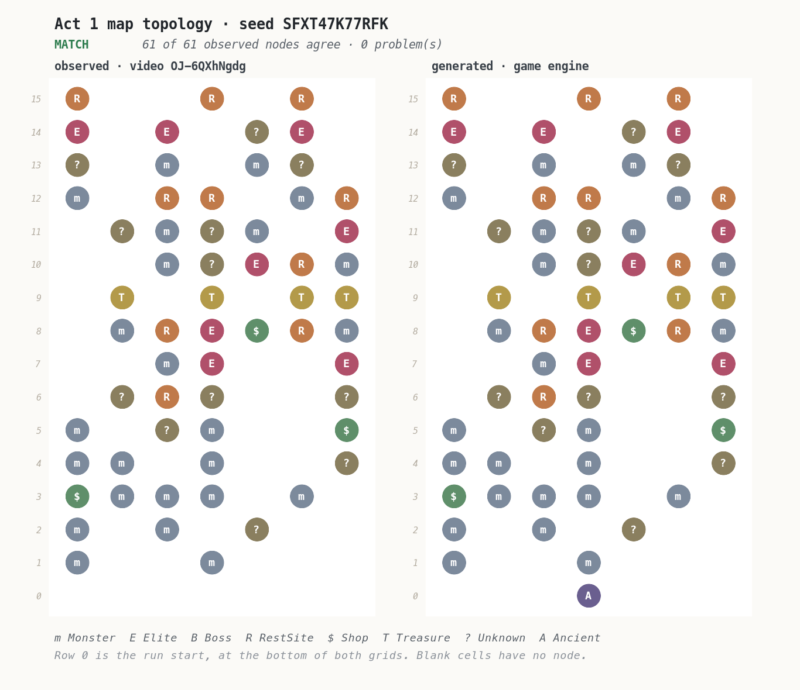
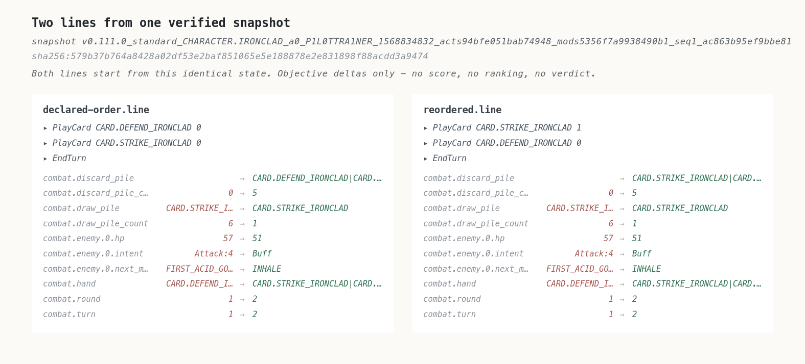

# Deterministic replay of a Slay the Spire 2 run, checked against the video

*2026-08-30T23:49:27Z by Showboat 0.6.1*
<!-- showboat-id: e6c021fc-420a-425d-b6aa-89b0dff77747 -->

This document runs the prototype and records what it actually printed. Every code
block below was executed; the output under it is that run's output, not a
transcription. `showboat verify DEMO.md` re-runs the lot and diffs.

**The claim being tested.** Given a video of somebody else's run, can that run be
reconstructed and replayed through the real game engine so exactly that the engine
agrees with everything the video shows — including hidden state no video can show?
And when the reconstruction is wrong, does the arbiter say so, rather than producing
something plausible?

The subject is one NaveGreed run, video `OJ-6QXhNgdg`, on Slay the Spire 2
`v0.111.0`. No footage from it is stored anywhere in this repository. What is stored
is facts read from it, each carrying the timestamp that lets anyone open the public
video and check.

Two premises this work started from turned out to be false. Both are shown below
being caught, rather than quietly corrected. The last section separates what is
proved from what is assumed, and the assumptions do real work.

## Setting up

The game is a read-only input. The bootstrap copies the installed assemblies into a
gitignored working directory, hashes the installation before and after, and fails if
a byte moved. No game content is committed here, and none of this works without
owning the game.

A note on the output below. Loading the real game assembly means the game's own
logger writes to the console — save-format versions, asset-cache misses, a Sentry
initialiser that finds no native extension. None of it is the arbiter's report, so
the commands filter it out, and the filter is visible in each command rather than
applied silently.

## Before any of that: is this a recording of the run it says it is?

One gate has to run before an engine is started, because no amount of replaying can
stand in for it.

This creator plays with three mods. Two are harmless to a reconstruction — a stream
overlay exporter and the community modding framework. The third resumes a past run
from a chosen floor in run history, and **a resumed run has the same seed, build,
content hash and acts as a fresh one.** Every environment gate below would pass. The
replay would run cleanly. It would reconstruct a different run, because the recording
does not start where the history says it does.

So the manifest records what the recording shows about its own beginning, and a
second reading of the environment taken from the end-of-run screen 2,038 seconds
later. Both are checked before anything else runs. This command needs no game.

```bash
./scripts/arbiter validate manifests/navegreed-OJ-6QXhNgdg.replay.json --show-rejections --out build/evidence
```

```output
manifest : navegreed-OJ-6QXhNgdg
structure: VALID

ingestion gates, fed inputs that should be refused:

resumed-from-run-history
  corruption : Marks the recording as having been entered from the run history screen.
  why it matters: One of the three mods in this creator's environment resumes a past run from a chosen floor. A resumed run has the same seed, build, content hash and acts as a fresh one, so every environment gate passes and the replay runs cleanly - against a recording that does not start where the history says it does. Nothing downstream can see this.
  verdict    : REFUSED
  because    : source.run_start says the run was entered from run history. That is a resumed run, not a run from its start, and an ordered history replayed from run start would reconstruct a different run.

recording-starts-mid-run
  corruption : Sets the first observed run timer to fifteen minutes and the first floor to 12.
  why it matters: The fingerprint a resumed run leaves even when nobody saw the history screen: the timer carries the original run's accumulated time instead of starting near zero.
  verdict    : REFUSED
  because    : source.run_start observes floor 12 first. A run recorded from its start is on floor 1 when it first becomes visible.

ends-on-a-different-run
  corruption : Changes the seed read from the end-of-run screen, leaving the opening reading alone.
  why it matters: What a recording spliced from two runs looks like, and what a reading that drifted looks like. One reading cannot catch either; two readings taken most of an hour apart can.
  verdict    : REFUSED
  because    : source.run_summary reads seed as 'MMWN3B7J2JL3' where environment.seed is 'SFXT47K77RFK'. The two ends of the recording disagree, so at least one reading is wrong or the recording covers more than one run.

unidentified-mod
  corruption : Drops one mod from the environment while leaving the reported count at three.
  why it matters: An unidentified mod is precisely the gap the content hash cannot close, so a shortfall has to be visible rather than rounded away by a list that looks complete.
  verdict    : REFUSED
  because    : environment.mods lists 2 mod(s) but reports 3 were loaded. An unidentified mod is exactly the gap the content hash cannot close, so the shortfall has to be visible rather than rounded away.

all 4 damaged provenance records were refused; the real one is valid
```

The four rejections are the interesting half. The first two are the resumed run,
caught two different ways — the history screen, and the fingerprint it leaves even
when nobody saw that screen: the run timer carrying the original run's accumulated
time instead of starting near zero. The third is a recording spliced from two runs,
which one reading of the environment cannot catch and two readings most of an hour
apart can. The fourth is an unidentified mod, which is precisely the gap the content
hash cannot close.

The selected recording reads `00:04` on floor 1, with no history screen and no resume
dialog, so it passes.

## The environment has to be the right one

A replay in the wrong environment does not fail. It succeeds at producing a
different run, and everything checked afterwards then compares the wrong things
confidently. So the first thing the arbiter does is refuse.

```bash
./scripts/arbiter preflight manifests/navegreed-OJ-6QXhNgdg.replay.json 2>&1 | grep -vE '^\[INFO\]|^SentryGodotInitializer|^\[WARN\] Asset not cached'
```

```output
manifest : navegreed-OJ-6QXhNgdg

  ok   build_version    manifest=v0.111.0                       local=v0.111.0
  ok   build_date_utc   manifest=2026.08.14                     local=2026.08.14
  ok   content_hash     manifest=1568834832                     local=1568834832
  ok   seed_alphabet    manifest=legal                          local=legal
  ok   game_mode        manifest=standard                       local=standard
  ok   mod_environment  manifest=navegreed-2026-08 (3 mod(s))   local=audited source tooling

acts this build ships:
  0:ACT.OVERGROWTH (default)
  0:ACT.UNDERDOCKS
  1:ACT.HIVE (default)
  2:ACT.GLORY (default)

environment matches; replay may proceed
```

Look at the act list. This build ships **two acts at index 0**, and
`ACT.OVERGROWTH` is the default.

That is the first false premise. The video's map screen is titled *Underdocks*.
Taking "the default act at each index" — the obvious thing, and what this code did
at first — produced a run that generated **the same Act 1 map, node for node**, and
a completely different set of encounters: a 59-health enemy where the video shows a
42-health one.

The map was identical because map topology is not generated from the run's shared
random stream at all — the act map is built from a **fresh generator seeded from the
run seed**. So the map cannot detect a substituted act, and a cross-check that looks
decisive can be blind to the thing that matters. The act is now part of the
environment's identity, read from the name the game prints on the map screen.

## Verifying the seed without reading it

The seed reaches us as text somebody read off a low-contrast overlay. An earlier
optical pass on this video returned `SEXT47K77REK` with per-character confidence
`1.0`. That is the second false premise: it is wrong in two places. Agreement
between readings that share a source and an engine is not evidence of accuracy.

The check that reads nothing: regenerate each candidate seed's Act 1 map through the
game and compare its topology against the map the video shows. Map generation is
seeded from the run seed alone, so this tests the seed directly.

The four candidates are the readings that are visually indistinguishable — `E` and
`F` are not separable in either position at the resolution the video offers.

```bash
./scripts/arbiter verify-seed manifests/navegreed-OJ-6QXhNgdg.map-observation.json --candidates SEXT47K77REK,SFXT47K77RFK,SEXT47K77RFK,SFXT47K77REK --out build/evidence 2>&1 | grep -vE '^\[INFO\]|^SentryGodotInitializer|^\[WARN\] Asset not cached'
```

```output
SEXT47K77REK: MISMATCH  12/61 observed nodes agree, 67 problem(s)
    row 1 column 0: observed Monster, generated nothing
    row 2 column 0: observed Monster, generated nothing
    row 2 column 2: observed Monster, generated nothing
    row 2 column 4: observed Unknown, generated Monster
    ... and 63 more
SFXT47K77RFK: MATCH    61/61 observed nodes agree, 0 problem(s)
SEXT47K77RFK: MISMATCH  19/61 observed nodes agree, 71 problem(s)
    row 1 column 0: observed Monster, generated nothing
    row 2 column 0: observed Monster, generated nothing
    row 2 column 2: observed Monster, generated nothing
    row 2 column 4: observed Unknown, generated nothing
    ... and 67 more
SFXT47K77REK: MISMATCH  16/61 observed nodes agree, 71 problem(s)
    row 1 column 0: observed Monster, generated nothing
    row 1 column 3: observed Monster, generated nothing
    row 2 column 0: observed Monster, generated nothing
    row 2 column 2: observed Monster, generated Shop
    ... and 67 more

candidates tested : 4
matching          : SFXT47K77RFK
resolved seed     : SFXT47K77RFK
summary           : build/evidence/seed-verification-summary.json
```

The verifier draws what it compared. The left grid is the transcription — 61 nodes
read by hand from five frames at source resolution, across 15 of the map's 16 rows.
The right grid is what the engine generated. Nothing here is a screenshot of the
video: the video belongs to its creator and none of it is reproduced, so what is
drawn is the transcription, which is also what the comparison actually used.

```bash {image}

```



And the same drawing for the seed the optical pass reported with full confidence.
Mismatches are ringed.

```bash {image}

```


Row 0 appears only on the generated side. It is the run's starting node, which sits
below the visible area in every frame that was read, so it was left out of the
transcription rather than assumed.

**What this proves, and what it does not.** It proves the seed. It says nothing
about the position of the run's shared random stream, because the map does not come
from that stream — which is exactly how the act-variant mistake survived this check.

## Replaying the engine fixture

The source manifest remains ineligible because mod parity is unproved.
The replay, determinism, corruption, and snapshot demonstrations below use a generated vanilla fixture to exercise the engine spine without turning that result into evidence about the source environment.

```bash
./scripts/arbiter synthetic-fixture --out build/evidence/synthetic-engine.replay.json --lines-out build/evidence/synthetic-lines
```

```output
synthetic fixture: build/evidence/synthetic-engine.replay.json
synthetic line: build/evidence/synthetic-lines/declared-order.line.json
synthetic line: build/evidence/synthetic-lines/reordered.line.json
```

The synthetic fixture pins five declared actions: the opening blessing, the move to the first map node, the two cards played on turn 1, and ending that turn.
Four engine-produced checkpoints pin the generated state, and replay has to reproduce every one.
The separate VOD manifest carries the timestamps and observed provenance, but remains ineligible for replay until mod parity is proved.

```bash
./scripts/arbiter replay build/evidence/synthetic-engine.replay.json 2>&1 | grep -vE '^\[INFO\]|^SentryGodotInitializer|^\[WARN\] Asset not cached'
```

```output
manifest       : synthetic-v0111-pilot-trainer
actions        : 5
status         : VERIFIED

  ok   checkpoint combat-start (after action 1)
        combat.enemy.0.hp            observed=57                     engine=57
        combat.enemy.0.intent        observed=Attack:4               engine=Attack:4
        combat.enemy.0.model         observed=MONSTER.FUZZY_WURM_CRAWLER engine=MONSTER.FUZZY_WURM_CRAWLER
        combat.energy                observed=3                      engine=3
        combat.hand                  observed=CARD.DEFEND_IRONCLAD|CARD.STRIKE_IRONCLAD|CARD.DEFEND_IRONCLAD|CARD.STRIKE_IRONCLAD|CARD.STRIKE_IRONCLAD engine=CARD.DEFEND_IRONCLAD|CARD.STRIKE_IRONCLAD|CARD.DEFEND_IRONCLAD|CARD.STRIKE_IRONCLAD|CARD.STRIKE_IRONCLAD
        combat.player_hp             observed=80                     engine=80
        combat.turn                  observed=1                      engine=1
  ok   checkpoint after-defend (after action 2)
        combat.block                 observed=5                      engine=5
        combat.enemy.0.hp            observed=57                     engine=57
        combat.energy                observed=2                      engine=2
        combat.hand_count            observed=4                      engine=4
  ok   checkpoint after-strike (after action 3)
        combat.enemy.0.hp            observed=51                     engine=51
        combat.energy                observed=1                      engine=1
        combat.hand_count            observed=3                      engine=3
  ok   checkpoint turn-two (after action 4)
        combat.discard_pile          observed=CARD.DEFEND_IRONCLAD|CARD.STRIKE_IRONCLAD|CARD.DEFEND_IRONCLAD|CARD.STRIKE_IRONCLAD|CARD.STRIKE_IRONCLAD engine=CARD.DEFEND_IRONCLAD|CARD.STRIKE_IRONCLAD|CARD.DEFEND_IRONCLAD|CARD.STRIKE_IRONCLAD|CARD.STRIKE_IRONCLAD
        combat.draw_pile_count       observed=1                      engine=1
        combat.enemy.0.hp            observed=51                     engine=51
        combat.hand                  observed=CARD.STRIKE_IRONCLAD|CARD.DEFEND_IRONCLAD|CARD.TEAR_ASUNDER|CARD.BASH|CARD.DEFEND_IRONCLAD engine=CARD.STRIKE_IRONCLAD|CARD.DEFEND_IRONCLAD|CARD.TEAR_ASUNDER|CARD.BASH|CARD.DEFEND_IRONCLAD
        combat.player_hp             observed=80                     engine=80
        combat.turn                  observed=2                      engine=2

final state digest : sha256:c1cdb7d8f8da6fbf0990136a70fe9bfa2f09d19381d69491d4ad00a63c7b48c8
action history hash: sha256:a669af21fa7b99e90e035e4e777772074fb198a4873581edeb65e5f0adb344a5
```

Three fields show what the synthetic fixture pins.

**The hand, in order.** `Defend, Strike, Defend, Strike, Strike` is generated from seed `P1L0TTRA1NER`, which appears nowhere in the VOD artifacts.

**The enemy's telegraphed intent, `Attack:4`.** The generated first room contains a Fuzzy Wurm Crawler at 57 health.

**`combat.player_hp 80` after ending the turn.** The generated enemy does not damage the player on this turn, while the played Strike moves the enemy from 57 to 51 health.
These are pinned engine outputs for machinery tests, not observations from the source video.

## Determinism

Fresh processes, not fresh sessions. The engine keeps a great deal of static state,
and a determinism claim that only holds inside one process is not the claim anyone
wants.

The canonical state compared here is built by an explicit allowlist projection — 
including the position of all fifteen random-number streams and the full order of
the draw pile, neither of which any video can show. What is excluded is decided up
front and documented, so a digest mismatch can only be a real divergence and never
an artefact of running on a different afternoon.

```bash
./scripts/arbiter determinism build/evidence/synthetic-engine.replay.json --runs 3 --out build/evidence 2>&1 | grep -vE '^\[INFO\]|^SentryGodotInitializer|^\[WARN\] Asset not cached'
```

```output
run 0: sha256:c1cdb7d8f8da6fbf0990136a70fe9bfa2f09d19381d69491d4ad00a63c7b48c8
run 1: sha256:c1cdb7d8f8da6fbf0990136a70fe9bfa2f09d19381d69491d4ad00a63c7b48c8
run 2: sha256:c1cdb7d8f8da6fbf0990136a70fe9bfa2f09d19381d69491d4ad00a63c7b48c8

all 3 fresh processes produced byte-identical canonical state
```

## Rejecting a history that is wrong

A checker nobody has fed a bad input to has never been shown to reject anything. So
the history is damaged in four specific ways, and each is replayed.

The two interesting ones are the corruptions that arithmetic on the footage alone
**accepts**: reordering two plays, and substituting a card of the same energy cost.
Energy conservation balances, hand accounting balances, and the damage arithmetic
balances — every check that can be done from the frames says yes. Those are the two
that justify owning an engine at all.

```bash
./scripts/arbiter negative-controls build/evidence/synthetic-engine.replay.json --out build/evidence 2>&1 | grep -vE '^\[INFO\]|^SentryGodotInitializer|^\[WARN\] Asset not cached'
```

```output
baseline (uncorrupted): VERIFIED

reorder-plays
  corruption   : Plays the same two cards in the opposite order, adjusting hand indices so both remain valid.
  video-only   : UNDETECTED - The same cards are played, aggregate energy and hand counts are unchanged, and the final visible damage and block totals agree. The intermediate state and hidden pile order still depend on order.
  arbiter      : REJECTED
  first divergence: combat.block                 observed=5                      engine=0
  end state       : differs from the uncorrupted run

substitute-same-cost
  corruption   : Replaces the final played card with a different same-cost card selected by the control.
  video-only   : UNDETECTED - Energy conservation and hand accounting both balance, because the substitute costs the same. The damage arithmetic balances too unless the enemy's health is read frame by frame, which the earlier video-only pipeline did not do.
  arbiter      : REJECTED
  first divergence: combat.enemy.0.hp            observed=51                     engine=57
  end state       : differs from the uncorrupted run

omit-play
  corruption   : Drops the final card play entirely.
  video-only   : DETECTED - Energy and hand counts no longer balance against the declared line. Included as a control on the control: an arbiter that rejected only the subtle corruptions and let this one through would be broken in an interesting way.
  arbiter      : REJECTED
  first divergence: combat.enemy.0.hp            observed=51                     engine=57
  end state       : differs from the uncorrupted run

wrong-opening-choice
  corruption   : Takes a different blessing at the run's opening event.
  video-only   : DETECTED - The different opening option changes generated setup before combat. Included because it corrupts the history far from the turn being checked, which tests that divergence is caught where it surfaces.
  arbiter      : REJECTED
  first divergence: combat.hand                  observed=CARD.DEFEND_IRONCLAD|CARD.STRIKE_IRONCLAD|CARD.DEFEND_IRONCLAD|CARD.STRIKE_IRONCLAD|CARD.STRIKE_IRONCLAD engine=CARD.DEFEND_IRONCLAD|CARD.STRIKE_IRONCLAD|CARD.STRIKE_IRONCLAD|CARD.STRIKE_IRONCLAD|CARD.STRIKE_IRONCLAD
  end state       : differs from the uncorrupted run

all 4 corrupted histories were rejected; the uncorrupted one verified
```

The reordering first diverges at the bound `combat.block` checkpoint: Defend has not yet run in the reordered line.
Its final canonical state also differs because the discard pile preserves play order.
The checkpoint identifies the first divergence instead of waiting for that hidden end-state difference.

## A verified snapshot, and two lines from it

This is the point of the whole apparatus. Once a mid-run position can be reproduced
exactly, it can be handed to a player, and two different lines can be played from
the identical position and compared.

The snapshot is a **derived cache**, never a source of truth. It is keyed by the
build, seed, content hash, game mode and the hash of the exact action history that
produced it — so it can never be served for a run that would not produce it. And
"restore" here means re-derive and verify: each restore replays the same prefix in a
fresh process and refuses unless the digest matches what was cached. That is slower
than loading a blob and much harder to get quietly wrong.

```bash
rm -rf build/snapshots && ./scripts/arbiter snapshot-lines build/evidence/synthetic-engine.replay.json --at 1 --line build/evidence/synthetic-lines/declared-order.line.json --line build/evidence/synthetic-lines/reordered.line.json --out build/evidence --cache build/snapshots 2>&1 | grep -vE '^\[INFO\]|^SentryGodotInitializer|^\[WARN\] Asset not cached'
```

```output
snapshot key   : v0.111.0_standard_CHARACTER.IRONCLAD_a0_P1L0TTRA1NER_1568834832_acts94bfe051bab74948_mods5356f7a9938490b1_seq1_ac863b95ef9bbe81
snapshot source: materialised now
snapshot digest: sha256:579b37b764a8428a02df53e2baf851065e5e188878e2e831898f88acdd3a9474

line declared-order.line  (3 action(s))
  restore verified against snapshot digest: yes
    PlayCard card_id=CARD.DEFEND_IRONCLAD hand_index=0
    PlayCard card_id=CARD.STRIKE_IRONCLAD hand_index=0
    EndTurn 
    delta combat.discard_pile              ->  CARD.DEFEND_IRONCLAD|CARD.STRIKE_IRONCLAD|CARD.DEFEND_IRONCLAD|CARD.STRIKE_IRONCLAD|CARD.STRIKE_IRONCLAD
    delta combat.discard_pile_count      0  ->  5
    delta combat.draw_pile               CARD.STRIKE_IRONCLAD|CARD.DEFEND_IRONCLAD|CARD.TEAR_ASUNDER|CARD.BASH|CARD.DEFEND_IRONCLAD|CARD.STRIKE_IRONCLAD  ->  CARD.STRIKE_IRONCLAD
    delta combat.draw_pile_count         6  ->  1
    delta combat.enemy.0.hp              57  ->  51
    delta combat.enemy.0.intent          Attack:4  ->  Buff
    delta combat.enemy.0.next_move       FIRST_ACID_GOOP  ->  INHALE
    delta combat.hand                    CARD.DEFEND_IRONCLAD|CARD.STRIKE_IRONCLAD|CARD.DEFEND_IRONCLAD|CARD.STRIKE_IRONCLAD|CARD.STRIKE_IRONCLAD  ->  CARD.STRIKE_IRONCLAD|CARD.DEFEND_IRONCLAD|CARD.TEAR_ASUNDER|CARD.BASH|CARD.DEFEND_IRONCLAD
    delta combat.round                   1  ->  2
    delta combat.turn                    1  ->  2

line reordered.line  (3 action(s))
  restore verified against snapshot digest: yes
    PlayCard card_id=CARD.STRIKE_IRONCLAD hand_index=1
    PlayCard card_id=CARD.DEFEND_IRONCLAD hand_index=0
    EndTurn 
    delta combat.discard_pile              ->  CARD.STRIKE_IRONCLAD|CARD.DEFEND_IRONCLAD|CARD.DEFEND_IRONCLAD|CARD.STRIKE_IRONCLAD|CARD.STRIKE_IRONCLAD
    delta combat.discard_pile_count      0  ->  5
    delta combat.draw_pile               CARD.STRIKE_IRONCLAD|CARD.DEFEND_IRONCLAD|CARD.TEAR_ASUNDER|CARD.BASH|CARD.DEFEND_IRONCLAD|CARD.STRIKE_IRONCLAD  ->  CARD.STRIKE_IRONCLAD
    delta combat.draw_pile_count         6  ->  1
    delta combat.enemy.0.hp              57  ->  51
    delta combat.enemy.0.intent          Attack:4  ->  Buff
    delta combat.enemy.0.next_move       FIRST_ACID_GOOP  ->  INHALE
    delta combat.hand                    CARD.DEFEND_IRONCLAD|CARD.STRIKE_IRONCLAD|CARD.DEFEND_IRONCLAD|CARD.STRIKE_IRONCLAD|CARD.STRIKE_IRONCLAD  ->  CARD.STRIKE_IRONCLAD|CARD.DEFEND_IRONCLAD|CARD.TEAR_ASUNDER|CARD.BASH|CARD.DEFEND_IRONCLAD
    delta combat.round                   1  ->  2
    delta combat.turn                    1  ->  2

diagram: build/evidence/snapshot-lines.svg
```

```bash {image}

```


Deltas and nothing else. No score, no ranking, no highlight on the "better" outcome —
which line is better is a question about a game, and answering it here would turn a
measurement into an opinion. A test asserts the report contains no score, rank or
verdict field.

The current fixture's two lines reach the same visible totals and differ in the ordered discard pile.
That is an objective state delta: `Defend, Strike, ...` in the declared order and `Strike, Defend, ...` in the reordered line.
No score or recommendation is attached.

## The tests

The pure suite needs no game at all and runs anywhere.
The integration suite drives the built command line, one process per test, and skips with an explanation on a machine that cannot run it.

Every checker has a demonstrated negative input: the manifest validator has a
malformed input per rule, the preflight has a mismatched build and a mismatched
content hash, the map comparison has a wrong node, a missing node, an extra node and
a wrong grid size, the arbiter has four corrupted histories, and the cache key has
changes that must and must not invalidate it.

```bash
dotnet test sts2-pilot-trainer.sln -c Release --nologo -v quiet 2>&1 | grep -E "Passed!|Failed!|error" | sed -E 's/, Duration: [0-9.]+ (ms|s) - / - /'
```

```output
Passed!  - Failed:     0, Passed:    91, Skipped:     0, Total:    91 - Sts2PilotTrainer.Replay.Tests.dll (net9.0)
Passed!  - Failed:     0, Passed:    22, Skipped:     0, Total:    22 - Sts2PilotTrainer.Arbiter.Tests.dll (net9.0)
```

## BaseLib `PowerCmd.Apply` target probe

The source environment's BaseLib risk is tested against the exact v3.4.5 release DLL, pinned by SHA-256.
Harmony installs the released `SelfApplyDebuffPatch` on the retail `PowerCmd.Apply` target, and a player applies a custom debuff while its original `BeforeApplied` task remains incomplete.
The probe binds canonical state, every RNG stream, replay events, prepared-assembly hashes, seed, action history, target IL, and patch IL identity across fresh processes.
Its negative control removes that exact postfix before invoking the same target, so the detector fails if the release patch is omitted.

```bash
./scripts/fetch-baselib-parity.sh && ./scripts/arbiter baselib-parity build/parity/BaseLib.dll --out build/evidence/baselib-powercmd-parity.json
```

```output
BaseLib.dll: OK
BaseLib.json: OK
BaseLib PowerCmd target probe: PASS
BaseLib behavior parity: DIFFERS
VOD publication parity: NOT ESTABLISHED
report: build/evidence/baselib-powercmd-parity.json
```

The [typed report](baselib-powercmd-parity.json) demonstrates that BaseLib v3.4.5 clears `SkipNextDurationTick` for the exercised player-applied custom debuff while the unpatched baseline leaves it set.
Removing the released postfix reproduces the baseline result, so the negative control detects failure in the exact behavior under test rather than an unrelated state mutation.

The affected branch is then tested against the exact reconstructed VOD history rather than assumed reachable or inert.
The history probe records every retail `PowerCmd.Apply` invocation with its action sequence, power type, applier side, custom-model participation, and original-task completeness.
A fresh-process negative control injects a player-applied custom debuff after the real history enters combat and must trigger the same detector.

```bash
./scripts/arbiter baselib-reachability manifests/navegreed-OJ-6QXhNgdg.replay.json build/parity/BaseLib.dll --out build/evidence/baselib-reachability.json
```

```output
BaseLib reachability instrument: PASS
Affected branch in reconstructed history: NOT REACHED
report: build/evidence/baselib-reachability.json
```

The [history-bound report](baselib-reachability.json) binds the build, BaseLib release, retail target IL, VOD identity, seed, complete reconstructed action hash, final state, and RNG streams.
The three dated-build utilities are non-gameplay tooling, and this non-vacuous result closes the measured BaseLib residual for this history only.

## The gate

All of the above is one verdict, and the tools compute it rather than a reader
concluding it from a wall of green. The standard is successful reproduction through
the real engine, and no condition accepts a cheaper stand-in — not reader
confidence, not arithmetic over the footage, not a screenshot of a mod list.

Those cheaper methods are useful filters and they are not evidence, which this
document has now shown twice over: two of the four history corruptions pass every
arithmetic check available from the frames, and a run resumed from history passes
every check that is not about the recording itself.

```bash
./scripts/arbiter gate manifests/navegreed-OJ-6QXhNgdg.replay.json --out build/evidence 2>&1 | grep -vE '^\[INFO\]|^SentryGodotInitializer|^\[WARN\] Asset not cached'
```

```output
manifest : navegreed-OJ-6QXhNgdg

  pass  publication-source Publication evidence comes from a VOD, never an engine-generated fixture.
  pass  provenance    The recording is of the run it claims, from that run's start.
  pass  seed-topology The manifest seed independently reproduces the map observed in the same VOD.
  pass  environment   The declared build, content hash and mode match this machine.
  pass  baselib-path  The measured BaseLib behavior branch is unreachable in this exact reconstructed history.
  pass  reproduction  The reconstructed history replays through the real engine and matches every observed value.
  pass  determinism   Fresh processes produce byte-identical canonical state.
  pass  rejection     Corrupted and incomplete histories are refused.

PUBLISHABLE - every condition of the gate holds
```

The verdict is written to `build/evidence/publication-gate.json` together with the
standard it applied, so an artifact can never be read as having met a weaker bar
than the one that was actually used.

## What is proved, and what is not

**Proved by source-independent checks and the vanilla engine fixture.**

- The seed is `SFXT47K77RFK`. The engine's own map generator reproduces all 61
  transcribed nodes; the seed an optical reader reported with full confidence
  reproduces 12. This does not depend on reading a character.
- In the synthetic engine fixture, replaying a mechanically generated action sequence from run start reproduces its pinned engine checkpoints.
This proves the replay spine against a controlled fixture, not the separate history-bound tooling check for the VOD.
- The same manifest in three fresh processes produces byte-identical canonical
  state, including all fifteen random-stream positions and the full draw-pile order.
- Four corrupted histories are rejected, two of which every arithmetic check
  available from the footage accepts.
- Four damaged provenance records are refused before any engine starts, including
  both fingerprints of a run resumed from history — which replays perfectly and is
  therefore invisible to every other check here.
- A verified snapshot is keyed to the history that produced it, restores to a
  digest-checked identical state, and supports two lines being played from it with
  objective deltas and no verdict.

**Assumed, and doing real work.**

- **The source player had everything unlocked.** The game generates a run's content
  against the player's unlock state, and nothing in a video shows it. Measured, on
  this seed: changing only that assumption moves the shared random stream from
  position 412 to 370 and changes which encounters the act generates — while leaving
  the map byte-identical. Agreement on generated content is the evidence for this
  assumption; it is not independently established.
- **The game mode is standard.** Daily runs are ruled out — their seeds are
  date-derived and this one is not, and a daily shows modifier icons this run does
  not. Custom mode is not ruled out by direct evidence. It is the weakest link in the
  environment identity, and the manifest marks it as an inference rather than an
  observation.
- **The three source utilities are non-gameplay tooling, with BaseLib bounded to this history.** They are named — a stream-overlay exporter, the community modding framework, and a run-resume utility — and the manifest carries a risk assessment for each. The content hash cannot cover every behavior patch. The target-level BaseLib v3.4.5 probe changes `SkipNextDurationTick` for a player-applied custom debuff, while the history-bound probe records that the reconstructed VOD actions never reach that branch and detects an injected affected call.
- **The mod identities themselves are not from the video.** It names no mod
  anywhere; the overlay gives only a count. They came from a separate investigation
  and the manifest marks them as an inference rather than an observation.

**Not attempted.**

- **This is not the retail client.** It is the real shipped assembly driven headless,
  with the presentation layer stubbed out. Everything above is agreement at points a
  video could show, which is strong and is not the same as running the game.
- **Only the opening turn is covered.** Every claim is about the part of the run that
  was transcribed by hand. Extending the transcription is ordinary work; nothing here
  suggests it would be *easy*, and the manifest says where it stops.
- **Nothing is automatically extracted from video.** The five actions and 61 map
  nodes were read by a person. Building the extractor is the next problem and was
  deliberately not started: an extractor is only worth building once there is an
  arbiter that can tell you when it is wrong.

**The two premises that were wrong** are the reason to trust the rest of this less
than a green result usually invites. Both were accepted facts at the start; both
produced runs that looked entirely healthy; both were caught only by comparing
against something the video independently shows. The act-variant one in particular
survived the map check, which is the most convincing-looking check in this document.

## Reproducing this

Build, then re-run every block above and diff the output:

    ./scripts/build.sh
    showboat verify demo/DEMO.md

You need the game and .NET 9. The images need nothing at all — they are drawn by the
tools from the comparison data, not captured from a screen. Both are emitted as SVG
into `build/evidence/` by the commands above, and the copies in this directory were
rasterised from them:

    magick -density 160 -background white build/evidence/seed-verification-SFXT47K77RFK.svg demo/map-topology-match.png
    magick -density 160 -background white build/evidence/seed-verification-SEXT47K77REK.svg demo/map-topology-mismatch.png
    magick -density 150 -background white build/evidence/snapshot-lines.svg demo/snapshot-two-lines.png
