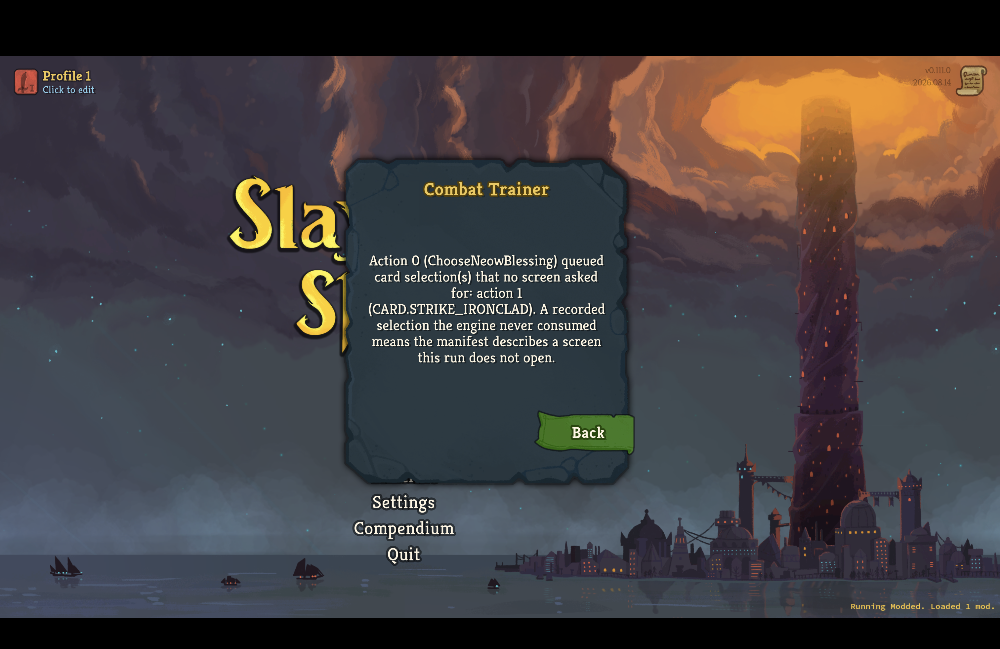
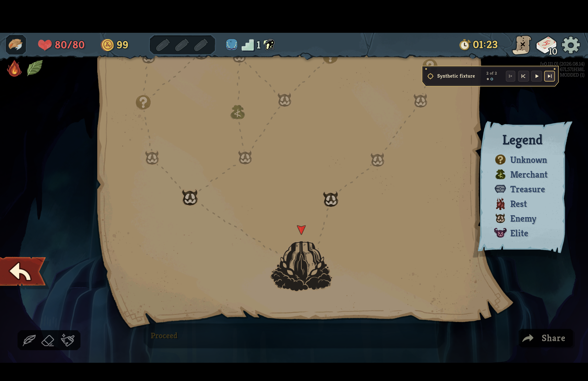
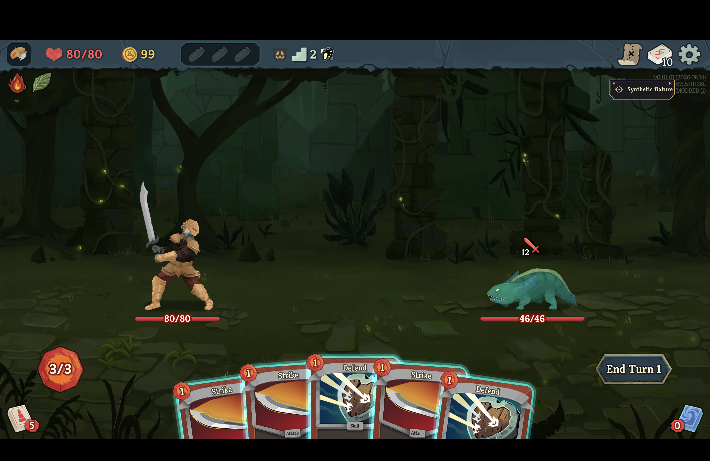
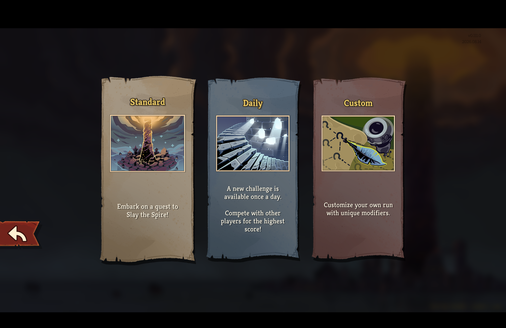

# Neow card-screen replay in the retail client

*2026-09-08T05:46:00Z by Showboat 0.6.1*
<!-- showboat-id: 78d727cb-88d9-4f34-9f3c-683a4a303e1e -->

This demonstration reproduces the original player-visible refusal and proves the repaired path in Slay the Spire 2 v0.111.0.
Both retail sessions used the same engine-generated fixture and a Steam-independent client launched from an empty directory with `--force-steam=off` and an isolated `--clientId`.
The only reproduction-harness adaptation names the otherwise anonymous synthetic fixture on screen; its action history and provenance remain unchanged.

```python3
import json
p = json.load(open('../src/Sts2PilotTrainer.Replay/Fixtures/synthetic-v0111-whole-act.replay.json'))
for action in p['actions'][:3]:
    print(action['seq'], action['verb'], action['args'])
```

```output
0 ChooseNeowBlessing {'option_index': '0'}
1 SelectCardFromScreen {'card_id': 'CARD.STRIKE_IRONCLAD', 'option_index': '0'}
2 MapMove {'act': '0', 'column': '1', 'row': '1'}
```

The preserved parent reaches Neow, commits New Leaf, and then refuses because its queued Strike answer was never requested by a screen.

```bash {image}
neow-card-screen-before.png
```



The repaired build scopes the engine card-selector seam to the opening blessing call.
The retail log records `the screen that decision opened took the recording’s answer`, and the client reaches the map with decision two ready instead of returning to the menu.

```bash {image}
neow-card-screen-after.png
```



Committing the recorded map move reaches the fixture’s expected combat-start boundary.
The retail log records canonical digest `sha256:39de91b3cc68e8094ac328e8b8b5355a2b147cca8d9e54142bcf114f06f65a59`.

```bash {image}
neow-card-screen-combat.png
```



A fresh client loaded from the final installed artifact also confirms that current code has not reintroduced the retired Combat Trainer mode card.

```bash {image}
neow-card-screen-current-singleplayer.png
```



The regression checks that the client accepts every verb in the fixture’s walk to the first fight and excludes its card-screen answer from the transport decision count.

```bash
set -o pipefail; dotnet test ../tests/Sts2PilotTrainer.Mod.Tests/Sts2PilotTrainer.Mod.Tests.csproj -c Release --no-build --filter FullyQualifiedName~RecordedFightVerbAgreementTests --logger 'console;verbosity=minimal' 2>&1 | sed -E 's#Test run for .*/([^/]+) \(#Test run for \1 (#; s/Duration: [0-9]+ ms/Duration: <elapsed> ms/'
```

```output
Test run for Sts2PilotTrainer.Mod.Tests.dll (.NETCoreApp,Version=v9.0)
VSTest version 17.12.0 (arm64)

Starting test execution, please wait...
A total of 1 test files matched the specified pattern.

Passed!  - Failed:     0, Passed:     2, Skipped:     0, Total:     2, Duration: <elapsed> ms - Sts2PilotTrainer.Mod.Tests.dll (net9.0)
```
