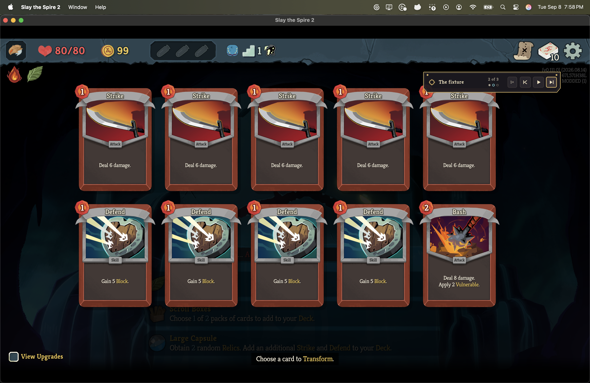
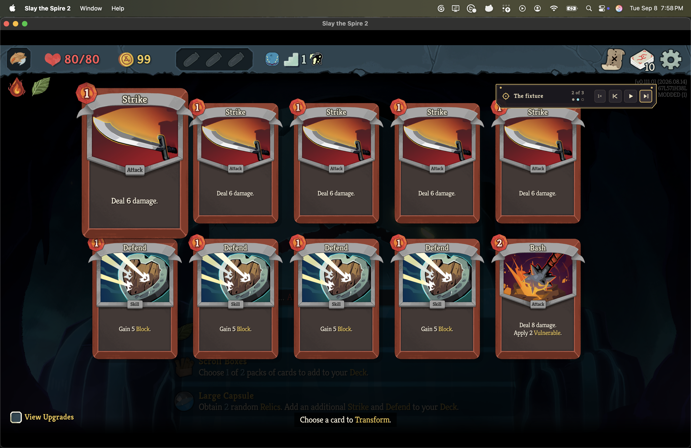
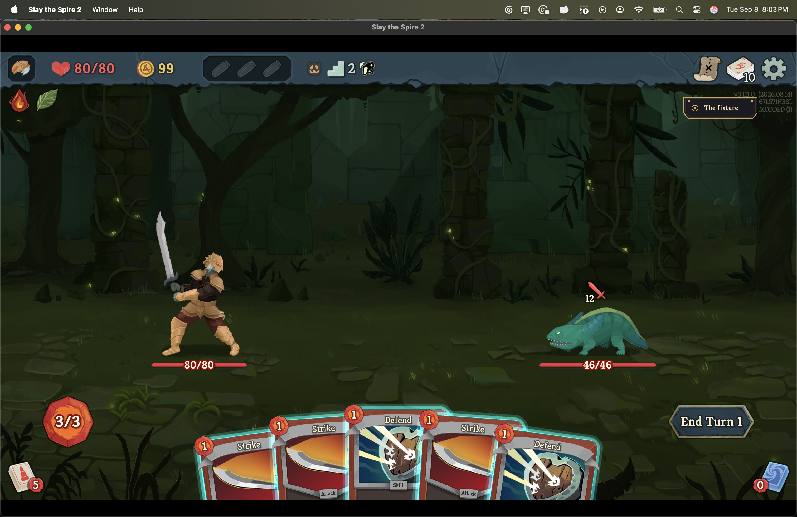

# The recorded card, lit on the game's own card screen

Captured in Slay the Spire 2 v0.111.0 (2026.08.14, commit `41cef1ea`) on macOS arm64,
in a Steam-independent client launched from an empty working directory with
`--force-steam=off` and an isolated client id. The save tree written was the isolated
`default/1/modded/profile1`, never the player's Steam tree.

## What this replaces

An earlier build answered this screen behind the player's back. A recording whose
opening blessing removes, transforms or upgrades a card had its answer pushed through
the engine's own `ICardSelector` seam, so the screen was never drawn: the player watched
a blessing being taken and never saw the card it took, and the only place the card was
said was a caption. That behaviour is gone, and the two screenshots of it that used to be
in this directory went with it, because they asserted something the code no longer does.

## The screen arrives, with nothing lit

The recording's blessing is New Leaf, which transforms one card. Committing it opens the
game's own transform screen over the player's whole deck - five Strikes, four Defends and
a Bash - and the trainer holds there with nothing selected, so the watcher sees every card
the recording saw before any of them is singled out. The transport reads `2 of 3` with its
middle pip hollow.



## The recorded card lights

The recording took the Strike at option 0. It is lifted and scaled by the game's own
focus - the same state a player's own cursor puts a card in - while the four other Strikes
stay flat. Nothing about the four is different to look at, which is the point: the
recorded pick is a position in the list the engine handed the screen, not a name, so the
trainer reads that list off the screen rather than matching on the card's name. The
transport's middle pip is now filled.

The retail log for this frame:

```
[Runmobile] arrived at decision 2 of 3; 10 option(s), nothing lit
[Runmobile] revealed decision 2 of 3: CARD.STRIKE_IRONCLAD at option 0 on the card screen
```



## Committing it reaches the recorded fight

The pick is pressed the way a click presses it, the screen's own preview is confirmed
after a hold, the event underneath then proceeds, and the recording's map move opens the
fight. The canonical state at that boundary is the one the arbiter derives headlessly from
the same recording, field for field:

```
[Runmobile] made recorded decision 2 of 3
[Runmobile] carried on past a screen that was waiting to proceed
[Runmobile] arrived at decision 3 of 3; 2 option(s), nothing lit
[Runmobile] revealed decision 3 of 3: map node (row 1, column 1)
[Runmobile] made recorded decision 3 of 3
[Runmobile] the fight opened; room=Monster, combat manager=in progress, player combat state=Play, turn=1
[Runmobile] standing in the recorded fight; canonical state at combat start is
  sha256:39de91b3cc68e8094ac328e8b8b5355a2b147cca8d9e54142bcf114f06f65a59
```



`./scripts/arbiter enter-fight --fight 1` on the same recording reports `ENTERED` at that
same digest with no client involved, which is what makes the two hosts comparable rather
than merely both green.

## What was written

`./scripts/protected-files.sh compare` after the session reports changes only under this
mod's own install directory, this mod's own `user://Runmobile/` store, and the game's own
log churn. The player's saves, profile and run history are untouched.

## The reproduction harness

The recording driven here is the committed engine-generated fixture
`synthetic-v0111-whole-act`, whose opening blessing is the shape this change is about; the
shipped NaveGreed recording takes Leafy Poultice and opens no card screen at all, so it
cannot meet this path. Two harness-only adaptations were made to a scratch copy and are
not in the branch: the mod embedded that fixture in place of the shipped pair, and
`RecordingIdentity` named the otherwise anonymous fixture, because every player-facing
screen refuses a recording with a blank where a name goes. The fixture's action history
and its provenance are exactly as they are on disk - a `video` block on a
`synthetic-engine` source is refused by the validator, which is why the name is in the
harness build rather than in the manifest.
