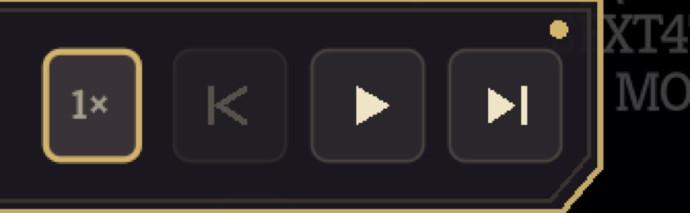

# One transport, all the way into the fight

*2026-09-04T08:22:36Z by Showboat 0.6.1*
<!-- showboat-id: 39d7e557-7d4b-4b7c-93d2-5d599c74c414 -->

The recording's journey to its fight used to be a popup per step: one panel put up over
Neow, torn down, another put up over the map. This document is the retail-client proof
that it is now one long-lived node instead - a tag hanging under the game's own meta
cluster that survives the map-to-combat transition, takes clicks, takes focus, lights
the game's own selected state without clicking it, and refuses out loud rather than
guessing.

The one executable block below was run and its output captured;
`showboat --workdir .. verify PLAYBACK-TRANSPORT.md` re-runs it and diffs. Everything
else here is a photograph of the retail client, which is the whole point: these are
facts about a running game, not about a test harness.

**The claim being tested.** Three facts about the retail client that no game-free
process can answer, and one about the game's own furniture:

1. a node parented to the run's persistent interface survives the map-to-combat
   transition as the same node, rather than being rebuilt;
2. the game's input handling does not swallow clicks on that node's controls;
3. a controller can reach those controls, which means they hold focus rather than only
   answering the mouse; and
4. the recorded choice can be lit using the game's own selected state - the event row's
   ring, the map node's reticle - without issuing the click that would take it.

`PlaybackTransport` in `Sts2PilotTrainer.Trainer` owns what the tag says,
`PlaybackTransportStrip` draws it, `PlaybackTransportDock` parents it to `NRun.GlobalUi`
so it outlives a room, and `RecordedFightReveal` does the lighting.
[docs/mod-ui-direction.md](../docs/mod-ui-direction.md) owns what it looks like and why.

**How this session ran the client.** Slay the Spire 2 v0.111.0, the shipped retail
build, launched with MegaCrit's own `--force-steam=off` flag - so the session has no
Steam account, writes into the isolated `default/1/modded/profile1` save tree rather
than the player's, and cannot construct a cloud save store at all. Only this mod was
enabled; BaseLib, Hindsight and STS2_MCP were disabled in that tree so nothing but the
mod under test loaded.

One thing about these photographs is worth stating rather than leaving for a reader to
notice. They were taken before this branch was rebased onto the shell rename, so the mod
loaded from a directory called `CombatTrainer` rather than `Runmobile`. That name appears
in no screenshot: it is the shell's, and the mod list is the only place it is shown.
Everything the shots do carry - the mode card, the eligibility screen, the tag, the
chip, the refusal - still reads Combat Trainer on the current head, because the rename
deliberately kept Combat Trainer as the module and as the training feature a player
sees. The profile the run was measured against was seeded by
copying the player's own `progress.save` into the isolated tree, so the client stands
where the player's does without a byte of the player's tree being written.

## The tag, and what it is made of

The first recorded decision. Neow's screen is the game's own, all three blessings still
legible, and the tag hangs under the deck and settings cluster where the top bar's own
widgets end - a measured anchor, not a constant. Its controls are icon only: the
captain's ruling is that progressive disclosure is the game's own principle, so the
glyph carries the meaning and the sentence is one hover away.

The row the recording took is lit by **the game's own selection**, not by anything this
mod draws. `RecordedFightReveal` focuses the option button and calls the reticle's own
`OnSelect`, which is what puts the ring on Leafy Poultice. Nothing has been chosen yet:
health still reads 64 of 80, and the blessing costs 12 of it.

```bash {image}
![Neow's event screen in the retail client. A dark hanging tag sits under the top bar's meta cluster reading "NaveGreed" beside a target mark, "1 of 2" over two step dots, and four icon-only controls: a 1x speed plate, a hollow look-back glyph, a filled play triangle and a filled step glyph. A note hangs below it: "NaveGreed's choices are shown as recorded. This shows what was chosen, not why." The third blessing row, Leafy Poultice, carries the game's own cyan selection ring. The top bar reads 64/80 health and 99 gold.](transport-watching-neow.png)
```

![Neow's event screen in the retail client. A dark hanging tag sits under the top bar's meta cluster reading "NaveGreed" beside a target mark, "1 of 2" over two step dots, and four icon-only controls: a 1x speed plate, a hollow look-back glyph, a filled play triangle and a filled step glyph. A note hangs below it: "NaveGreed's choices are shown as recorded. This shows what was chosen, not why." The third blessing row, Leafy Poultice, carries the game's own cyan selection ring. The top bar reads 64/80 health and 99 gold.](8497f360-2026-09-04.png)

Closer, because the glyph family is the design. A filled shape moves the run and a
hollow one only looks: step and play are filled, look back is a hollow stroke and is
drawn refused on the first decision because there is nothing behind it yet. The step
dots are the journey at a glance - teal for where the run is, hollow for what is ahead -
and the numerals carry the same fact for a journey with too many steps to draw.

```bash {image}

```


## The click lands, and the same node carries the next decision

Pressing step commits the recorded blessing and reveals the next choice. Three things
in this shot are the proof:

- **the click was taken.** Leafy Poultice is now in the relic row beside Burning Blood,
  and health has gone 64/80 to 64/68 - the blessing's own -12 max HP. The game's input
  handling did not swallow the press.
- **it is the same node.** The tag did not close and reopen: it reads "2 of 2", the
  first step dot has gone grey, and look back is now offered rather than refused.
- **the reveal is the game's own again.** The Monster node in the centre column carries
  the map's own reticle and arrow. Nothing was clicked to put it there.

```bash {image}

```


## Looking back changes nothing but what is on screen

Look back shows an earlier choice again. It does not rewind the run, and it cannot: a
decision made two screens ago happened somewhere that is gone. So what was read at the
time is listed instead, the counter says which step is being looked at rather than where
the run is, and the map keeps standing exactly where the recording left it.

The speed menu is open over the ledger in this shot on purpose. Both hang under the tag,
and the plates are translucent because the game is meant to show through them - which
means two surfaces on the same band are not one covering the other, they are both
legible at once and neither readable. The client drew them stacked; they now hang off
one measure, each below whatever is already there.

```bash {image}

```


```bash {image}

```


## The transition this design exists to survive

Play runs the rest of the recorded sequence, holding on each choice long enough to read.
The last hold commits the map move, the game fades into the fight, and the tag is still
there - the same node, still reading "2 of 2", drawn over the Battle Start banner. A
popup could not do this: it is created and torn down around each decision, so it has
nowhere to be while the room it was parented to is being replaced.

```bash {image}

```


And then it gets out of the way. Once the fight is proved to be the recorded one and
handed over, the tag collapses to a chip carrying its mark and the creator and nothing
else - silent until it is pressed. The captain's ruling: a player fighting wants nothing
in the way.

The fight behind it is the recording's, on every value a person read off the video: the
Sludge Spinner at 42 of 42 with a 9-damage intent, the opening hand of Strike,
Hellraiser, Strike, Bash and Defend, 3 of 3 energy, six in the draw pile, none
discarded, 64 of 68 health at Ascension 10 on floor 2. The client's own log records the
part no screenshot can show - the whole canonical state at that moment hashing to
`sha256:979ba9de5e67882643dbd3f45b6eee6ae7d7412441e52b760f040e461752baae`, the same
digest the headless host derives.

```bash {image}

```


## Focus, which is what a controller needs

An icon-only control a controller cannot reach is a control half the players do not
have. Every button on the tag is `FocusModeEnum.All`, and hover and focus both put the
gold rim on it - the game's own language for "this is the thing you are about to press"
- and both raise the tooltip, so a controller gets the same sentence a pointer does.

The shot below is the proof that it is focus and not hover: the pointer is in the middle
of the map, hundreds of pixels away, and the speed control still carries the rim from
the press that focused it.

```bash {image}

```



## The recording owns every decision, and a refusal says so

While the recording is deciding, the player cannot decide for it. `DeviationLock` sits
in front of the two commands those decisions reach - `EventSynchronizer.ChooseLocalOption`
and `RunManager.EnterMapCoord` - rather than in front of the buttons, because a screen
with its buttons hidden is a screen a controller, a hotkey or another mod can still
reach. Clicking a node the recording did not take does nothing, and the client says so:

> `[INFO] [CombatTrainer] ignoring an attempt to choose a map node: the recording owns
> every decision before its fight.`

And when the fight that opens is not the recording's, the journey stops rather than
handing the player something to compare that cannot be compared. This is the refusal in
the retail client, reached by a deliberately fault-injected build that gave the fight no
time at all to open - the same shape of failure the boundary exists to catch, forced on
purpose because a correct build does not produce one:

```bash {image}
![The main menu with a Combat Trainer popup over it. The body reads "This fight did not open the way the recording's did, so it was not entered. At checkpoint 'floor2-combat-start': combat.draw_pile_count: the recording shows '6', this game produced '11'; combat.energy: the recording shows '3', this game produced '0'; combat.hand: the recording shows the five recorded cards, this game produced nothing. Something before the fight differed, and a fight that starts somewhere else cannot be compared against the recording's." One button reads Back.](transport-refusal.png)
```

![The main menu with a Combat Trainer popup over it. The body reads "This fight did not open the way the recording's did, so it was not entered. At checkpoint 'floor2-combat-start': combat.draw_pile_count: the recording shows '6', this game produced '11'; combat.energy: the recording shows '3', this game produced '0'; combat.hand: the recording shows the five recorded cards, this game produced nothing. Something before the fight differed, and a fight that starts somewhere else cannot be compared against the recording's." One button reads Back.](87a36016-2026-09-04.png)

## Three things only the client could say

Every screenshot above is from a build that is one commit newer than the one this
session started with, because running the journey in the retail client found three
defects that a process which never draws a frame cannot have.

**The boundary was read on a timer, and a correct entry was refused.** The map move's
own task completes when the combat room is built, and the opening hand is dealt over the
frames after that; the hand-over waited a flat two seconds and then read the boundary
whatever the game was doing. On this machine two seconds landed during the Battle Start
banner, so the boundary saw one card of the recording's five in hand and ten of its six
in the draw pile, and refused - twice, deterministically, on a run that was correct.
`RecordedFightEntry.IsReadyForThePlayer` already existed for exactly this, with a comment
saying exactly this, and nothing called it. The hand-over now waits for it, with the
budget as a deadline rather than as the answer.

**The refusal was thrown away before anybody read it.** The popup lives in the game's own
modal container, and returning to the main menu frees what is in that container - so the
refusal was put up, freed with the run it was explaining, and the client's own deferred
focus grab threw `ObjectDisposedException` on a disposed button. The player was dropped
at the main menu with no account of what had happened at all. The refusal now goes up on
the far side of the return, which is why there is a popup in the shot above.

**Two of the mod's own surfaces were drawn on the same band.** The plates are translucent
because the game is meant to show through them, so the speed menu over the look-back
ledger was not one covering the other - both were legible at once and neither readable.

All three carry regression tests that were run against the old code and watched to fail:

```bash
set -o pipefail; dotnet test tests/Sts2PilotTrainer.Mod.Tests/Sts2PilotTrainer.Mod.Tests.csproj -c Release --filter "FullyQualifiedName~RecordedFightRunTimingTests|FullyQualifiedName~WhatHangsUnderTheTagHangsBelowWhateverIsAlreadyThere" 2>&1 | grep -E "^Passed!|^Failed!" | sed "s/, Duration:.*//"
```

```output
Passed!  - Failed:     0, Passed:     6, Skipped:     0, Total:     6
```

## What this proves, and what it does not

**Proved in the retail client.** One node carries the whole watched journey and survives
the map-to-combat transition as the same node. Its controls take clicks that the game's
input handling does not swallow, and they hold focus, so a controller reaches them and
gets the same words a pointer does. The recording's own choice is lit with the game's own
selected state - the event row's ring, the map node's reticle - without the click that
would take it. The player cannot decide for the recording while it is deciding. A fight
that does not open the way the recording's did is refused, out loud, with the engine's
own sentence, and the run goes with it. And the transport gets out of the way for the
fight it set up.

**Measured about the player's game: 377 of 378, and the 378th stated rather than
rounded away.** The ledger covers the files this proof was told not to touch - the other
installed mods, the player's whole Steam-tree save store, the shared `mod_configs` area
and Steam's own cloud staging - and its ability to see an add, a modify and a delete was
proved with a canary before any "nothing changed" was trusted.

Everything that is a game file is byte identical: every byte of
`SlayTheSpire2/steam/76561197971725248/` - saves, profile, progress, run history - every
byte of the other three installed mods, every byte of `mod_configs/`, and every byte of
Steam's cloud staging for this app.

The one file that moved is `Steam/userdata/.../config/localconfig.vdf`. It is a Steam
**client** preferences file: it is outside every game save tree, and it is in the ledger
only because the ledger takes Steam's whole `userdata` directory rather than picking
paths out of it. **I did not snapshot its prior contents, so I cannot show you its diff
and I am not claiming the launches did not write it.** What I have is an argument that
they could not have: Steam tracked no game process at all during this session -
`gameprocess_log.txt` has no line for any of the five PIDs, and its last entry for this
app predates the session by a day - `cloud_log.txt` and `connection_log.txt` gained
nothing but the client's own hourly housekeeping, and the game never initialized
Steamworks, so it held no handle through which it could write a Steam client file. A
prior investigation measured the same file moving across a launch with only its global
`AppInfoChangeNumber` line changing, which is client churn unrelated to this app. That is
an argument, not a measurement, and the fix for next time is one line of ledger: copy the
file, do not only hash it.

The trainer's own write barrier held through a whole abandoned attempt - the isolated
tree's `progress.save` is byte identical to the copy seeded into it - and that one is a
measurement.

**Not proved here, and deliberately not built.** This is the transport for the decisions
the current manifest supports - an opening blessing and a map move - and not the whole-run
transport. There is no VOD ingestion, no recording catalogue, no shop, rest, treasure or
unsupported reward, no act transition, no run-progress persistence, no solution peeking,
no turn reset or branching, no solver and no score. Those are later slices, and
[docs/proof-of-concept-path.md](../docs/proof-of-concept-path.md) has them in dependency
order. What the surfaces look like is settled separately in
[docs/mod-ui-direction.md](../docs/mod-ui-direction.md); a redesign changes what
`PlaybackTransportStrip` draws and leaves the dock, the reveal and the transport alone.

