# One transport, derived in one place

*2026-09-04T22:44:18Z by Showboat 0.6.1*
<!-- showboat-id: b0c9c00b-c93e-46ce-a359-d27b93e4d178 -->

The recording's journey to its fight is one long-lived tag, and this document is the
retail-client proof of the model that decides what that tag *is* at any moment.

What changed since the last version of this document: the transport's modes used to be
decided by a single boolean that answered three different questions at once - what
exists, what is drawn, and what can be pressed. Four defects came out of that, and
patching them in turn produced a fifth. The boolean is gone. `PlaybackTransport.For`
is now the only way to get a transport state, it is total and pure, and
`TransportSurface` answers those three questions separately for every element. The
strip projects that table and never reads the mode.

**How this session ran the client.** Slay the Spire 2 v0.111.0, the shipped retail
build, launched with MegaCrit's own `--force-steam=off` flag - so the session has no
Steam account, writes into the isolated `default/1/modded/profile1` save tree rather
than the player's, and never initialises Steamworks at all. Only this mod was enabled;
the log below shows the other three skipped.

Images in this document come from two client sessions, and each section says which.
Everything up to "Re-proved on the head that ships" was taken on 2026-09-04, against the
head that carried the model; everything from there down was taken on 2026-09-05 against
`401db7f`, the commit that fixed the field shape described in that section. Two commits
followed it here - this document, and one review pass that changed error logging only - so
nothing drawn below changed after these were taken. That last section explains why a second
session was needed, and it is not a detail. Within each session, earlier runs found defects
and were taken against the code before their fixes; none of those shots survive here. The one exception is deliberate and labelled where it appears: the refusal is
forced with a fault-injected build, because a correct one does not produce a refusal,
and that build was reverted immediately after the shot.

## What this document owes its reader, before anything else

The previous version of this document photographed the speed menu, open, with its four
rows. That menu could not be chosen from. Every row was built in a `for` loop whose
closure was written over the loop variable itself, so every row asked for a row one
past the last, and pressing one closed the menu and did nothing - in every build this
surface has ever had. The photograph was honest about what was on screen and silently
wrong about what it implied.

**Nothing here is carried over from it.** Every image below was taken against the head
under proof. Each section says whether its claim is *newly proved* - something no
earlier build could have done - or *re-proved*, meaning it was true before and is shown
again rather than inherited.

## The tag, and the sentence it says once

The first recorded decision. Neow's screen is the game's own, all three blessings still
legible, and the tag hangs under the deck and settings cluster where the top bar's own
widgets end - a measured anchor, not a constant. Its controls are icon only: the glyph
carries the meaning and the sentence is one hover away.

The row the recording took is lit by **the game's own selection**, not by anything this
mod draws. Nothing has been chosen yet: health still reads 64 of 80, and the blessing
costs 12 of it.

*Re-proved, with one thing newly correct.* The sentence under the tag is said once per
run, and until this head it was said to nobody: the tag is docked when the journey
enters its watching phase, which is before the first reveal lands, and the note was
being consumed by that first derivation. It was drawn and gone inside one deferred
call. It is now spent on the first decision somebody is actually shown.

```bash {image}
![Neow's event screen in the retail client. A dark hanging tag sits under the top bar's meta cluster reading "NaveGreed" beside a gold target mark, "1 of 2" over one filled teal dot and one hollow one, and four icon-only control plates: "1x", a hollow look-back glyph drawn dim, a filled play triangle and a filled step glyph. A second plate hangs beneath it carrying the whole sentence "NaveGreed's choices are shown as recorded. This shows what was chosen, not why." over two lines. The third blessing row, Leafy Poultice, carries the game's own cyan selection ring. The top bar reads 64/80 health and 99 gold.](transport-watching-neow.png)
```

![Neow's event screen in the retail client. A dark hanging tag sits under the top bar's meta cluster reading "NaveGreed" beside a gold target mark, "1 of 2" over one filled teal dot and one hollow one, and four icon-only control plates: "1x", a hollow look-back glyph drawn dim, a filled play triangle and a filled step glyph. A second plate hangs beneath it carrying the whole sentence "NaveGreed's choices are shown as recorded. This shows what was chosen, not why." over two lines. The third blessing row, Leafy Poultice, carries the game's own cyan selection ring. The top bar reads 64/80 health and 99 gold.](91e60dc1-2026-09-04.png)

```bash {image}

```


## A control that does what it says

**Newly proved. This is the defect the document above admits to.**

Pressing the speed plate opens the menu. Two things in this shot were wrong until this
head. The menu's rows are all four legible - the tooltip that the same press raised is
gone rather than drawn across the first two of them, because pressing a control focuses
it and focus raises its tooltip *before* the menu it opens exists. And the rows can be
chosen from at all.

```bash {image}

```


Choosing 2x, and the plate says 2x. That is the whole claim, and it had never been true
before: no menu row on this surface had ever run its action.

```bash {image}
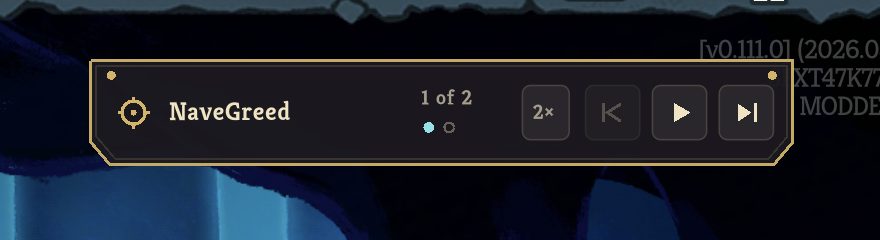
```


## Focus, which is what a controller needs

*Re-proved.* An icon-only control a controller cannot reach is a control half the
players do not have. Every button on the tag takes focus, and hover and focus both put
the gold rim on it - the game's own language for "this is the thing you are about to
press".

The shot below is the proof that it is focus and not hover: the pointer is far down the
left of the screen, and the speed plate still carries the rim from the press that
focused it.

```bash {image}

```

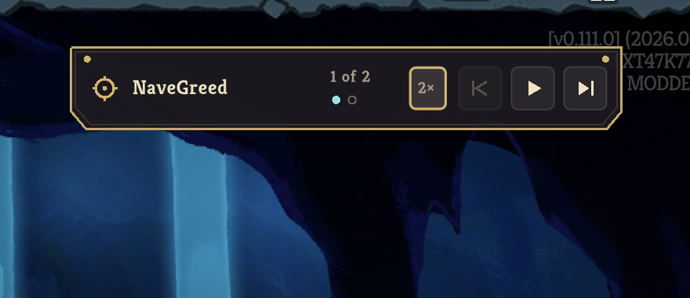

## The click lands, and the same node carries the next decision

*Re-proved.* Pressing step commits the recorded blessing and reveals the next choice.

- **the click was taken.** Leafy Poultice is in the relic row beside Burning Blood, and
  health has gone 64/80 to 64/68 - the blessing's own -12 max HP.
- **it is the same node.** The tag did not close and reopen: it reads "2 of 2", the
  first step dot has gone grey, look back is now offered rather than refused, and the
  2x set a moment ago is still 2x.
- **the reveal is the game's own again.** The Monster node in the centre column carries
  the map's own reticle. Nothing was clicked to put it there.

```bash {image}

```


## Looking back changes nothing but what is on screen

*Re-proved, and one thing in it is newly correct.* Look back shows an earlier choice
again. It does not rewind the run and it cannot: a decision made two screens ago
happened somewhere that is gone. So what was read at the time is listed instead, the
counter says which step is being looked at rather than where the run is, and the map
keeps standing exactly where the recording left it.

The newly correct part is the sentence. Everything that hangs under the tag hangs below
whatever is already there - and a tooltip is one of those things. Pressing look back
focuses it, focus raises the tooltip, and that happens *before* the ledger the press
produces exists; the sentence was therefore placed against the measure of a moment ago
and drawn over the rows it was meant to hang below. It is now put back at the end of
every pass, once the measure is final. The ledger reads clean and the sentence keeps
its last word.

```bash {image}
![The map with the tag reading "1 of 2" - the step being looked at, its dot ringed - and the look-back glyph now drawn refused because this is the earliest choice. A ledger hangs under the tag listing "Leafy Poultice" against a look-back glyph and "Monster node, centre column" against a teal dot for the step the run is actually holding on, both fully legible. Below the ledger, clear of it, the look-back tooltip reads "Look back / Shows an earlier choice again. Nothing is undone." with the last word intact.](transport-look-back.png)
```

![The map with the tag reading "1 of 2" - the step being looked at, its dot ringed - and the look-back glyph now drawn refused because this is the earliest choice. A ledger hangs under the tag listing "Leafy Poultice" against a look-back glyph and "Monster node, centre column" against a teal dot for the step the run is actually holding on, both fully legible. Below the ledger, clear of it, the look-back tooltip reads "Look back / Shows an earlier choice again. Nothing is undone." with the last word intact.](6da7d07c-2026-09-04.png)

## Between screens, the tag says it is waiting rather than saying nothing

**Newly proved.** There are two windows in which the run cannot be moved: the game
putting the next screen up after a decision, and the fight opening after the last one.
In both, everything that would move the run is refused.

**Those windows say nothing about why, and that is a decision rather than an
oversight.** The captain ruled that this surface shows rather than explains, so there
is no sentence and no tooltip reason in either window. What replaces the words is the
tag's own hold line - the same line that drains under Play - travelling instead. It
carries no fraction, because neither window has a known length and a line draining
toward a deadline would be claiming one it does not have.

One treatment covers both, because the condition turned out to be one thing rather than
two: the run is in its watching phase and nothing is revealed. That is the same
condition that refuses step, so what a player sees moving and what they find inert have
one cause rather than two that happen to coincide.

Both frames below are that window. Step's glyph is dim inside its focus rim - refused,
because the decision it would make is not on screen yet - while look back and play stay
bright, which is exactly what the table says for this state. The teal segment at the
tag's foot is further along in the second.

**How short this window is, stated rather than implied.** It is a few hundred
milliseconds, and `screencapture` samples at roughly two hundred. These two frames took
several attempts to catch. A reader should picture a brief travelling mark, not a
comfortable animation.

```bash {image}

```

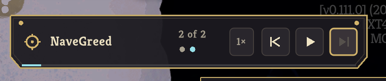

```bash {image}

```

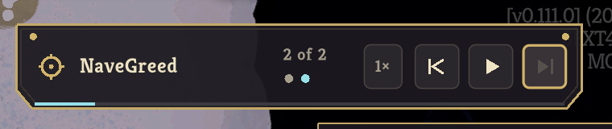

## The transition this design exists to survive

*Re-proved, and the log says it better than a photograph could.* A popup is created and
torn down around each decision, so it has nowhere to be while the room it was parented
to is being replaced. This tag is a child of the run's own persistent interface.

The evidence is not that the tag looks the same either side - a rebuilt node would look
the same too. It is that **the transport is docked exactly once** while the run crosses
Neow, an event screen, the map and a combat room. The whole journey, in the mod's own
words, is below.

    docked the transport under GlobalUi (viewport (1920, 1080), anchor (1824, 108.938866), ...)
    constructed NaveGreed's run; watching 2 recorded decision(s) before the fight
    revealed decision 1 of 2: event option 2 granting RELIC.LEAFY_POULTICE
    made recorded decision 1 of 2
    carried on past a screen that was waiting to proceed
    carried on past a screen that was waiting to proceed
    revealed decision 2 of 2: map node (row 1, column 3)
    made recorded decision 2 of 2
    letting the fight open; room=Monster, combat manager=in progress, player combat state=None, turn=1
    after letting the game run; the fight opened; room=Monster, ..., player combat state=Play, turn=1
    standing in the recorded fight; canonical state at combat start is
      sha256:979ba9de5e67882643dbd3f45b6eee6ae7d7412441e52b760f040e461752baae
    capturing the player's fight from the recorded combat start

One dock line, four screens. That digest is the same one the headless host derives, and
it was identical on every run this session.

## And then it gets out of the way

*Re-proved.* Once the fight is proved to be the recorded one and handed over, the tag
collapses to a chip carrying its mark and the creator and nothing else. The fight
behind it is the recording's on every value a person read off the video: the Sludge
Spinner at 42 of 42 with a 9-damage intent, the opening hand of Strike, Hellraiser,
Strike, Bash and Defend, 3 of 3 energy, six in the draw pile, none discarded, 64 of 68
health on floor 2.

```bash {image}

```


## The chip can be pressed, which is the whole of what it is for

**Newly proved, and it had never been reachable.** The chip says nothing until it is
pressed - hovering it raises no tooltip - and until this branch it could not be pressed
at all. Everything on the tag was hidden to collapse it, and in Godot a control that is
not visible receives no input, so the chip had no press target and neither of the two
directions it offers had ever been reached in the client by anybody.

The model makes that unstateable: presence and pressability are separate answers, and
the chip's press target is *present, silent and pressable* - the whole plate, taking
input while drawing nothing but the hover and focus rim.

At turn one with nothing played there is no attempt to finish, so the second row is
refused - and, as the picture shows, silent about it. Decided by the project's
coordinating owner: this is the only refused row that exists, it clears through the
very action the player is already there to take, and a permanent explanation for a
state that resolves itself in seconds costs more attention than it saves.

```bash {image}

```


## What the chip offers keeps up with the fight

**Newly proved.** One Strike played, and the same row is now offered.

This is the defect the re-derivation rule exists for. The chip used to be built by hand
at the hand-over with "nothing played yet" and nothing ever re-derived it, so it went on
stating turn one's answer - and its refusal reason - for the rest of the fight. The
observer that samples the player's actions now re-derives the surface on every one, so
the chip describes the fight as it is rather than as it was.

```bash {image}
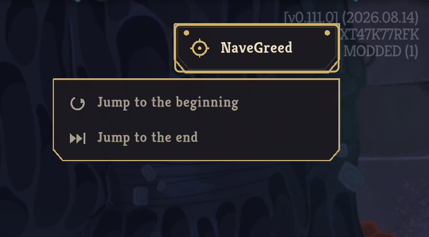
```


## Leaving, both ways

**Newly proved, both of them, for the first time in the client.** Both directions
discard the attempt, so both ask first through the game's own confirmation. The
sentences name the creator from the manifest rather than being written down.

```bash {image}
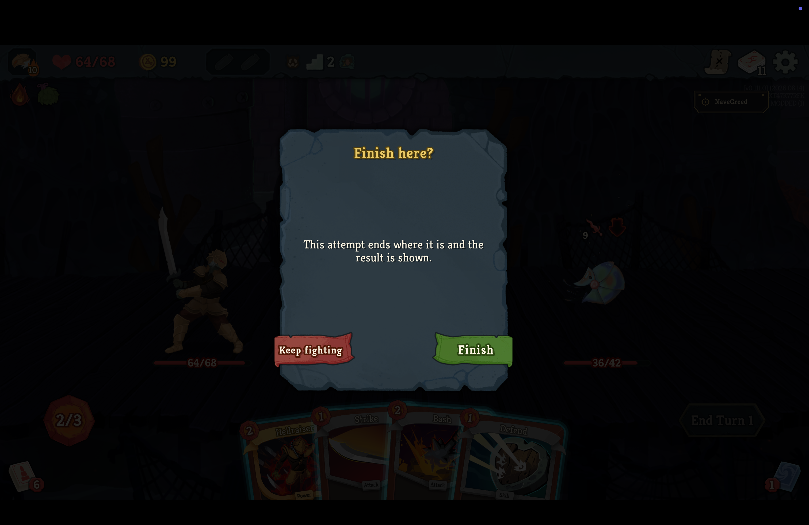
```


Confirming it ends the attempt, and the result appears **on the far side of the return
to the main menu** rather than over the run being torn down.

```bash {image}
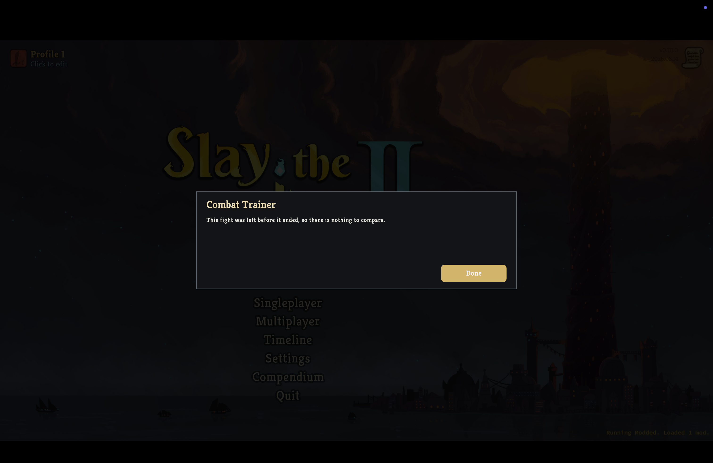
```


The other direction rebuilds the run from the recording's history to the same proven
combat start. Nothing is injected and no state is restored.

```bash {image}
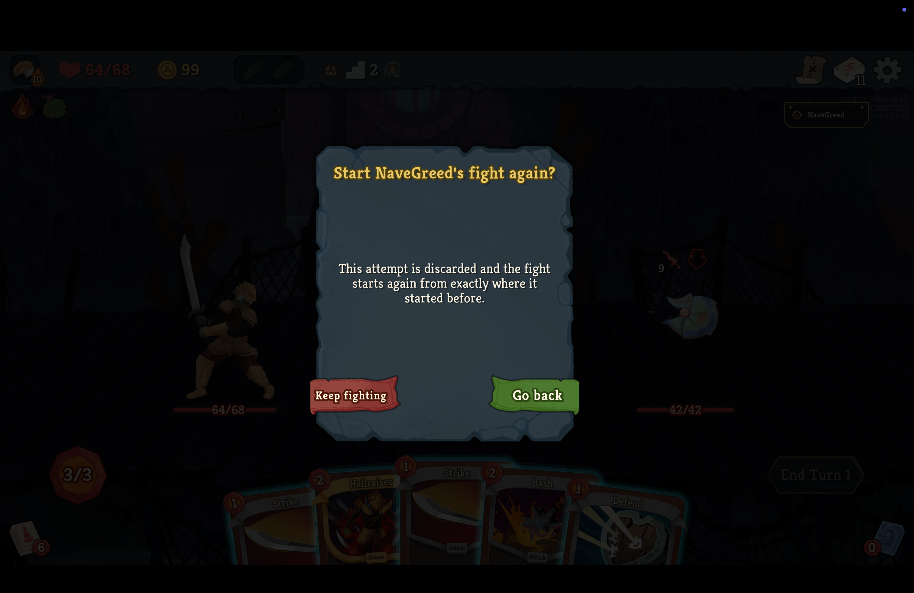
```


And it comes back. Health is 64 of 80 again, Leafy Poultice is gone from the relic row,
the recorded blessing is ringed by the game'"'"'s own selection once more, the speed is back
at 1x, and the once-only sentence is being said to a run that has not heard it.

Two things in this shot are the point. There is **exactly one tag** - the teardown
detaches before the new run docks its own. And there is **no stale result panel** over
it: the attempt was discarded rather than left, so the result the teardown would
normally queue is dropped between the clean-up that queues it and the return that would
show it.

```bash {image}

```


## A menu belongs to the surface that offered it

**Newly proved.** A menu opened on the tag survives the decisions the tag keeps
offering it through - closing it on every change would shut it under the player's hand
between one decision and the next.

```bash {image}

```

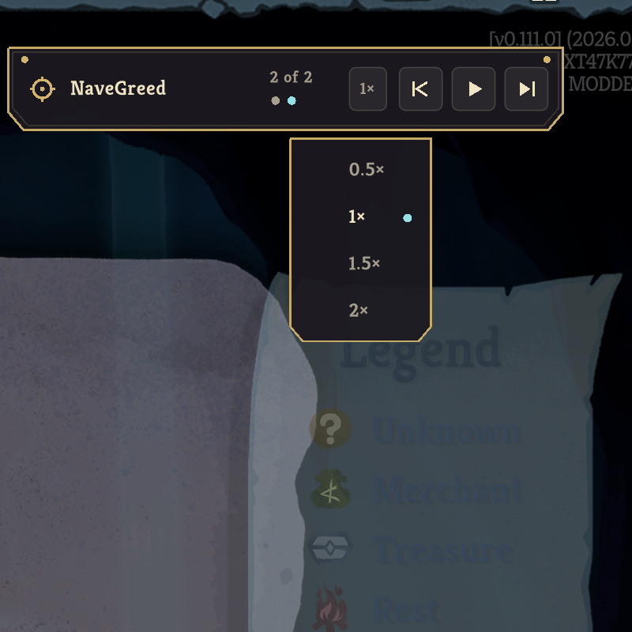

And it does not survive the collapse to the chip, because the chip offers a different
menu. Left hanging it would sit under a surface that is meant to say nothing until it
is pressed, and would swallow that first press closing itself. The strip closes any
menu whose kind is not the one the current surface offers - asked of the surface, not
of the mode.

```bash {image}

```

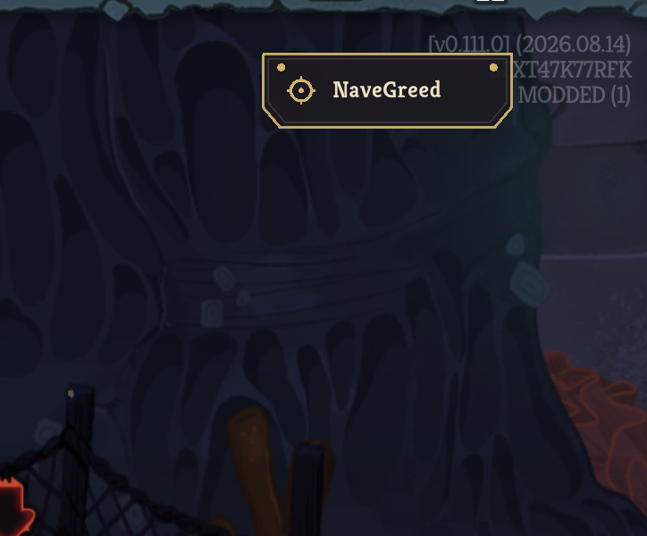

The first press of the chip therefore opens the chip'"'"'s own two directions, rather than
spending itself closing something stale.

```bash {image}

```

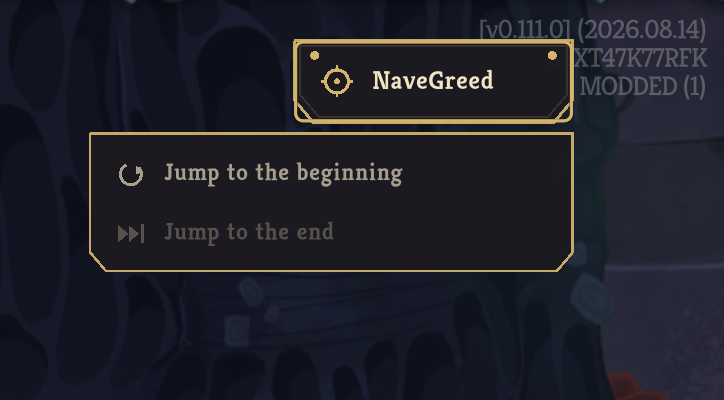

## A fight that is not the recording's is refused, out loud

*Re-proved.* When the fight that opens is not the recording's, the journey stops rather
than handing somebody something to compare that cannot be compared. A correct build does
not produce one, so this is forced: a deliberately fault-injected build that gave the
fight no time at all to open, reverted immediately after the shot.

The ordering is the part worth looking at. The refusal is a popup in the game's own
modal container, and returning to the main menu frees what is in that container - so a
refusal put up first was added, freed with the run it was explaining, and left the
player at the main menu with no account of what had happened at all. It goes up on the
far side of the return, which is why there is a popup here rather than an empty menu.

```bash {image}
![The main menu with a Combat Trainer popup over it. The body reads "This fight did not open the way the recording's did, so it was not entered. At checkpoint 'floor2-combat-start': combat.draw_pile_count: the recording shows '6', this game produced '11'; combat.energy: the recording shows '3', this game produced '0'; combat.hand: the recording shows the five recorded cards, this game produced nothing. Something before the fight differed, and a fight that starts somewhere else cannot be compared against the recording's." One button reads Back.](transport-refusal.png)
```

![The main menu with a Combat Trainer popup over it. The body reads "This fight did not open the way the recording's did, so it was not entered. At checkpoint 'floor2-combat-start': combat.draw_pile_count: the recording shows '6', this game produced '11'; combat.energy: the recording shows '3', this game produced '0'; combat.hand: the recording shows the five recorded cards, this game produced nothing. Something before the fight differed, and a fight that starts somewhere else cannot be compared against the recording's." One button reads Back.](dce98629-2026-09-04.png)

## The regression tests for what the client found

Five defects were found in the client this session and each carries a test that was run
against the code above it and watched to fail. The block below is those tests, plus the
whole strip and transport suites they live in.

```bash
set -o pipefail
for p in tests/Sts2PilotTrainer.Trainer.Tests tests/Sts2PilotTrainer.Mod.Tests; do
  dotnet test "$p" -c Release --filter "FullyQualifiedName~PlaybackTransportStripTests|FullyQualifiedName~TransportSurfaceTests|FullyQualifiedName~PlaybackTransportTests|FullyQualifiedName~RecordedFightRunTimingTests" 2>&1 |
    grep -E "^Passed!|^Failed!" | sed "s/, Duration:.*//"
done
```

```output
Passed!  - Failed:     0, Passed:    86, Skipped:     0, Total:    86
Passed!  - Failed:     0, Passed:    40, Skipped:     0, Total:    40
```

## Re-proved on the head that ships

Everything above was taken on 2026-09-04, against the head that carried the model. It is
not the head that ships, and the gap between them is the point of this section.

After those images were taken, the pipeline's tenth review round re-placed the look-back
tooltip and, in doing so, gave the strip a field of type
`private (Control Anchor, Func<ElementSurface> Element)? _tipSource`. That head is
`60083f3`. It passed eleven review rounds, a test gate, a document gate and CI, and it
could not load in the retail client at all: the game answered
`--- RUNNING MODDED! --- Loaded 0 mods (4 total)` with a `ReflectionTypeLoadException`
naming `Sts2PilotTrainer.Trainer`. The game calls `Module.GetTypes()` on the mod assembly
to find its initializer; that computes field layouts; that resolves a sibling assembly one
phase before `SiblingAssemblies` exists. A nullable value tuple built over a sibling's
type is enough to do it. A plain reference to one is not, which is why the trap keeps
being missed.

So an earlier green covered an artifact that could not run. The check history on this
branch is not a straight line, and a reader should not take the first green as covering
what ships.

`401db7f` replaces that field with a `Control` reference and two `Func<string>` providers,
adds `ModAssemblyLoadOrderTests` - which loads `Runmobile.dll` in an `AssemblyLoadContext`
that throws for every sibling rather than falling back, exactly as the game's own load
order does - and rewrites the trap in `docs/in-game-host.md` as a checkable rule rather
than an anecdote. The rule is narrower than the obvious one and had to be: a field's type
*may be* a sibling type, because a plain reference is a pointer; it may not be a generic
type built over one, in a nullable, a tuple, a delegate's type argument or a collection's
element.

The images from here down were taken on 2026-09-05 against `401db7f`, the commit just
described. Same client, same `--force-steam=off` launch, same isolated save tree.

### The mod is the one loaded, said by the game rather than by us

*Newly proved.* Every earlier version of this document asserted that only this mod was
enabled and showed no picture of it. This is the game's own mod line on the main menu,
with the pointer resting on it so the game names what it loaded.

The log from the same launch says the same thing in more detail, and is quoted rather
than executed because it is a transcript of that session and not a command anyone else
can re-run:

    [INFO] Skipping loading mod BaseLib, it is set to disabled in settings
    [INFO] Skipping loading mod Hindsight, it is set to disabled in settings
    [INFO] Skipping loading mod STS2_MCP, it is set to disabled in settings
    [INFO] Loading assembly DLL .../mods/Runmobile/Runmobile.dll
    [INFO] Calling initializer method of type Sts2PilotTrainer.Mod.RunmobileMod for Runmobile
    [INFO] Finished mod initialization for 'Runmobile' (Runmobile).
    [INFO]  --- RUNNING MODDED! --- Loaded 1 mods (4 total)

BaseLib and Hindsight stayed disabled deliberately: both rewrite their defaults into a
shared mod-configs area that the isolated save tree does not cover.

```bash {image}

```

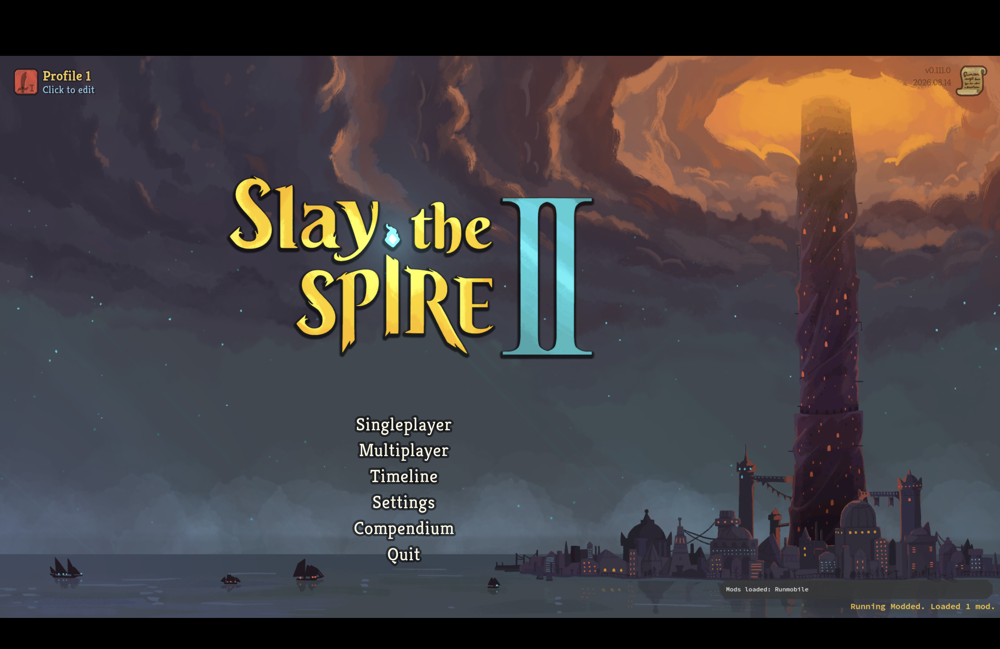

### The tag, re-shot on the shipping head

*Re-proved.* Three drawing defects were found in the first client session and fixed:
control glyphs and the tag's mark were centred against a size read before it was set, so
they drew outside their plates; the once-only note and the look-back tooltip were sized
from their raw text rather than their wrapped text, so the note stopped mid-word and the
tooltip lost its last word. Those fixes are older than this section - what is new is that
they are now photographed on the head that ships rather than on the head they were made
on.

The tooltip half of that was one class with three instances, not three separate bugs. The
same measure-then-wrap error produced the truncated note, the truncated look-back tooltip
and the clipped speed rows; fixing the sizing once fixed all three, which is why there is
one fix in the history and three symptoms in the earlier sections.

```bash {image}
![Neow event screen in the retail client on head 401db7f. The hanging tag under the top bar reads "NaveGreed" beside a gold target mark, "1 of 2" over one filled teal dot and one hollow one, and four icon-only plates: "1x", a dim hollow look-back glyph, a filled play triangle and a filled step glyph, each centred in its plate. Beneath it the once-only note reads "NaveGreed's choices are shown as recorded. This shows what was chosen, not why." complete over two lines. The Leafy Poultice blessing row carries the game's own cyan selection ring. Health reads 64/80.](transport-tag-reproved.png)
```

![Neow event screen in the retail client on head 401db7f. The hanging tag under the top bar reads "NaveGreed" beside a gold target mark, "1 of 2" over one filled teal dot and one hollow one, and four icon-only plates: "1x", a dim hollow look-back glyph, a filled play triangle and a filled step glyph, each centred in its plate. Beneath it the once-only note reads "NaveGreed's choices are shown as recorded. This shows what was chosen, not why." complete over two lines. The Leafy Poultice blessing row carries the game's own cyan selection ring. Health reads 64/80.](c5c47753-2026-09-05.png)

### The chip's two answers, both from one fight

*Re-proved, and this time as a pair from a single run.* The chip is what the transport
collapses to once the fight is the player's, and what it offers has to keep up with the
fight rather than be decided once. At turn one with nothing played there is no attempt to
jump to the end of, so that row is refused; after one card there is, so it is offered.
Both images below are the same fight, seconds apart, with one Strike played between them.

A refused row says nothing when hovered. That is deliberate and was made so in review: a
row the player cannot take should not also grow an explanation they did not ask for.

```bash {image}

```


```bash {image}

```

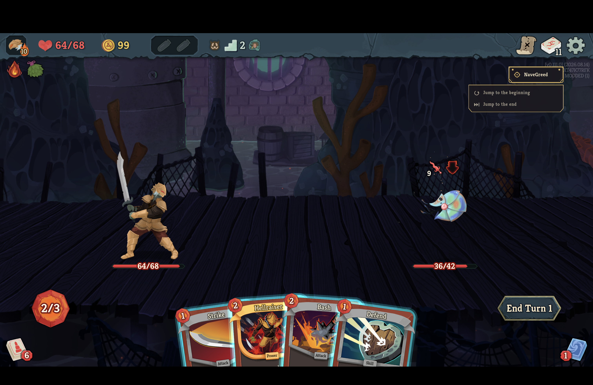

### A fight played to the end, and the comparison it earns

*Newly proved.* Every earlier version of this document showed the result panel only on the
paths where there is nothing to compare - a fight left early, a fight restarted. This is
the panel a completed fight produces: the player'"'"'s line beside NaveGreed'"'"'s, turn by turn,
with the projection'"'"'s own disclaimer that it states differences and does not say which
fight was better.

The fight below was won in four turns, the same number the recording took, from the same
starting position. The player ended on 42 of 64 and NaveGreed on 57. The chart is the
comparison'"'"'s output, not a score.

```bash {image}
![The Combat Trainer result window over the fight, headed "Your fight and NaveGreed's" with the line "Both fights started from the same position." A table compares You and NaveGreed: outcome Won and Won, turns 4 and 4, health at the start 64 and 64, health at the end 42 and 57, net health change -22 and -7, potions used none and none, cards removed none and none. Under it: "This states differences. It does not say which fight was better." and "Health lost counts only health that came off. Damage absorbed by block is not counted." To the right, a turn-by-turn column shows the cards each side played on turns 1 to 4 with the health each lost, and two line charts plot enemy health lost and health lost per turn for both lines. A Done button sits at the bottom right.](transport-result-won.png)
```

![The Combat Trainer result window over the fight, headed "Your fight and NaveGreed's" with the line "Both fights started from the same position." A table compares You and NaveGreed: outcome Won and Won, turns 4 and 4, health at the start 64 and 64, health at the end 42 and 57, net health change -22 and -7, potions used none and none, cards removed none and none. Under it: "This states differences. It does not say which fight was better." and "Health lost counts only health that came off. Damage absorbed by block is not counted." To the right, a turn-by-turn column shows the cards each side played on turns 1 to 4 with the health each lost, and two line charts plot enemy health lost and health lost per turn for both lines. A Done button sits at the bottom right.](76e5cb9d-2026-09-05.png)

### Losing on purpose, because that path had no evidence at all

*Newly proved, and it could not have been proved any other way.* When the player dies the
game runs its own death flow, and the question is whether the trainer'"'"'s answer survives it
or is swallowed by it. That path is a private static async void reaching the pre-fight
screen, the run manager and the dock; there is no seam a unit test can hold, which is why
until now it was argued in a comment and shown nowhere.

So the fight below was lost deliberately: reach the recorded combat, then end seven turns
without playing anything against a Sludge Spinner hitting for nine and ten a turn, from 64
health. The game'"'"'s own defeat screen came up - the "Conquered" banner, "Your fight is
over...", a Continue button - and the trainer'"'"'s panel came up over it rather than under it
or not at all. Pressing Done returned to the main menu with the run gone.

The panel refuses rather than inventing: there is no completed line to compare, so it says
so and offers no chart.

```bash {image}

```


### What the session wrote, with the caveat it has to keep

360 files are covered by `./scripts/protected-files.sh` across two roots: the game'"'"'s user
data directory, where saves, profiles, run history, settings and mod configs live, and the
mods directory, where this mod and everybody else'"'"'s are installed.

**The player'"'"'s own Steam save tree - 141 files - was not touched at all.** Nothing under
it has a modification time inside this session'"'"'s window. That is what `--force-steam=off`
buys: the launch writes into `default/1` instead, a tree the flag creates and nothing else
reads.

Ten files under the user root changed across the session, and every one of them is inside
that isolated tree or is the game'"'"'s own log: `logs/godot.log` and this launch'"'"'s dated log,
`default/1/settings.save` and its backup, `default/1/modded/profile.save` and its backup,
and `default/1/modded/profile1/saves/prefs.save` and `progress.save` with theirs. The
progress file changing is the game writing its own unlock progress in the disposable tree,
not the mod: `ProfileWriteBarrier` suppresses writes during a trainer run, and these
happened at the menu and on quit.

Six files changed in the mods root, all six of them this mod'"'"'s own assemblies under
`Runmobile/`, timestamped by the install that ran a minute before the launch rather than by
anything the session did. `BaseLib`, `Hindsight` and `STS2_MCP` carry their old timestamps
untouched.

**The caveat, kept rather than rounded away.** No ledger was taken before this launch,
because this worker inherited a client that was already running. The whole-session claim
above therefore rests on modification times, not on hashes. A ledger was taken mid-session
and compared after the quit; across that narrower window - which contains the riskiest
moment, the save-on-quit - the only protected file that changed was
`default/1/settings.save.backup`, in the isolated tree, and nothing under `user://Runmobile/`
changed at all. For the same reason, the client preferences file was not copied before the
session as the design asks; that step needs to happen at launch and there was no launch to
attach it to.

## What this proves, and what it does not

**Proved in the retail client.** One node carries the whole watched journey and is
docked once across four screens. Its controls take clicks the game's input handling does
not swallow, they hold focus so a controller reaches them, and - newly - **their menus
run the actions they name**, which no build of this surface had ever done. The
recording's own choice is lit with the game's own selected state without the click that
would take it. The chip can be pressed at all, and what it offers follows the fight
rather than describing the moment it was built. Both ways of leaving work, each behind
the game's own confirmation, and the result or the refusal arrives on the far side of
the return to the menu rather than over a run being torn down. A fight that does not
open the way the recording's did is refused, out loud, with the engine's own sentence.

**The five defects this session found, all of them only findable here.** No menu row had
ever run its action. The once-per-run sentence was consumed before anybody could read
it. An open menu did not move the measure things hang below. A tooltip raised by the
press that opened a menu was drawn across that menu. A tooltip raised by the press that
opened the look-back ledger was drawn across the ledger. Each has a regression test that
was run against the code above it and watched to fail.

**Measured about the player's game.** The ledger covers the game's whole user data
directory - saves, profile, progress, run history, settings and the shared mod configs -
and the mods directory, where this mod and everybody else's are installed. Its ability
to see an add, a removal and a change is covered by its own tests rather than by a
canary written into the player's real tree.

**Everything that is the player's is byte identical.** Nothing under the Steam save
tree, nothing in `mod_configs/`, and not a byte of the other three installed mods
appears in the comparison at all. `user://Runmobile/` - this mod's own store - was not
written either.

**Five files did change, and they are this mod's own installed assemblies.** They are
not the mod writing at runtime: all five carry the timestamp of the last
`install-mod.sh` of the session, which ran *before* the final launch. Saying "377 of
378" and moving on would have hidden that; the honest form is that the only changed
files are the ones a build and an install are supposed to change.

**Steam's own userdata, which the repository's ledger does not cover, was measured
separately: 226 of 226 files, and one changed.** That file is
`config/localconfig.vdf`, a Steam **client** preferences file outside every game save
tree. Last time this could only be argued about. This time the file was copied before
the session rather than only hashed - which is the fix the design report asked for - so
the diff can be shown: **one line of 1,575**, `AppInfoChangeNumber`, Steam's own global
app-info counter, which has nothing to do with this app. The game never initialised
Steamworks at all.

**Not proved here, and deliberately not built.** This is the transport for the decisions
the current manifest supports - an opening blessing and a map move - and not the
whole-run transport. There is no VOD ingestion, no recording catalogue, no shop, rest,
treasure or unsupported reward, no act transition, no run-progress persistence, no
solution peeking, no turn reset or branching, no solver and no score.

**One thing a reader should not over-read.** The two between-screens windows show no
reason in words by decision, and the travelling line is what replaces the sentence. It
is brief - a few hundred milliseconds - and this document says so rather than implying
a comfortable animation. Whether that reads as movement or as a flicker to a player at
normal speed is a judgement about the design, not a fact this proof establishes.

**Two sentences added on 2026-09-05, so this section is not read as covering both
sessions.** The file counts above - five changed assemblies, 226 of 226 in Steam's
userdata, the copied `localconfig.vdf` - are the 2026-09-04 session's measurement and
stay as its record. The 2026-09-05 session on `401db7f` was measured separately and its
figures, including the one it could not take, are in "What the session wrote, with the
caveat it has to keep". Two things listed above as unproved are no longer: the game's own
mod line is photographed, and the death path is shown carrying the trainer's answer over
the game's defeat screen rather than being swallowed by it.
