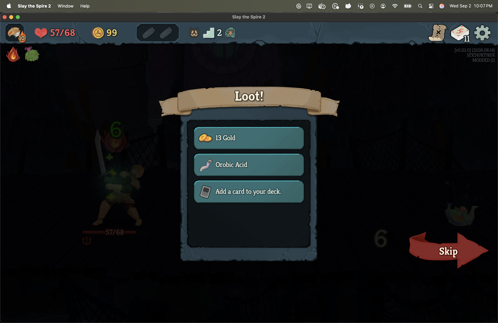

# The player's fight, compared

*2026-09-03T04:58:45Z by Showboat 0.6.1*
<!-- showboat-id: 89255b3f-990d-41b7-ba05-34e332c90b81 -->

This document runs the S5 loop of [the proof-of-concept path](../docs/proof-of-concept-path.md)
and records what it actually printed. Every code block below was executed; the output
under it is that run's output. `showboat --workdir .. verify PLAYER-FIGHT-COMPARISON.md`
re-runs the lot and diffs; the blocks are repo-root commands, which is what the working
directory is for.

**The claim being tested.** Can a fight somebody plays in the retail client be captured
as the same trace the headless arbiter produces, derived through the same projection,
compared with the recording's line by the same whole-combat comparison, and shown to
them - with a fight that was lost, left or not captured whole producing no comparison at
all?

Two halves. The first runs headlessly, with the recording standing in for the player:
its own nine fight actions are played through `FightCapture`, the capture the in-game
host observes a person with, and the result is compared with the engine's replay of the
same actions. The second is the retail client, with a person playing.

## The recording's side, and the proof it is this recording's

The client cannot replay - one process, one run, and it is the player's - so the
recording's line is produced here from a fresh replay and shipped inside the mod as
`manifests/navegreed-OJ-6QXhNgdg.recorded-fight.json`. Every value in it is
engine-produced. The block regenerates it into `build/evidence` and compares it with
the shipped file byte for byte after canonical serialisation: the shipped line is the
engine's own replay, or this fails.

```bash
set -o pipefail; ./scripts/arbiter recorded-fight manifests/navegreed-OJ-6QXhNgdg.replay.json --out build/evidence/regenerated.recorded-fight.json 2>&1 | grep -vE '^SentryGodotInitializer|^\[INFO\]|^\[WARN\]|^\[ERROR\]|^   at '; python3 -c "
import json
a=json.load(open('manifests/navegreed-OJ-6QXhNgdg.recorded-fight.json'))
b=json.load(open('build/evidence/regenerated.recorded-fight.json'))
print('shipped == regenerated:', a==b)"
```

```output
recording       : navegreed-OJ-6QXhNgdg
fight           : ENCOUNTER.SLUDGE_SPINNER_WEAK
covered         : actions through 10, 12 sampled step(s)
history hash    : sha256:da8eee5bce087da0b5d51c2e5fd445b730d37ebdc7d7a88ef23bcf731da6d35c
snapshot digest : sha256:979ba9de5e67882643dbd3f45b6eee6ae7d7412441e52b760f040e461752baae
outcome         : victory on turn 4, 64 -> 57 health

recorded fight: build/evidence/regenerated.recorded-fight.json
shipped == regenerated: True
```

## The loop, headlessly, with the recording standing in for the player

One command. It constructs the recording's run, makes the two decisions before the
fight, proves the boundary, and then - `--play` - plays the recording's own nine fight
actions through the player-side capture: the canonical state is sampled either side of
each one exactly as the in-game observer samples a person's, the capture completes
when the fight ends inside the killing blow, and the projection it hands over is
compared with the shipped recorded fight.

Three things in the output are worth reading closely.

Every summary **row is the same on both sides and every turn line reads the same
twice**, because the recording stood in for the player. That is the point rather than
a limitation: the capture, the projection and the comparison are the same code the
client runs, and a line that came through them and did not match the engine's own
replay of the same actions would be a defect in the capture.

The **panel** is printed word for word as the client shows it - the title, the two
columns, the seven rows, the turn detail, the two notes and the button. All of it is
the approved wording from `TrainerCopy`, produced from the comparison's numbers and the
manifest's creator name; nothing in it is written down for this recording.

The **sandbox line** is a hash over every byte of this process's sandbox profile store
before and after the played fight. It is printed because the headless host has no
write barrier, so whatever a won fight writes here is written; what it reads is a
measurement of this sandbox and not a claim about the client, where
`ProfileWriteBarrier` stops the writes a won fight reaches.

```bash
set -o pipefail; ./scripts/arbiter enter-fight manifests/navegreed-OJ-6QXhNgdg.replay.json --play 2>&1 | grep -vE '^SentryGodotInitializer|^\[INFO\]|^\[WARN\]|^\[ERROR\]|^   at '
```

```output
recording       : navegreed-OJ-6QXhNgdg
creator         : NaveGreed
progress        : AllUnlocked - UnlockState.all, supplied by the host in place of the source player's profile

profile before  : ascension ceiling 0 for CHARACTER.IRONCLAD; characters 1/5, cards 232/596, card_pools 8/12, character_card_pools 1/5, relics 254/299, potions 45/66, shared_ancients 0/1, epochs 0/57

NaveGreed's decisions before the fight: 2, combat starts after action 1
  NaveGreed's choices are shown as recorded. This shows what was chosen, not why.

  [Watching NaveGreed]  1 of 2   NaveGreed took Leafy Poultice
      action 0 ChooseNeowBlessing option_index=2
  [Watching NaveGreed]  2 of 2   NaveGreed moved to the Monster node, centre column
      action 1 MapMove act=0 row=1 column=3

combat start    : checkpoint 'floor2-combat-start', 13 observed value(s)
  ok   combat.block               recording=0                                                        game=0
  ok   combat.discard_pile_count  recording=0                                                        game=0
  ok   combat.draw_pile_count     recording=6                                                        game=6
  ok   combat.enemy.0.hp          recording=42                                                       game=42
  ok   combat.enemy.0.intent      recording=Attack:9+Debuff                                          game=Attack:9+Debuff
  ok   combat.enemy.0.max_hp      recording=42                                                       game=42
  ok   combat.enemy_count         recording=1                                                        game=1
  ok   combat.energy              recording=3                                                        game=3
  ok   combat.hand                recording=CARD.STRIKE_IRONCLAD|CARD.HELLRAISER|CARD.STRIKE_IRONCLAD|CARD.BASH|CARD.DEFEND_IRONCLAD game=CARD.STRIKE_IRONCLAD|CARD.HELLRAISER|CARD.STRIKE_IRONCLAD|CARD.BASH|CARD.DEFEND_IRONCLAD
  ok   combat.max_energy          recording=3                                                        game=3
  ok   combat.player_hp           recording=64                                                       game=64
  ok   combat.turn                recording=1                                                        game=1
  ok   player.max_hp              recording=68                                                       game=68

snapshot        : cache hit, v0.111.0_standard_CHARACTER.IRONCLAD_a10_SFXT47K77RFK_1568834832_seq1_d0cf798421262bced5ac23bd9d1a3e6457889d455cb638089bc95ede4c1664ec
  recorded      : sha256:979ba9de5e67882643dbd3f45b6eee6ae7d7412441e52b760f040e461752baae
  this game     : sha256:979ba9de5e67882643dbd3f45b6eee6ae7d7412441e52b760f040e461752baae

profile after   : ascension ceiling 0 for CHARACTER.IRONCLAD; characters 1/5, cards 232/596, card_pools 8/12, character_card_pools 1/5, relics 254/299, potions 45/66, shared_ancients 0/1, epochs 0/57
profile writes  : none - the reading and every byte of the profile store are unchanged

ENTERED - this game is standing in NaveGreed's fight, at the recorded combat start.

played          : NaveGreed's own 9 fight action(s), through the player-side capture
capture         : Completed
sandbox writes  : none during the fight - measured because the headless host has no write barrier; in the client ProfileWriteBarrier stops what a won fight would write

[Your fight and NaveGreed's]
                        You           NaveGreed
  Outcome               Won           Won
  Turns                 4             4
  Health at the start   64            64
  Health at the end     57            57
  Net health change     -7            -7
  Potions used          none          none
  Cards removed         none          none

  Turn by turn
  Turn 1: you took 8 off the enemy and lost 4; NaveGreed took 8 off and lost 4
  Turn 2: you took 24 off the enemy and lost 2; NaveGreed took 24 off and lost 2
  Turn 3: you took 6 off the enemy and lost 7; NaveGreed took 6 off and lost 7
  Turn 4: you took 4 off the enemy and lost 0; NaveGreed took 4 off and lost 0

  This states differences. It does not say which fight was better.
  Health lost counts only health that came off. Damage absorbed by block is not counted.
  [Done]

report: build/evidence/enter-fight.json
```

## The retail client, with a person playing

The mod was installed with `./scripts/install-mod.sh` and the game launched with only
Combat Trainer enabled. The captain opened Singleplayer, chose Combat Trainer, pressed
Enter the fight, skipped to the fight, and played it. Every screenshot below was taken
by a watcher on the game's own log, at the moment the trainer logged the phase, so
nothing was staged.

The fight, entered and being captured. The game log at this moment reads "standing in
the recorded fight; canonical state at combat start is sha256:979ba9de…" - the same
digest the headless host derives - and then "capturing the player's fight from the
recorded combat start". The Sludge Spinner at 42 of 42 with a 9-damage intent, the
opening hand of Strike, Hellraiser, Strike, Bash, Defend, 3 of 3 energy, turn 1.

```bash {image}

```


The fight, won. The game's own loot screen is up, the player at 57 of 68, and the log
reads "the player's fight ended; capture Completed, 12 action(s) sampled". Twelve
rather than the recording's nine, and the difference is worth understanding: Hellraiser
plays a Strike automatically whenever one is drawn, and in the client each of those
plays reaches the executor as a card action of its own, so the capture samples it as
one. Headlessly the same plays resolve inside the ended turn that drew them. Each is
attributed to the turn it was taken in either way, and the turn totals agree.

```bash {image}

```


The result, over the loot screen, on the game's own popup. The title, the two columns,
the seven summary rows and the turn detail are the approved wording; the numbers are
the comparison's. The captain played the recording's line, so every row agrees and
every turn line reads the same twice - which is the same output the headless block
above produced, now from a fight a person played. The panel scrolls: the fourth turn
line and the two notes are below the fold, as the eligibility screen's lower rows are.
Done returns to the main menu and the run is discarded.

```bash {image}

```


## What this proves, and what it does not

**Proved headlessly.** The shipped recorded fight is the engine's own replay of the
shipped manifest, regenerated in a fresh process and compared. The recording's own
actions, played through the player-side capture, project to a line the comparison
reports as identical to that replay on every summary field and every turn.

**Proved in the retail client.** With only Combat Trainer enabled, the client stood
the captain in the recorded fight at the verified boundary, sampled every action he
took either side through the game's own executor, closed the capture on the game's
own combat-ended event with the fight won, projected it, compared it with the shipped
recording, and showed the result on the game's popup. Done discarded the run.

**The captain's saved progress is unchanged.** SHA-256 over 150 files before the mod
was installed and after Done: every profile, progress, save, run-history file and
every file of BaseLib, Hindsight and STS2_MCP is byte identical. Exactly one file
differs, `modded/profile1/replays/latest.mcr`, the game's own combat replay scratch
file, which the engine rewrites at the end of every fight and which S4's session
recorded differing in the same way. It is not progress and is not read by anything.

**Not measured here.** A lost fight, a fight left through the game's own menu and a
capture that could not be completed are proved on the game-free capture and screen
and have not been watched in the client. Whether the result popup is reachable from
a controller is likewise not claimed.

[docs/in-game-host.md](../docs/in-game-host.md) records the capture's timing and its
limits, and [docs/proof-of-concept-path.md](../docs/proof-of-concept-path.md) has S5
in the context of the loop it closes.

**Observed, and recorded as a limit rather than expanded here.** The captain's report
after this session: it worked, and a text-led list of differences on a large modal is
not good enough for the next interface. The screenshot-backed playback interface that
points at is the follow-up after this loop merges; this slice stays the approved
wording on the game's popup.
