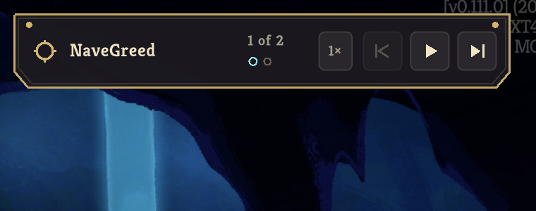
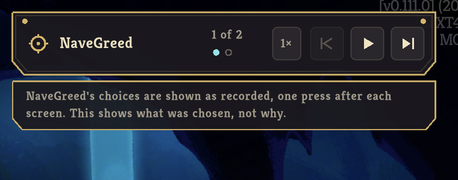
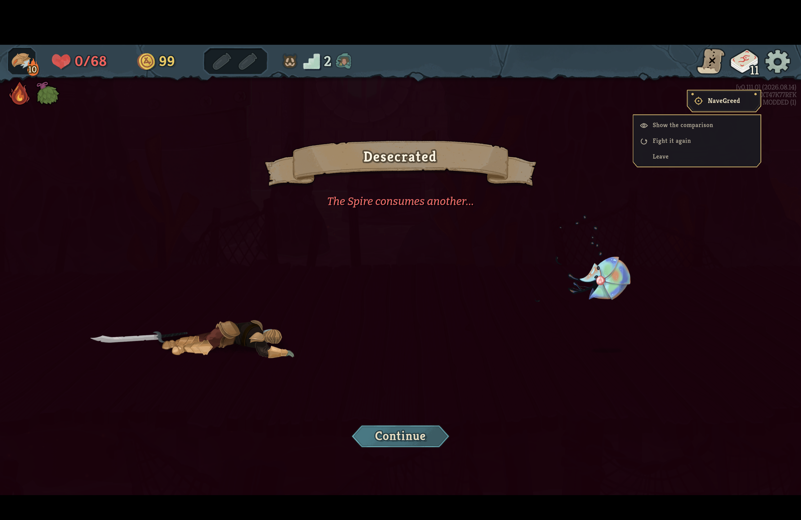
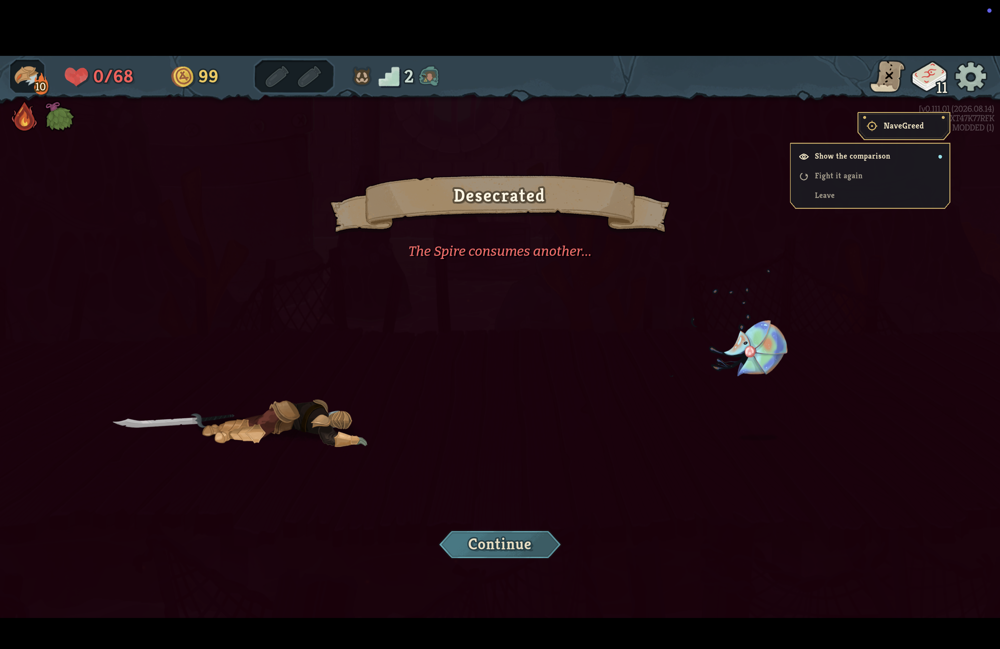

# Predict, then reveal

Captures from the retail client, Slay the Spire 2 v0.111.0, launched with `--force-steam=off` on 2026-09-06, with only this mod enabled.
They are product evidence for one rule applied at two moments: the mod never volunteers the recording's answer, and never withholds it from somebody who asks.

## A choice: consider, reveal, commit

Neow's screen has arrived and nothing is lit.
The tag's mark has no centre dot and the first pip is hollow, because the mod has nothing to point at yet; the log line for this frame reads `arrived at decision 1 of 2; 3 option(s), nothing lit`.

One press of step reveals: the mark gains its dot, the pip fills, Leafy Poultice takes the game's own selection ring, and the once-per-run note appears under the tag with its new clause.

## A finished fight: the choice

The fight was lost on purpose by ending eleven turns.
Two seconds after the game drew its ending the chip stayed and the choice hung under it, over the death screen and above the game's own Continue.
That answers the placement question the design left to a measurement: on a loss the run's persistent interface survives the game's ending, and the log reads `offered the post-fight choice under the chip`.

Show the comparison draws the real comparison of the lost line against the won one.

Done returns to the choice, and the row just taken carries the teal dot for the rest of the sitting.

The game's own Continue then left the run as the Leave row would, and the main menu came back with no error in the log.
