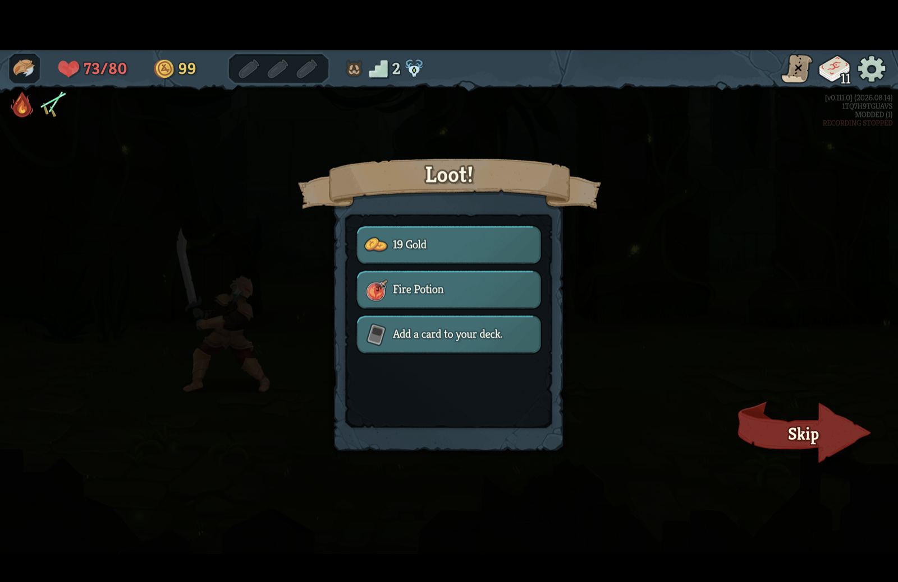
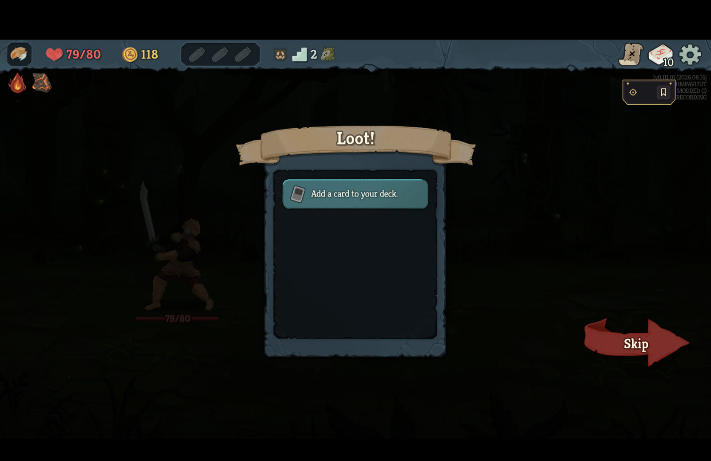
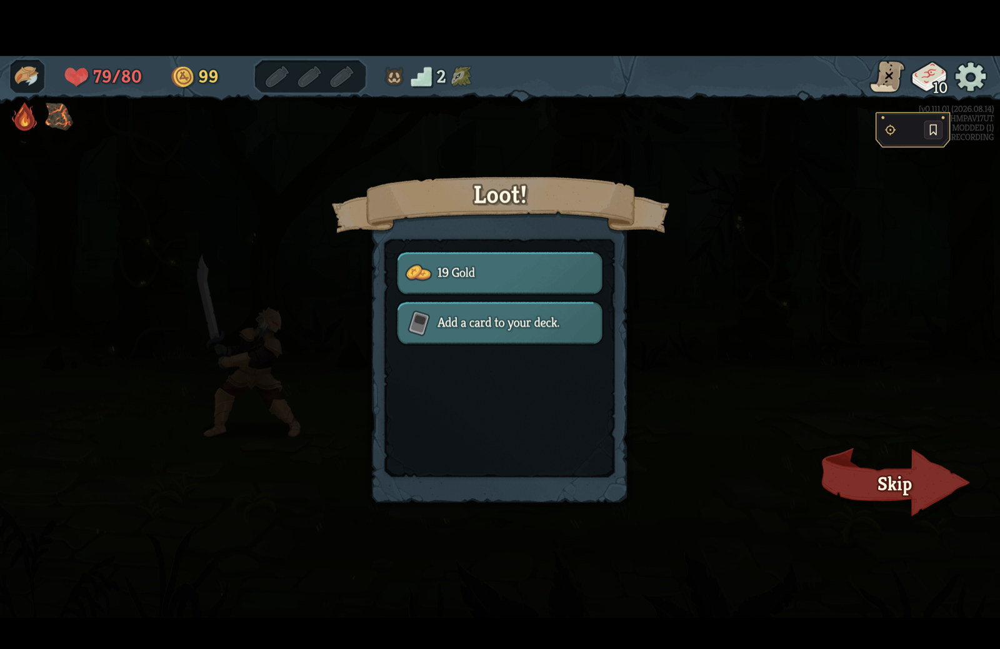
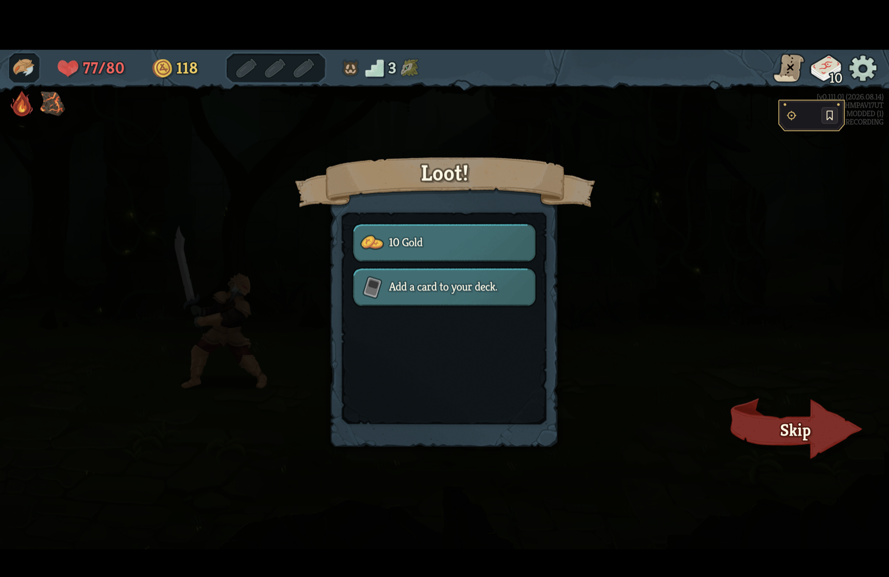
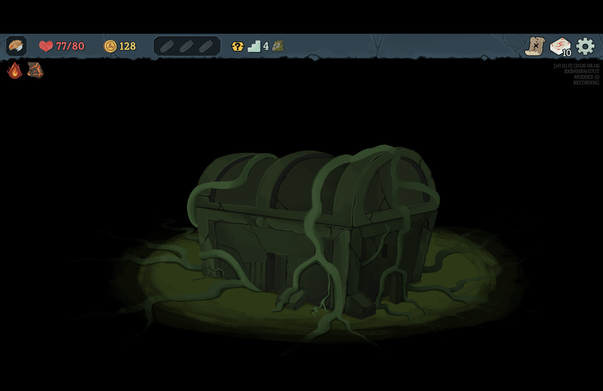

# Continue keeps recording past a finished fight's residue

*2026-09-15T01:48:05Z by Showboat 0.6.1*
<!-- showboat-id: bb954767-0286-4465-973d-0ae3d921cd81 -->

The v0.111.0 retail client ran this branch, built and installed through `scripts/install-mod.sh`, on 2026-09-14, launched directly with `--force-steam=off` and never through Steam, on the isolated non-Steam save tree's first profile, whose runs are only this project's. The console lock state was read into a variable from `IOConsoleLocked` and was unlocked before every click, and every click checked that the game was the frontmost application first and refused otherwise. Commands start at the main menu on a 1512 × 982-point display; the screenshots are the display, scaled to 1600 pixels wide. Ironclad, no ascension, one run: the opening blessing, a fight won, the loot screen, a second fight won, and a treasure room, with Save and Quit followed by Continue at three moments. The game's own version overlay at the top right names the seed and the recorder's state.

## Before

On main before this change, with the room re-entry fix of #71 installed, a Save and Quit on the loot screen after claiming the gold, followed by Continue, came back with the gold on offer again and the overlay reading RECORDING STOPPED: the game restores its fight-won save, which carries no combat state, while the recorder's last reading carried the finished fight, and the resume compared the two digest for digest. The log named eleven differing fields: ten `combat.*` fields of the finished fight and `player.gold` 118 → 99.

```bash {image}

```



## The loot screen

The same press on this branch. The 19 gold is claimed on the loot screen of the first fight, the run is saved and quit from the pause menu, and continued from the main menu.

```bash {image}

```



Continue brings the loot screen back with the gold on offer again, exactly as before, and the overlay goes on reading RECORDING. The log: `continuing the recording of native-BXBHMPAV17UT-20260915-013709 at decision 11; continuity rewound`, then the reason the recorder gives for the rewind, and then the new bounded line naming what differed: `the run resumed differs from the journal's reading after decision 11 (ClaimReward) in 11 field(s): combat.block: 0 -> absent; combat.encounter: ENCOUNTER.SHRINKER_BEETLE_WEAK -> absent; combat.enemy_count: 0 -> absent; combat.energy: 1 -> absent; combat.hand: -> absent; combat.outcome: victory -> none; combat.player_hp: 79 -> absent; combat.player_powers: -> absent; and 3 more`. The match is the killing play, a finished fight and not a room entry, so under the fight-only rollback rule the claim the game rolled back is kept as a discarded branch and the recording is a rewind: whole and playable, honestly not shareable. Which rollbacks are continuous is the next change's question, not this one's.

```bash {image}

```



## The map after the loot

Gold claimed and the rest skipped, Save and Quit on the map before moving, Continue: the game has no save later than the fight's end, so it comes back to the loot screen with the gold on offer once more, and the recorder reads it the same way - `at decision 26; continuity rewound`, the claim discarded, the overlay reading RECORDING.

```bash {image}

```



## An arrival after a won fight

The second fight won and its loot taken, the ? node above resolves to a treasure room. Save and Quit on arrival, before the chest is touched, and Continue.

```bash {image}

```



Continue re-enters the treasure room. The recorder's reading at the arrival carried the second fight's residue and the restored run carries none, which on main was a broken watch in exactly those eight fields; here the resume placed it at the arrival itself, wrote no refusal and no rollback, and the log reads `continuing the recording ... at decision 29; continuity rewound` - the rewound is the loot screen's from earlier in the run, carried on the journal, and this Continue added nothing to it. The overlay reads RECORDING.
A second frame was captured after the Continue and rendered byte-identical to the one above: the chest is untouched, the overlay reads RECORDING in both, and nothing on the screen moves, so the after-capture is not repeated here.
That the quit and the Continue happened between the two is the session's timestamped click record, kept with the session and not committed, and the log line quoted above, which the recorder writes only on a resume.

## The recording

Given up from the pause menu in the treasure room: `recorded native-BXBHMPAV17UT-20260915-013709: abandoned, 29 decision(s), 12 boundary/boundaries, continuity rewound, integrity complete`. `./scripts/arbiter validate` says VALID, so the run is the player's to play from; `./scripts/arbiter gate` refuses it at its `continuity` condition, because a rewind is never shared. The captain's real Steam save tree hashed identical before and after the session.
