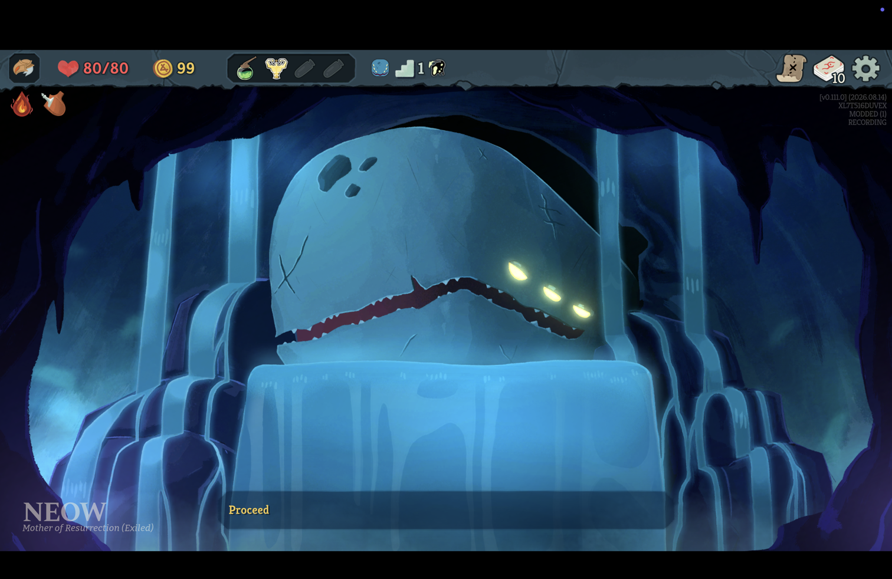
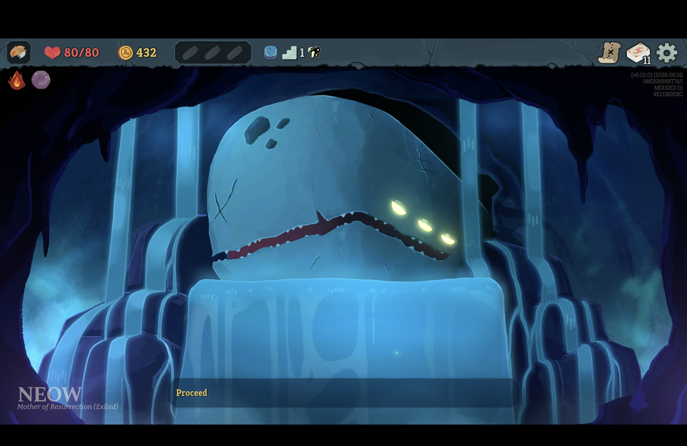
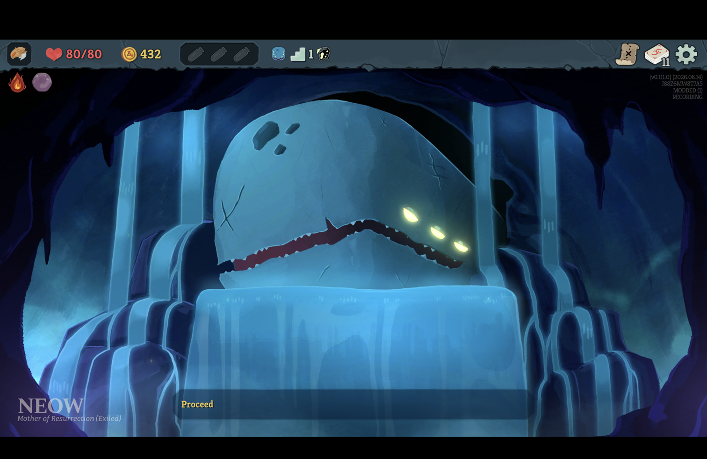
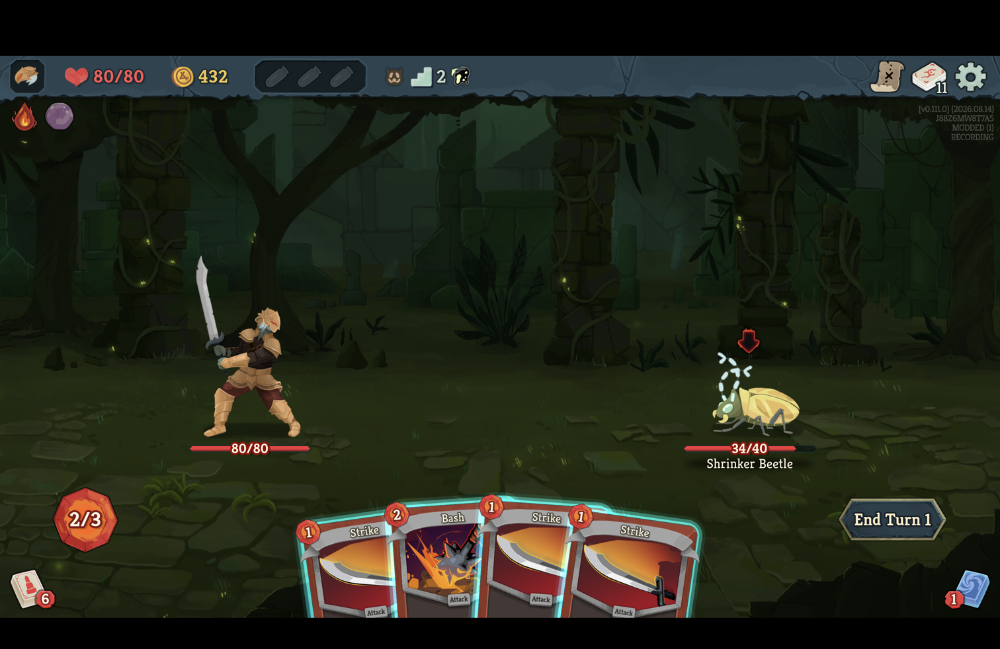
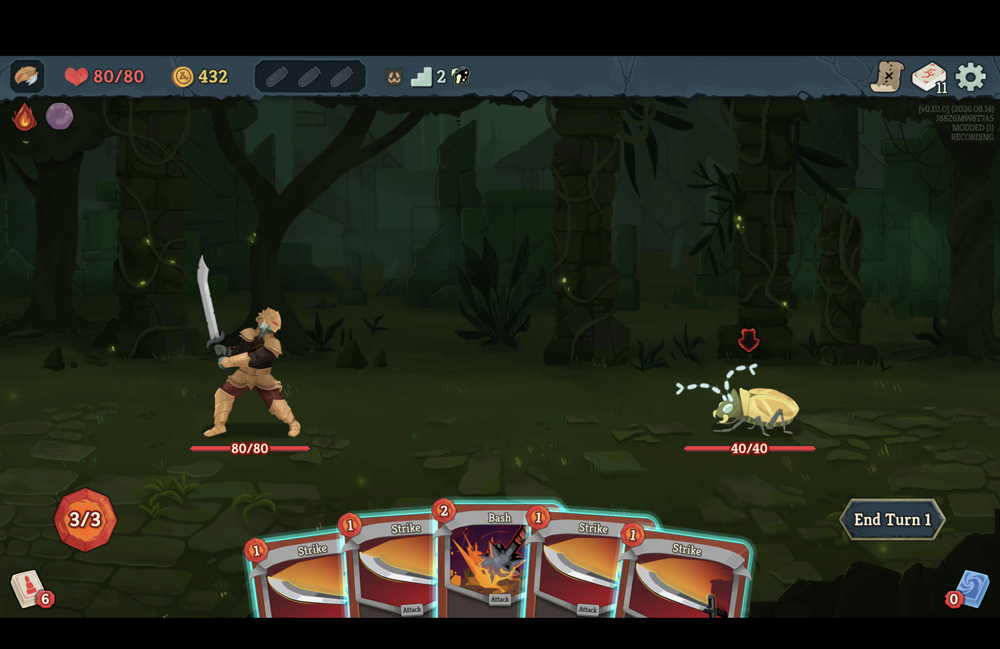
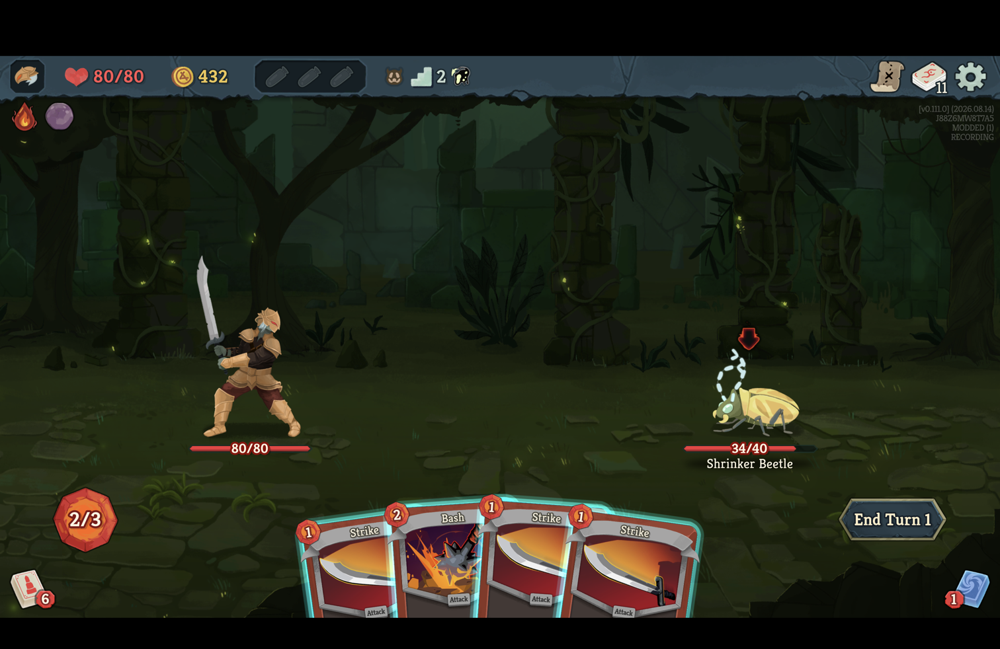

# An honest Continue keeps the recording

*2026-09-14T23:25:33Z by Showboat 0.6.1*
<!-- showboat-id: 01d9b2bb-c11d-4b42-a1fc-33ac2b6ce081 -->

The v0.111.0 retail client ran twice on 2026-09-14, built and installed through `scripts/install-mod.sh`: once at `origin/main` (469c941) to reproduce the report, and once at the head of this branch. It was launched directly with `--force-steam=off --clientId=1`, without invoking Steam, on the isolated non-Steam save tree's second profile, whose runs are only these. The console lock state was read into a variable from `IOConsoleLocked` and was unlocked before every click; every click checked that the game was the frontmost application first and refused otherwise. `scripts/protected-files.sh compare` afterwards reported only the installed mod, the game's own saves and settings for the profile that played, its logs, and the two journals under `user://Runmobile/`. The game's version overlay at the top right names the run's seed and the recorder's state.

## Before: RECORDING STOPPED at Neow's room

At `origin/main`, the Ironclad took Neow's blessing (Phial Holster), with the overlay reading RECORDING.

```bash {image}

```



Save and Quit, then Continue from the main menu. The game returns to Neow's room with the blessing kept and Proceed offered, and the overlay reads RECORDING STOPPED. The log: `continuing the recording of native-XL7T516DUVEX-20260914-231858 at decision 1; continuity broken`, then `The run this session resumed into is not one this recording ever saw.`

```bash {image}

```


The recorder attached as soon as the continued run had a floor count, which it carries on the save before the game has re-entered its room, and read a run at act floor 0 - `EnterMapPointInternal` is the one thing that sets the act floor and the game never saves it - against the journal's 1. Every other field agreed. `RunCapture.Resume` was right to refuse a state the journal never saw; the reading was taken one step before the game had finished continuing.

## After: the same Continue, recording

At this branch's head, a fresh run took Cursed Pearl.

```bash {image}

```



Save and Quit, Continue. Neow's room again, and the overlay reads RECORDING. The log: `continuing the recording of native-J88Z6MW8T7A5-20260914-232158 at decision 1; continuity continuous`.

```bash {image}

```



## After: a Continue into a live fight

The same gap sits one step later for a fight: the combat room is pushed before its assets load and its fight is set up, and a reading between the two is in no combat at all. The run went on to the first enemy and played a Strike (40 to 34).

```bash {image}

```



Save and Quit inside the fight, then Continue. The game's own save rolls the fight back to its entry - the enemy at 40/40, the opening hand dealt afresh - and the overlay reads RECORDING. The log: `continuing the recording of native-J88Z6MW8T7A5-20260914-232158 at decision 2; continuity continuous`.

```bash {image}

```



A Strike played after the Continue is recorded as decision 2 again. The journal holds the opening, the blessing, the map move, the Strike played before the quit, a rollback line naming decision 1 as the entry the game returned to with that Strike discarded from seq 2 through 2, and the new Strike at seq 2 - the game's observed rollback of a live fight, continuity untouched.

```bash {image}

```


