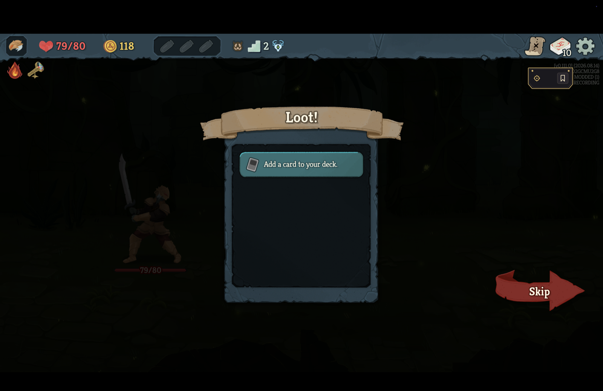
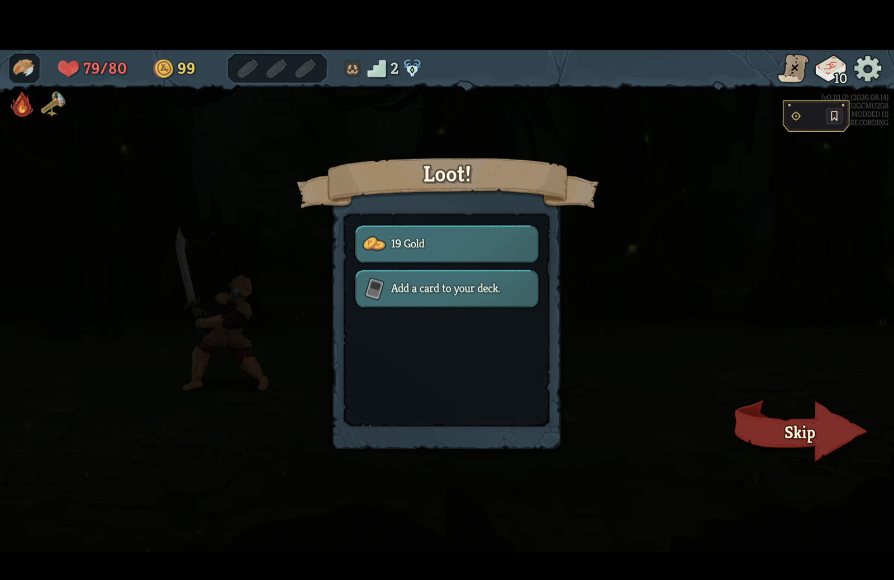
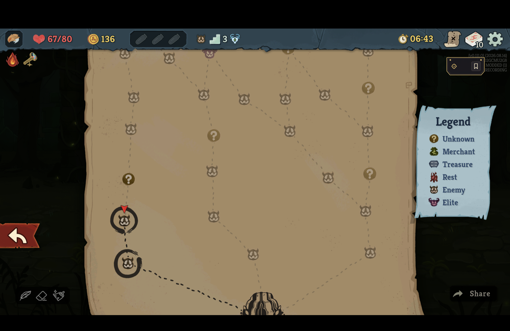
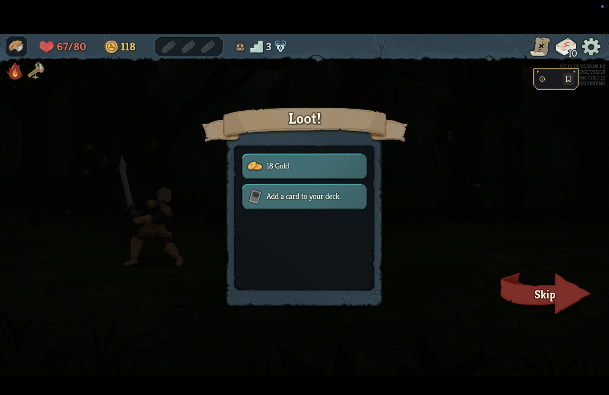
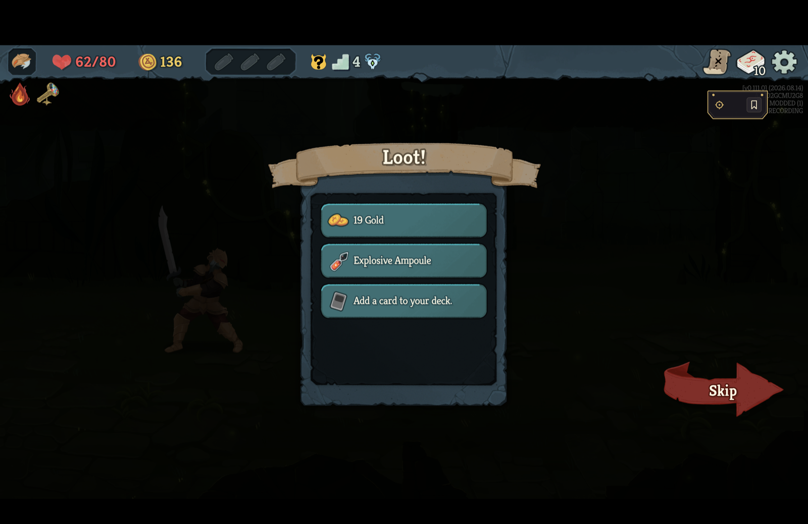
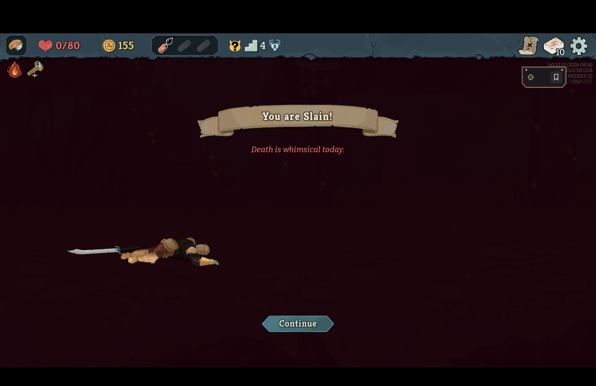

# Save and Quit outside combat is publishable: the projection carries nothing of a finished fight

*2026-09-15T09:15:24Z by Showboat 0.6.1*
<!-- showboat-id: b6decba4-19e3-4f98-ac21-22e344d1ad3c -->

The previous slice left one failure on the table: a run continued outside a fight after a won one was continuous, validated and was the player's to play from, and still failed `./scripts/arbiter gate` on reproduction at its first non-fight arrival after the Continue - `combat.turn observed '1', engine produced '2'` at the floor-3 entry of the retail run in RECORDER-SAVE-POINTS.md. The engine keeps a finished fight's `PlayerCombatState` on the player until the next fight, the game's own save carries no combat at all, and the projection emitted that residue into every reading until the next fight, so the restored client and the replaying engine read a different state at every shop, rest, event and loot screen after a fight. This change is manifest format 7: outside a live fight `CanonicalStateProjection.ProjectCombat` emits only whether a fight is live and, off the room the run stands in, how the last one ended. Everything below is driven on the real engine; the headless scenarios first, then the retail client.

```bash
cd .. && dotnet test tests/Sts2PilotTrainer.Mod.Tests -c Release --nologo --no-build --filter "FullyQualifiedName~RecorderContinueTests|FullyQualifiedName~FinishedFightProjectionTests" 2>&1 | grep -E "^(Passed!|Failed!)"
```

```output
Passed!  - Failed:     0, Passed:    19, Skipped:     0, Total:    19, Duration: 21 s - Sts2PilotTrainer.Mod.Tests.dll (net9.0)
```

Nineteen scenarios. `FinishedFightProjectionTests` is the counterfactual: a live fight is projected whole - turn, phase, energy, every pile, block, powers, every enemy - before and after a play; once the killing play has settled the engine still holds the fight (`PlayerCombatState` non-null, turn past 1, the room marked pre-finished) and the projection carries exactly `combat.in_progress=false` and `combat.outcome=victory`; the loot taken changes nothing of it; leaving the room takes the outcome to `none`; a dead player reads `defeat` off the player whatever the room says. `RecorderContinueTests` adds the retail run headlessly, from the saves the game itself took: a fight won on the way to a shop, the gold claimed, Save and Quit on the map, Continue restoring the fight-won save, the loot taken again, the shop arrived at - continuous, the claim as the branch, and then the whole continued history replayed through `Arbiter.ReplayStartedRun` with every checkpoint holding, every declared boundary reproducing at its own digest, and every branch replaying from its save. Before the projection change that test failed at exactly the retail run's place:

`Rejected; checkpoint 'floor-4-entry' (after action 28): combat.energy observed '0', engine produced '2' / checkpoint 'floor-4-entry' (after action 28): combat.turn observed '1', engine produced '4'` - the test's first run, on the projection as it was at #73, committed as the reproduction before the fix. The restored client stood at the shop with the fresh combat state `StartPreFinishedCombat` resets it to; the engine stood there with the fight as it was fought.

## The retail client

The v0.111.0 client ran this branch on 2026-09-15, built and installed through `scripts/install-mod.sh`, launched directly with `--force-steam=off` and never through Steam, on the isolated non-Steam save tree's first profile, whose runs are only this project's; the captain's Steam tree and the game assembly hashed identical before and after, the profile pointer was put back to where it was, and `./scripts/protected-files.sh compare` reported nothing changed outside this mod's own install directory, the mod's own store and the isolated profile's own saves. Every click checked the console lock and that the game was frontmost and refused otherwise. Screenshots are the 1512 × 982-point display scaled to 1600 pixels wide. Ironclad, no ascension, run `native-AA002GCMU2G8-20260915-085317`: Kaleidoscope at Neow, three fights won, and Save and Quit followed by Continue at three moments - on the first loot screen after the gold was claimed, on the map after the second fight's loot, and on the third loot screen - then two claims on the restored loot screen and a Give Up there, so the run's last reading is one a restored client took.

The first loot screen with the 19 gold claimed (118 gold), before Save and Quit from the pause menu.

```bash {image}

```



Continue brings the loot screen back with the 19 gold on offer again and the overlay reading RECORDING. The log: `continuing the recording of native-AA002GCMU2G8-20260915-085317 at decision 12; continuity continuous`, then `the game returned this run to decision 11, its latest save; 1 decision(s) made after it are kept as a discarded branch`.

```bash {image}

```



The second fight won and its loot taken, Save and Quit on the map before moving.

```bash {image}

```



Continue restores the fight-won save, so the loot screen comes back with the 18 gold on offer once more: `continuing ... at decision 23; continuity continuous`, `the game returned this run to decision 22, its latest save; 1 decision(s) made after it are kept as a discarded branch`. The gold taken again and the rest skipped, the ? node above resolved to a third fight.

```bash {image}

```



The third fight won and its 19 gold claimed, Save and Quit, Continue: `continuing ... at decision 38; continuity continuous`, `the game returned this run to decision 37, its latest save; 1 decision(s) made after it are kept as a discarded branch`.

```bash {image}

```



The gold and the Explosive Ampoule claimed on the restored run - two decisions read on a client that carries a fresh combat state where the engine carries the fight - and Give Up from the pause menu. The overlay reads RECORDING COMPLETE and the log `recorded native-AA002GCMU2G8-20260915-085317: abandoned, 40 decision(s), 16 boundary/boundaries, continuity continuous, integrity complete`.

```bash {image}

```



## The gate

`./scripts/arbiter gate` on the recording the client wrote, copied out of the mod's store unchanged. Every engine condition passes: reproduction at every checkpoint, all three discarded branches from the saves they left, every declared boundary at its digest, determinism. The one condition that fails is `rejection`, and it fails for what it always demands of a short run - four of the ten negative controls have nothing in a three-fight history with no card taken, no event and no enchantment to damage - which is the standing publication bar and not this Continue; the longer committed native recording meets it.

```bash
cd .. && ./scripts/arbiter gate build/retail-proof/native-AA002GCMU2G8-20260915-085317.replay.json --out build/retail-proof/gate 2>&1 | grep -E "^manifest|^  (pass|FAIL)|PUBLISHABLE"; ./scripts/arbiter negative-controls build/retail-proof/native-AA002GCMU2G8-20260915-085317.replay.json --out build/retail-proof/gate --require-all-controls 2>&1 | grep -vE "^\[INFO\]|^\[WARN\]|Sentry|GetLength" | grep -E "NOT APPLICABLE|REQUIRED CONTROLS" | cut -c1-90
```

```output
manifest : native-AA002GCMU2G8-20260915-085317
  pass  publication-source Publication evidence comes from a VOD or from this project's own recorder, never an engine-generated fixture.
  pass  provenance       The recording is of the run it claims, from that run's start.
  pass  continuity       The recorder's account of the run was never rewound by a reload behind what it had recorded.
  pass  environment      The declared build and content hash match this machine, and the declared mode is supported.
  pass  reproduction     The reconstructed history replays through the real engine and matches every observed value.
  pass  discarded-branches Every discarded branch reproduces through the real engine from the state of the save it left.
  pass  covered-fight    The reproduced history covers a whole fight, from its combat start to the end of that fight.
  pass  declared-boundaries Every boundary the recording declares is one the verified history reaches, at the action it names.
  pass  combat-boundary  Every compatible boundary digest in the manifest matches the real-engine reproduction.
  pass  determinism      Fresh processes produce byte-identical canonical state.
  FAIL  rejection        Every required corruption applies, and corrupted and incomplete histories are refused.
NOT PUBLISHABLE - see the failing condition above
  arbiter      : NOT APPLICABLE - this control needs a card play nominating a card the sam
  arbiter      : NOT APPLICABLE - this control needs a card reward nominating another card
  arbiter      : NOT APPLICABLE - this control needs a card marked on a screen an option e
  arbiter      : NOT APPLICABLE - this control needs an event choice; this history has non
ONLY 6 OF 10 REQUIRED CONTROLS APPLIED
```

The recording's discarded branches, save points and the format it was written in - a format-7 recorder writes no `migrated_from_version` note:

```bash
cd .. && jq -c "{manifest_version, continuity:.source.native.continuity, integrity:.source.native.integrity, migrated_from:.source.native.migrated_from_version, save_points:(.source.native.save_points|map(.after_seq)), discarded:(.source.native.discarded|map(\"to \\(.rollback_to_seq): \\(.actions|map(.verb)|join(\",\"))\"))}" build/retail-proof/native-AA002GCMU2G8-20260915-085317.replay.json
```

```output
{"manifest_version":7,"continuity":"continuous","integrity":"complete","migrated_from":null,"save_points":[1,2,11,14,22,25,37],"discarded":["to 11: ClaimReward","to 22: ClaimReward","to 37: ClaimReward"]}
```

## The previous slice's own recording, read under format 7

The run behind RECORDER-SAVE-POINTS.md - `native-T1J5B8MK762U-20260915-062336`, written by the format-6 recorder and still in the store - is what the migration exists for. Read as it is, it reproduces now, because the reader takes away what a format-6 checkpoint expected of a finished fight; what it cannot take away is a digest, so the gate names the one boundary this build cannot reproduce and says what to do about it, and the branch that left from that same arrival is refused in the same words.

```bash
cd .. && ./scripts/arbiter gate build/retail-proof/previous-slice-v6.replay.json --out build/retail-proof/gate-v6 2>&1 | grep -E "^  (pass|FAIL)|^       B|PUBLISHABLE" | cut -c1-330; ./scripts/arbiter replay build/retail-proof/previous-slice-v6.replay.json --discarded-branch 1 --out build/retail-proof/gate-v6/db1.json 2>&1 | grep -vE "^\[INFO\]|^\[WARN\]|Sentry|GetLength|^   at " | tail -2
```

```output
  pass  publication-source Publication evidence comes from a VOD or from this project's own recorder, never an engine-generated fixture.
  pass  provenance       The recording is of the run it claims, from that run's start.
  pass  continuity       The recorder's account of the run was never rewound by a reload behind what it had recorded.
  pass  environment      The declared build and content hash match this machine, and the declared mode is supported.
  pass  reproduction     The reconstructed history replays through the real engine and matches every observed value.
  FAIL  discarded-branches Every discarded branch reproduces through the real engine from the state of the save it left.
  pass  covered-fight    The reproduced history covers a whole fight, from its combat start to the end of that fight.
  FAIL  declared-boundaries Every boundary the recording declares is one the verified history reaches, at the action it names.
  FAIL  combat-boundary  Every compatible boundary digest in the manifest matches the real-engine reproduction.
       Boundary digest mismatches: arrival on floor 3: the recording declares sha256:32ff1a532f39413f44e93a52caa55cc9b689de3da9aa44502cb51af286e3da3f, the engine produced sha256:b0af672d0b8f693ea59c9e77e8aa78068ed0e24590c23096a0309537b634beca (captured under a format that projected the finished fight before this arrival; re-deri
  pass  determinism      Fresh processes produce byte-identical canonical state.
  FAIL  rejection        Every required corruption applies, and corrupted and incomplete histories are refused.
NOT PUBLISHABLE - see the failing condition above
DISCARDED BRANCH REJECTED
The discarded decisions left a floor arrival whose digest is not the one the engine produced there. The recording was written under a format that projected the finished fight before that arrival; re-derive it with `migrate-manifest --derive-boundaries`.
```

`migrate-manifest --derive-boundaries` on a copy re-derives exactly that arrival from a replay that verified everything else the recording holds, re-points the branch that identified the arrival by the older digest, and writes the file as format 7 with the note that it began as 6. Every engine condition then passes; `rejection` fails as it does for the run above, on the four controls a two-fight run gives nothing to.

```bash
cd .. && cp build/retail-proof/previous-slice-v6.replay.json build/retail-proof/previous-slice-migrated.replay.json && ./scripts/arbiter migrate-manifest build/retail-proof/previous-slice-migrated.replay.json --derive-boundaries 2>&1 | grep -E "^(derived|rederived|integrity|migrated)"; ./scripts/arbiter gate build/retail-proof/previous-slice-migrated.replay.json --out build/retail-proof/gate-v6m 2>&1 | grep -E "^  (pass|FAIL)|PUBLISHABLE" | cut -c1-120
```

```output
derived  : 5 boundaries from a verified replay
rederived: arrival on floor 3 was produced under format 6, which could carry the finished fight before it; its digest is now the verified replay's
integrity: complete (migrated from version 6)
migrated : build/retail-proof/previous-slice-migrated.replay.json
  pass  publication-source Publication evidence comes from a VOD or from this project's own recorder, never an engine-ge
  pass  provenance       The recording is of the run it claims, from that run's start.
  pass  continuity       The recorder's account of the run was never rewound by a reload behind what it had recorded.
  pass  environment      The declared build and content hash match this machine, and the declared mode is supported.
  pass  reproduction     The reconstructed history replays through the real engine and matches every observed value.
  pass  discarded-branches Every discarded branch reproduces through the real engine from the state of the save it left.
  pass  covered-fight    The reproduced history covers a whole fight, from its combat start to the end of that fight.
  pass  declared-boundaries Every boundary the recording declares is one the verified history reaches, at the action it 
  pass  combat-boundary  Every compatible boundary digest in the manifest matches the real-engine reproduction.
  pass  determinism      Fresh processes produce byte-identical canonical state.
  FAIL  rejection        Every required corruption applies, and corrupted and incomplete histories are refused.
NOT PUBLISHABLE - see the failing condition above
```

The committed manifests went through the same command in this change - the two native recordings had two and three such arrivals each, the video reconstruction one - and the three synthetic fixtures were regenerated; `ShippedManifestTests`, `OwnRunPlaybackTests` and the rest of the game-gated suite hold them, and `MigrateManifestTests` holds the re-derivation to exactly the boundaries that predate this projection, refusing a combat start that disagrees as it always did.
