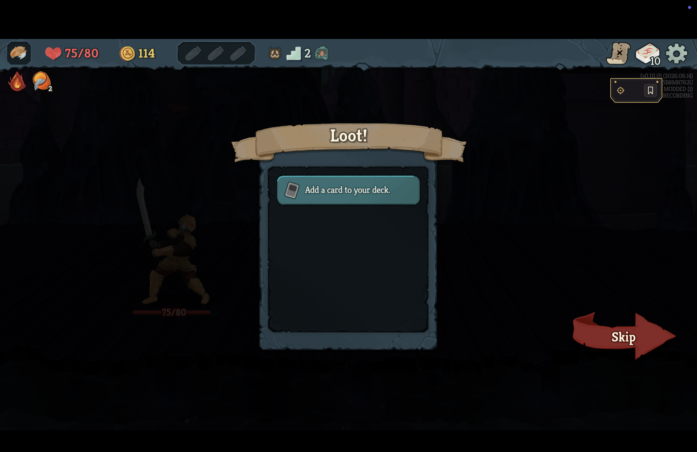
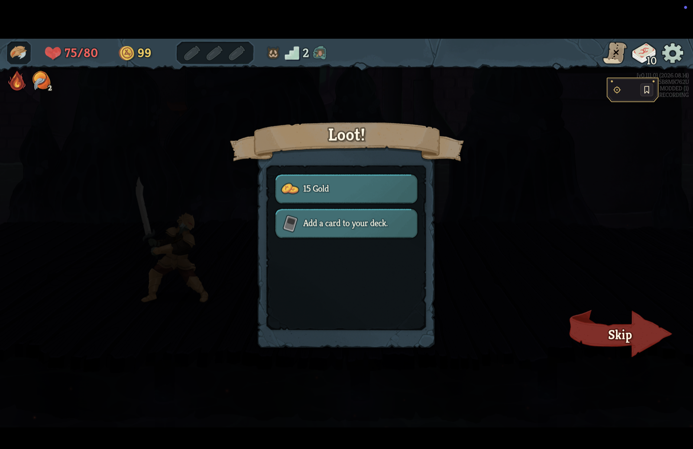
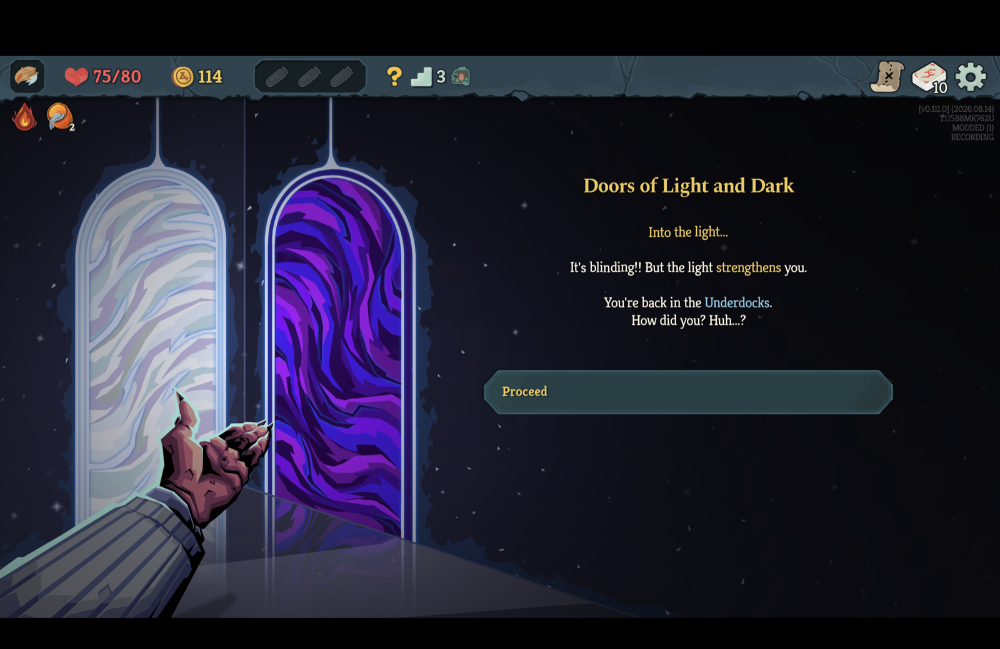
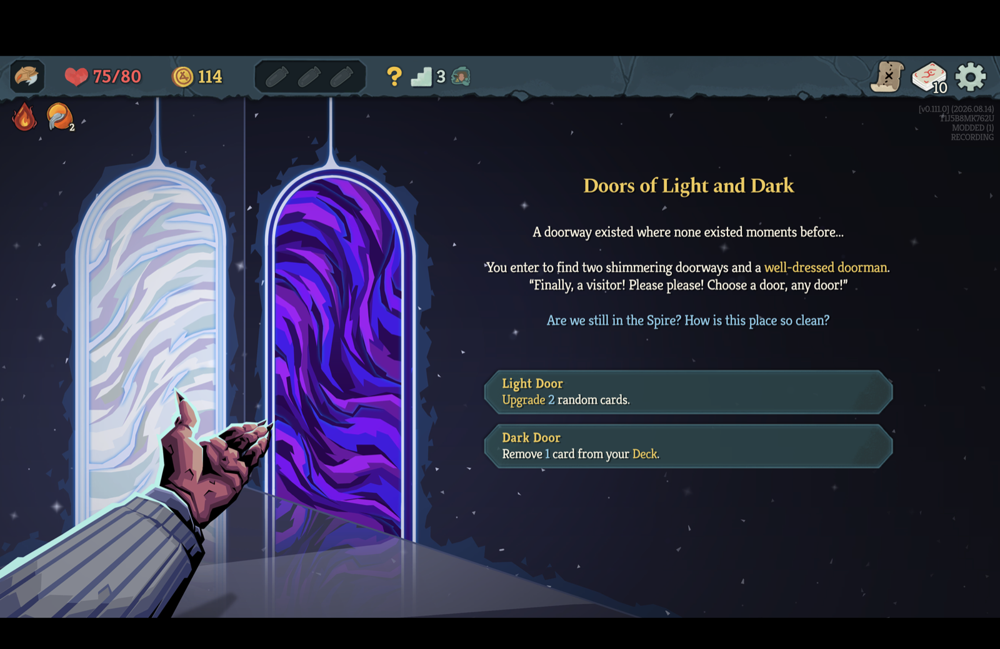
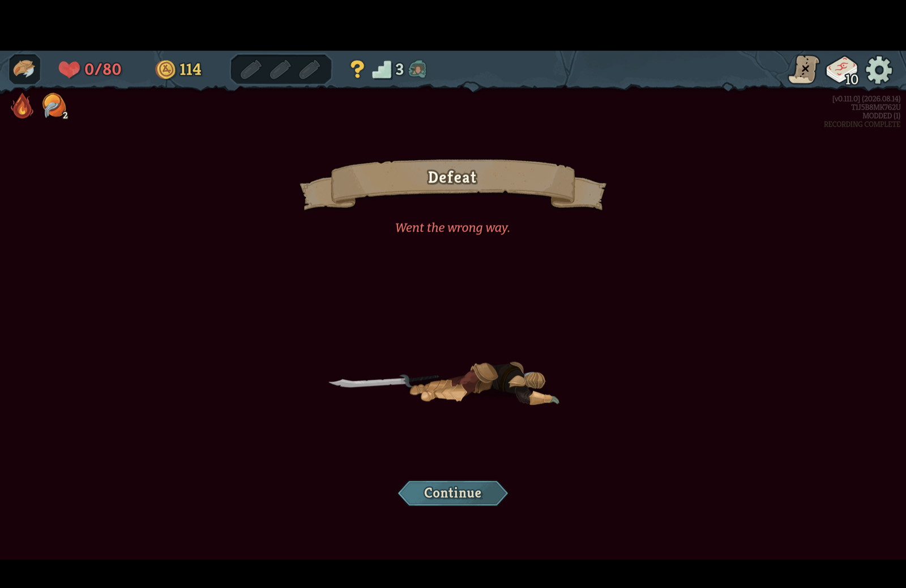

# Continue returns to the game's latest save, and the recording stays continuous; publication still fails after a non-fight Continue

*2026-09-15T03:50:40Z by Showboat 0.6.1*
<!-- showboat-id: b7114683-3162-471e-8910-e8ed5e926d5d -->

The game saves the run at five moments and nowhere else: as the run begins, inside every map-point arrival before the room is rolled, when a fight is won, when an ancient event finishes, and again with the reload count on Continue. Continue restores the latest of them, so what was done after it is undone and re-offered: the loot back on the screen, the shelf restocked, the rest site untaken, the event page unturned. The recorder now writes each of those saves to its journal as it lands, and a Continue that returns to the latest one is continuous, with the undone decisions kept as a discarded branch the gate replays. A Continue from an older save is a reload and rewound; a Continue nowhere in the journal is broken. What this restores is continuity: a run continued outside a fight after a won one validates and is playable, and still fails `./scripts/arbiter gate` on reproduction at the first non-fight arrival after the Continue, for the reason the retail section at the end shows; the projection migration that fixes that is the next slice, not this one. Everything below is driven headlessly through the real engine from the saves the game itself took, by `RecorderContinueTests`, with the recordings it writes kept under `build/demo-scratch` for this document to read.

```bash
export RECORDER_CONTINUE_RECORDINGS="$(cd .. && pwd)/build/demo-scratch/save-points"; rm -rf "$RECORDER_CONTINUE_RECORDINGS"; dotnet test ../tests/Sts2PilotTrainer.Mod.Tests -c Release --nologo --no-build --filter "FullyQualifiedName~RecorderContinueTests" 2>&1 | grep -E "^(Passed!|Failed!)"
```

```output
Passed!  - Failed:     0, Passed:    13, Skipped:     0, Total:    13, Duration: 6 s - Sts2PilotTrainer.Mod.Tests.dll (net9.0)
```

Thirteen scenarios, every one driven from a save the game itself asked for through `RunSaveInterception` and restored through `GameSession.RestoreSavedRun`, the retail Continue headlessly: Neow's room and a live fight (the two Continues #71 fixed), a shop arrival after a won fight (#72), and now the loot screen after a claim, the map after the rewards, a shop purchase, a rest, an ordinary event's page, a Continue from an older save than the latest, a Continue into a state nobody recorded, and the Neow re-offer both ways. Every recording each scenario wrote, read back: its continuity, where the game saved (`source.native.save_points`, as the decision each save holds the state after), and every discarded branch with where it returned to, whether it was a reload's, and what it held.

```bash
find ../build/demo-scratch/save-points -name "*.replay.json" | sort | while read m; do jq -r "[.source.native.continuity, (.source.native.save_points|map(.after_seq)|tostring), (.source.native.discarded // [] | map(\"to \\(.rollback_to_seq)\\(if .reload then \" by reload\" else \"\" end): \\(.actions|map(.verb)|join(\",\"))\")|join(\" | \"))] | @tsv" "$m"; done | column -t -s "$(printf \"\\t\")"
```

```output
rewound     [1,2,11]                          to -1 by reload: ChooseNeowBlessing,SelectCardFromScreen
rewound     [1,2,11]                          to 2 by reload: PlayCard,PlayCard,PlayCard,EndTurn,PlayCard,PlayCard,EndTurn,PlayCard,PlayCard
continuous  [1,2,11,14,25,28,30,44,47]        to 47: ChooseEventOption
continuous  [1,2,11,14,25,28,30,44,47,70,73]  to 73: ChooseRestSiteOption
continuous  [1,2,11,14,25,28]                 to 28: ShopPurchase
continuous  [1,2,11]                          to -1: ChooseNeowBlessing,SelectCardFromScreen
continuous  [1,2,11]                          to 11: ClaimReward | to 11: ClaimReward
continuous  [1,2,11]                          to 11: ClaimReward,SkipRewards
```

Reading the rows: the run-start save is never listed and is what a return to -1 is; 1 is the blessing's card-screen answer, which shares the blessing's state and is where the finished ancient event saved; 2 is the arrival at the first fight; 11 the play that won it. The shop purchase, the rest, the event page, the claimed reward and the reward-then-skip each came back at the latest save with the decision kept as the branch and the recording continuous; the loot screen quit twice holds two branches at the same save, the second recorded on the restored run. The Neow re-offer is continuous where the finished event's save never reached the disk (the journal holds no line for it, which is what a crash before the game's write completes leaves) and a reload where it did, because Continue then restored an older save than the latest; the Continue from the arrival save after the fight was won is the same reload with the whole fight as its branch. The Continue into a state nobody recorded wrote no manifest: it stopped the watch as broken. The journal behind the shop scenario, with only the save-point and rollback lines shown - the save on decision 28 is the shop arrival, the rollback to it is written without `reload`, and the purchase it discarded is decision 29:

```bash
m="$(for f in $(find ../build/demo-scratch/save-points -name "*.replay.json"); do jq -e ".source.native.discarded[0].actions[0].verb == \"ShopPurchase\"" "$f" >/dev/null 2>&1 && echo "$f"; done | head -1)"; grep -hE "\"save_point\"|\"rollback\"" "${m%.replay.json}.journal.jsonl"
```

```output
{"save_point":{"after_seq":1,"run_clock_ms":0}}
{"save_point":{"after_seq":2,"run_clock_ms":0}}
{"save_point":{"after_seq":11,"run_clock_ms":0}}
{"save_point":{"after_seq":14,"run_clock_ms":0}}
{"save_point":{"after_seq":25,"run_clock_ms":0}}
{"save_point":{"after_seq":28,"run_clock_ms":0}}
{"rollback":{"rollback_to_seq":28,"rollback_to_digest":"sha256:d0891445e9b2baeb2b351e34a142e58572c93ec3f29da4b10ae528abacf836f5","discarded_from_seq":29,"discarded_through_seq":29}}
```

The same recording through the arbiter's validator on the file, which holds every save point to a decision the history made and every branch that is not a reload's to one of them:

```bash
m="$(for f in $(find ../build/demo-scratch/save-points -name "*.replay.json"); do jq -e ".source.native.discarded[0].actions[0].verb == \"ShopPurchase\"" "$f" >/dev/null 2>&1 && echo "$f"; done | head -1)"; ../scripts/arbiter validate "$m" 2>&1 | grep -vE "^(manifest|path)" | head -5
```

```output
integrity: complete
structure: VALID

```

## The retail client

The v0.111.0 client ran this branch on 2026-09-14, built and installed through `scripts/install-mod.sh`, launched directly with `--force-steam=off` and never through Steam, on the isolated non-Steam save tree's first profile, whose runs are only this project's; the captain's Steam tree hashed identical before and after, and the profile pointer was put back to where it was. Every click checked the console lock and that the game was frontmost and refused otherwise. Screenshots are the 1512 × 982-point display scaled to 1600 pixels wide. Ironclad, no ascension, run `native-T1J5B8MK762U-20260915-062336`: the blessing, a fight won, the loot screen, a ? node that resolved to an event, and Save and Quit followed by Continue at two moments before a Give Up. Two earlier runs on this branch found two defects the headless suite could not: the client rolls the rewards on its own clock after the killing play has settled, so the play's own reading never matches the restored loot screen and the claim's before-reading is what does; and the loot screen's skip is declined from inside the map move that leaves the room, so the arrival's save was placed on the skip by a rule that only knew something was in flight. Both are in the code above this document and in the suite.

The loot screen with the 15 gold claimed (114 gold), then Save and Quit from the pause menu and Continue from the main menu.

```bash {image}

```



Continue brings the loot screen back with the 15 gold on offer again and the overlay reading RECORDING. The log: `continuing the recording of native-T1J5B8MK762U-20260915-062336 at decision 8; continuity continuous`, then `the game returned this run to decision 7, its latest save; 1 decision(s) made after it are kept as a discarded branch`. Decision 7 is the killing play, where the fight-won save landed; the claim is the branch.

```bash {image}

```



The gold claimed again, the rest skipped, and the ? node above resolved to Doors of Light and Dark. The Light Door chosen: two random cards upgraded, the event on its Proceed page.

```bash {image}

```



Save and Quit on that page, Continue: an ordinary event takes no save of its own, so the game restores the arrival and offers both doors again, and the log reads `continuing the recording ... at decision 11; continuity continuous` then `the game returned this run to decision 10, its latest save; 1 decision(s) made after it are kept as a discarded branch` - decision 10 is the arrival, and the door is the branch.

```bash {image}

```



Give Up from the pause menu. The overlay reads RECORDING COMPLETE and the log `recorded native-T1J5B8MK762U-20260915-062336: abandoned, 11 decision(s), 5 boundary/boundaries, continuity continuous, integrity complete`; `./scripts/arbiter validate` says VALID and the manifest lists save points after decisions 0, 1, 7 and 10 with two branches, neither a reload's.

```bash {image}

```



`./scripts/arbiter gate` on that recording: **pass** publication-source, provenance, **continuity** - which is what this change is for, and which the loot-screen Continue alone refused before it - and environment; **FAIL** reproduction, at the floor-3-entry checkpoint: `combat.turn observed '1', engine produced '2'`, with the discarded-branches, covered-fight, declared-boundaries, combat-boundary, determinism and rejection conditions failing behind it for want of a verified reproduction. That checkpoint is the arrival at the event, and the value is the previous fight's residue: the run the game restored on the loot screen carries a fresh combat state in place of the fight's own, the engine carries the fight as it was fought, and `CanonicalStateProjection` emits that residue into every reading until the next fight replaces it. The recording is honest about what the client showed; the projection is what has to stop carrying a finished fight, and AGENTS.md reserves that change for its own migration because every committed boundary digest moves with it. Until then a run continued outside a fight is continuous, playable and validates, and fails the gate at the first non-fight arrival after the Continue.
