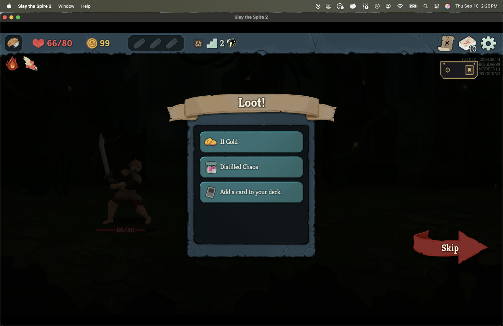
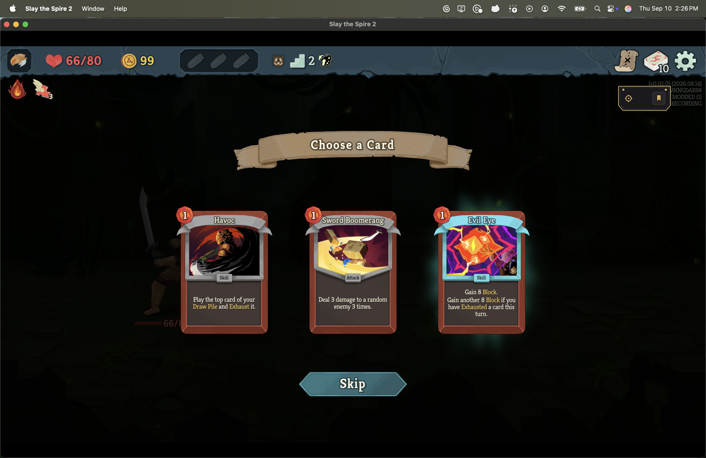
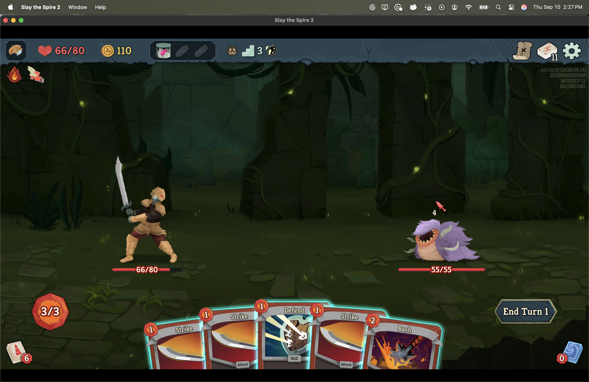
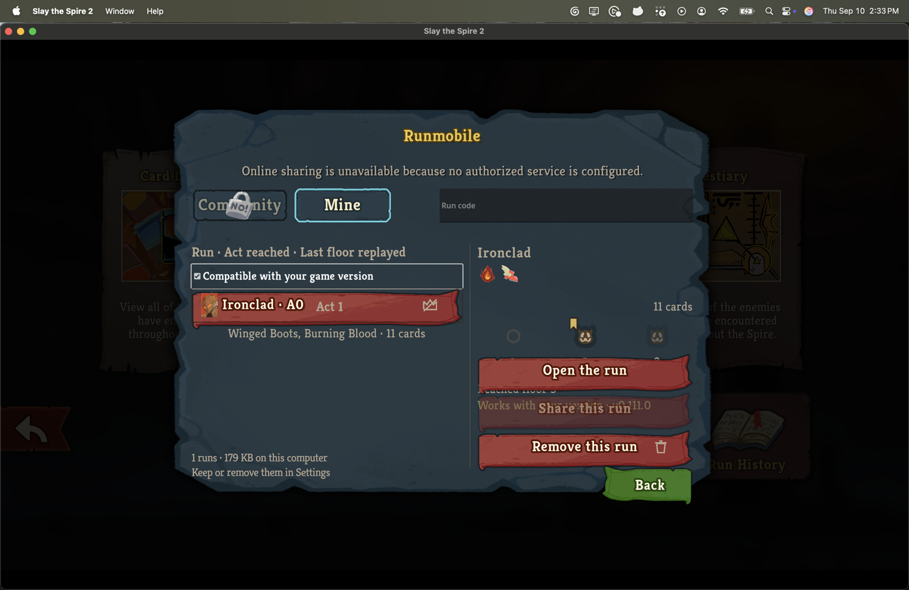
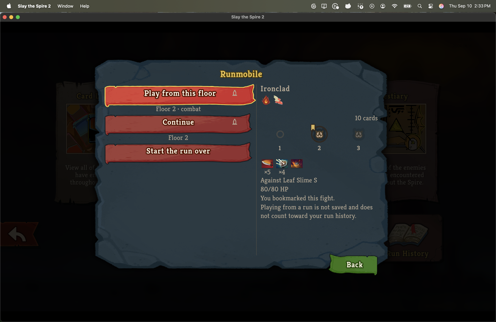
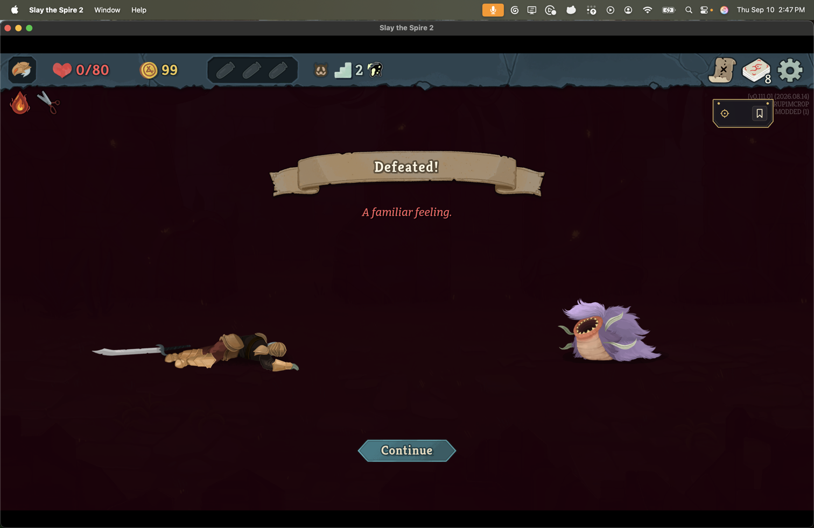
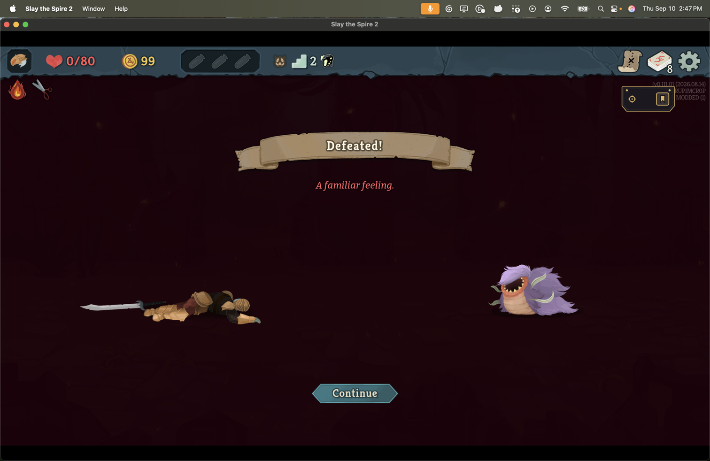
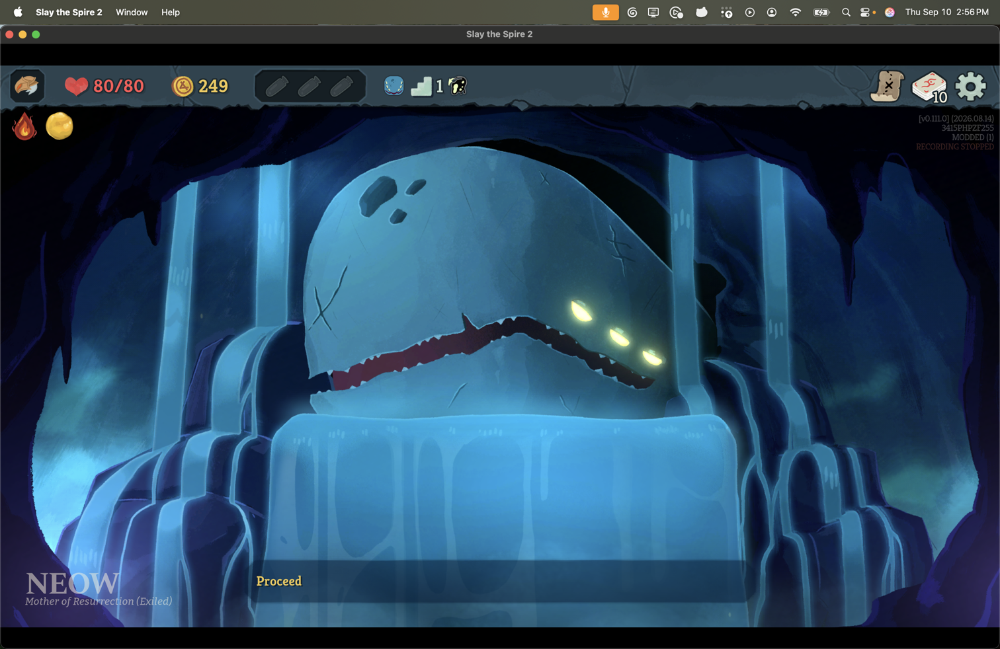
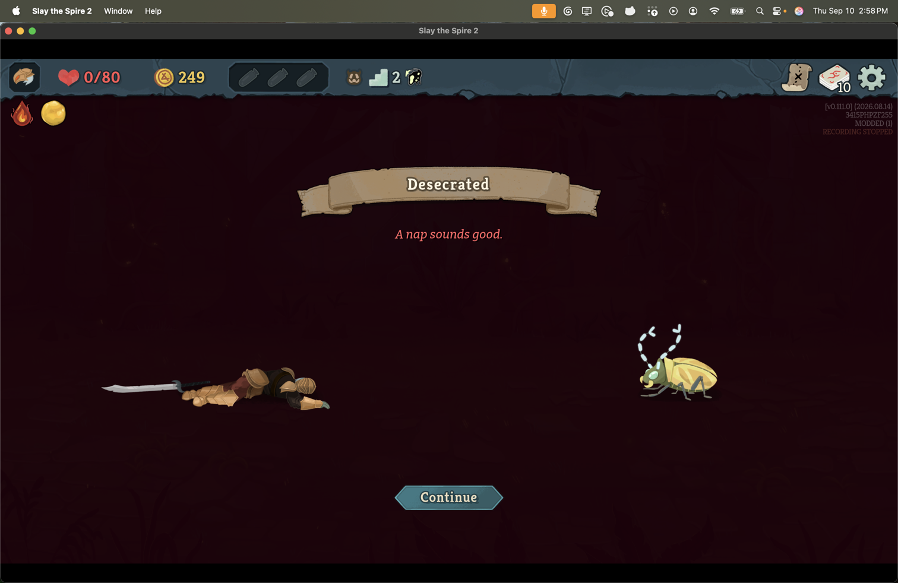

# Bookmark a fight at the moment it ends

*2026-09-10T22:01:19Z by Showboat 0.6.1*
<!-- showboat-id: 4efe20e4-5315-43f6-81ec-839055b0cb88 -->

The v0.111.0 retail client ran this branch, built and installed through `scripts/install-mod.sh`, three times on 2026-09-10: at the head the pipeline had validated, and once after each of the two recorder changes below. It was launched directly with `--force-steam=off`, without invoking Steam, on the isolated non-Steam save tree's second profile, whose runs are only these. The console lock state was read into a variable from `IOConsoleLocked` and was unlocked before every click; every click checked that the game was the frontmost application first and refused otherwise. Commands start at the windowed main menu on a 1512 × 982-point display. The screenshots are the display at that size; the game's own version overlay at the top right names the run's seed.

## The fight that was won

The Ironclad won the first fight of a fresh run. The tag hangs under the top bar the moment the loot screen is up, hollow: the mod's mark at the left, the bookmark control at the right, in the transport's own material on the transport's own anchor.

```bash {image}
runmobile-bookmark-loot-offered.png
```


Pressed, it fills gold. The journal gained one line at that instant: `{"bookmark":{"fight":1,"on":true,"after_seq":14,"run_clock_ms":222000}}`.

```bash {image}
runmobile-bookmark-loot-marked.png
```



The card-reward screen the loot opens is the same stretch of the run, so the tag stays, still filled.

```bash {image}
runmobile-bookmark-card-reward-marked.png
```



Pressing again is the undo: hollow, and a second line with `"on":false`. A third press put it back, and the manifest written at the run's end carries the one entry the last line per fight says.

```bash {image}
runmobile-bookmark-card-reward-unmarked.png
```


The map move to the next floor is where the stretch ends. The next fight opens with no tag.

```bash {image}
runmobile-bookmark-gone-after-map-move.png
```



## In the library

After the run ended, the Mine tab lists it, and the pane's strip hangs the gold tab off the bookmarked fight's floor. The Community pane reads the same positions through the same code and draws the same cell; no sharing service is configured on this tree, so that tab is locked here and was not captured.

```bash {image}
runmobile-bookmark-mine-pane.png
```



The opened run, with that floor selected: the tab, the selected ring, and the sentence "You bookmarked this fight." among the fight pane's facts.

```bash {image}
runmobile-bookmark-open-run.png
```



## The fight that was lost, and what it found

At the pipeline's head, the death screen offered nothing. The recording of that run shows why: the ended turn the player died in was never written, the fight was left live, and the manifest held no boundary for it - the game calls `RunManager.OnEnded` from inside the killing enemy turn and the combat manager raises `CombatEnded` only afterwards, so a recorder that finished at the first had nothing to close the fight with. `RunRecorder.End` now holds a loss with a fight live until the engine's own `CombatEnded` closes it, and finishes then. With that installed, the same loss on the same profile:

```bash {image}
runmobile-bookmark-death-offered.png
```



Pressed on the death screen. The manifest was already on disk, and was written again with the bookmark in it; the run clock is the killing decision's own, because the game's run is no longer in progress by the time this screen is up: `{"fight": 1, "bookmarked": {"Value": true, "Source": "Declared", "Evidence": {"action_ordinal": 12, "run_clock_ms": 224000}}}`. The recording's last action is that decision, `12 EndTurn` at `run_clock_ms 224000`, and its boundaries now hold the lost fight's `combat_start` and nine turn starts.

```bash {image}
runmobile-bookmark-death-marked.png
```



## A recording that stopped offers nothing

A run was saved on its first floor and its journal's last digest was altered by hand before Continue, which is a resume the recorder cannot account for. The overlay says so - RECORDING STOPPED - and the run went on.

```bash {image}
runmobile-bookmark-recording-stopped.png
```



Lost on the next floor: no tag on the death screen, a press where it would hang writes nothing, and the manifest records the loss with continuity broken and no bookmarks.

```bash {image}
runmobile-bookmark-broken-no-tag.png
```



## Nothing outside the store changed

`./scripts/protected-files.sh compare` against a ledger taken before the first launch, with the user's home replaced by `~`, reported the mod's own reinstall under `mods/Runmobile/`, the game's own saves for the profile that was played and its profile list, the four recordings and journals under `user://Runmobile/`, and the game's log churn. Nothing else.
