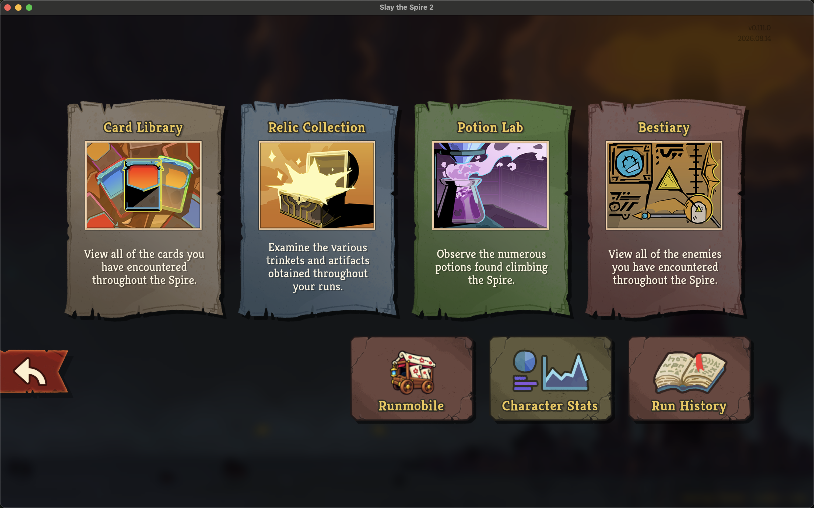
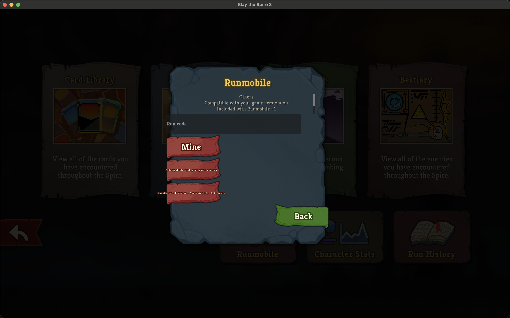

# Runmobile in the Compendium

*2026-09-07T21:11:55Z by Showboat 0.6.1*
<!-- showboat-id: ca20bf91-c3ba-48c5-84c6-4d14daaede1c -->

Initiating trigger: launch the installed Runmobile mod through Steam and open Compendium from the main menu.

Masking condition in the reported session: the installed directory was a stale pre-rename build (`has_pck: false`, the old Combat Trainer module, and a library visibility check that tried to read an absent prepared assembly).

Visible symptom: the live Compendium showed Character Stats and Run History but no Runmobile destination.

The corrected package uses the otherwise vacant Leaderboards slot for a native bottom-row destination and loads the same wagon resource as the mod list.

```bash {image}
runmobile-compendium-entry.png
```



Activating the wagon card opens the existing Runmobile browser, including Others, Mine, compatibility filtering, direct run-code lookup, and the included recording.

```bash {image}
runmobile-library-open.png
```



```bash
sips -g pixelWidth -g pixelHeight runmobile-compendium-entry.png runmobile-library-open.png | sed 's#^.*/##'
```

```output
runmobile-compendium-entry.png
  pixelWidth: 3024
  pixelHeight: 1888
runmobile-library-open.png
  pixelWidth: 3024
  pixelHeight: 1888
```
