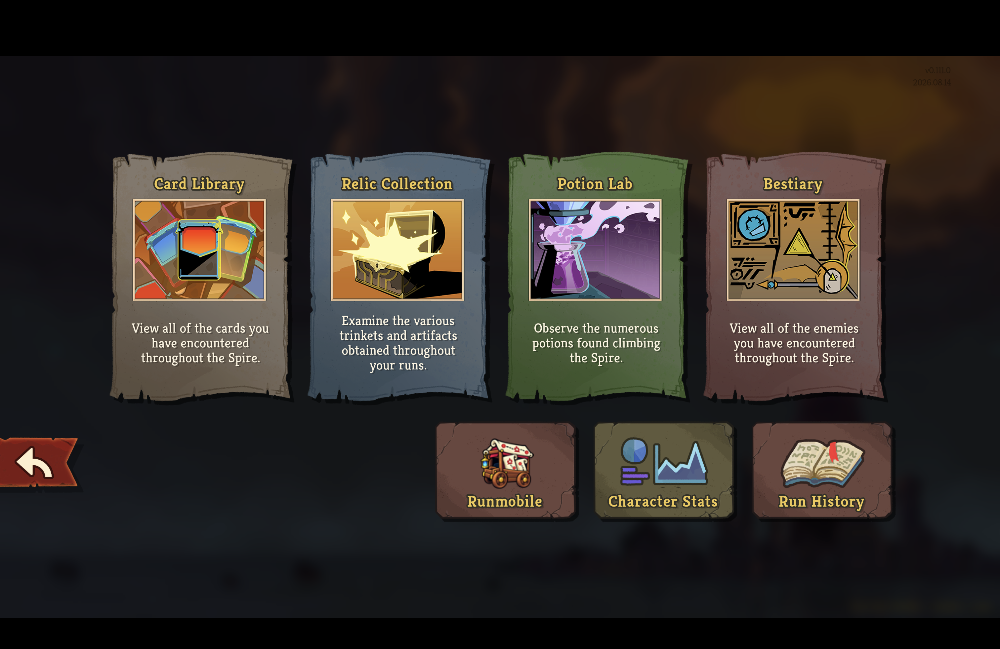
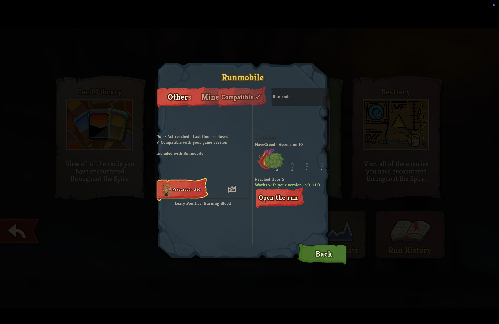
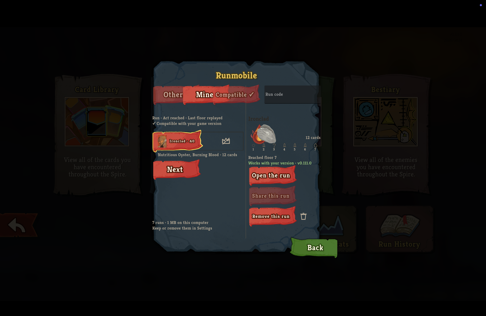
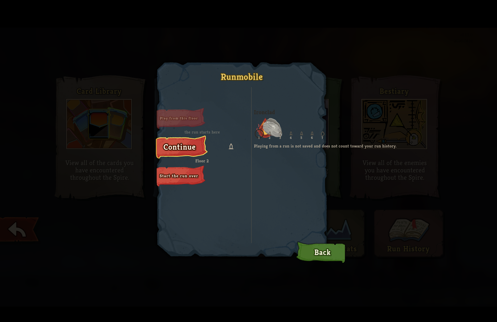

# Runmobile parchment run library

*2026-09-08T03:07:36Z by Showboat 0.6.1*
<!-- showboat-id: 796200b4-34a4-4deb-8b4e-a1081741ebbf -->

The supported installer placed this branch in the retail client, which was launched directly with `--force-steam=off` and a profile containing recorded runs.

The actual Compendium shows Runmobile as a native destination beside the game’s own entries.

```bash {image}

```



Opening that destination renders the parchment browser with the two-line filter header, a character portrait, act reached, relics, the numbered run strip, and the selected run’s reached floor without clipping.

```bash {image}

```



The Mine control opens the player’s recorded runs, retains pagination and removal behavior, and keeps the retention summary inside the left pane.

```bash {image}

```



The Open the run control reaches the playable run view, whose entry controls and selected-floor details remain readable at the retail resolution.

```bash {image}

```



```bash
sips -g pixelWidth -g pixelHeight runmobile-compendium-parchment.png runmobile-library-parchment.png runmobile-library-mine.png runmobile-library-open-run.png | sed 's#^.*/##'
```

```output
runmobile-compendium-parchment.png
  pixelWidth: 3024
  pixelHeight: 1964
runmobile-library-parchment.png
  pixelWidth: 3024
  pixelHeight: 1964
runmobile-library-mine.png
  pixelWidth: 3024
  pixelHeight: 1964
runmobile-library-open-run.png
  pixelWidth: 3024
  pixelHeight: 1964
```
