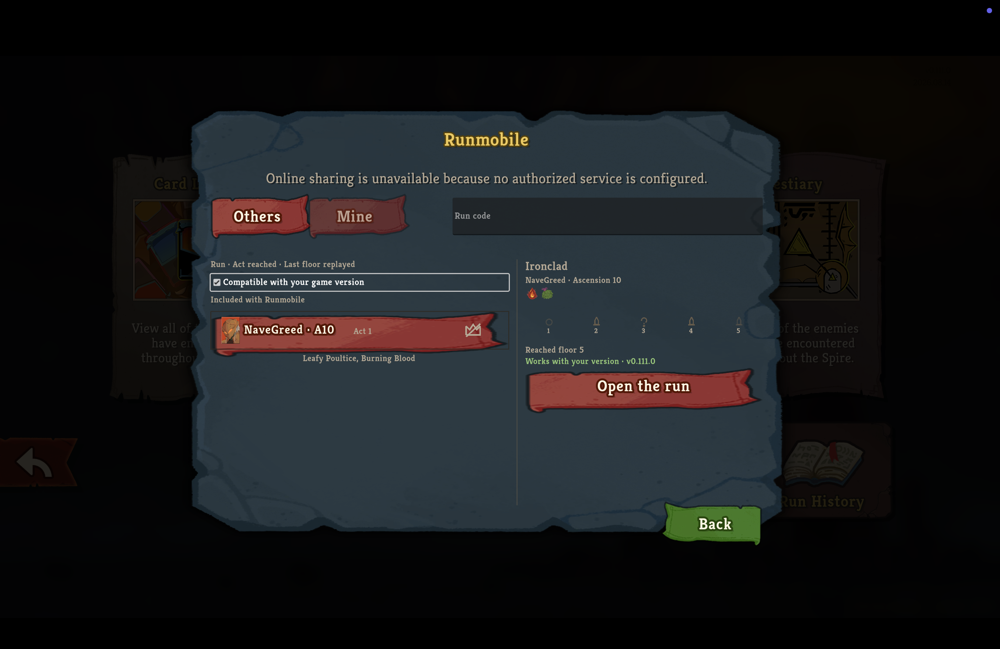
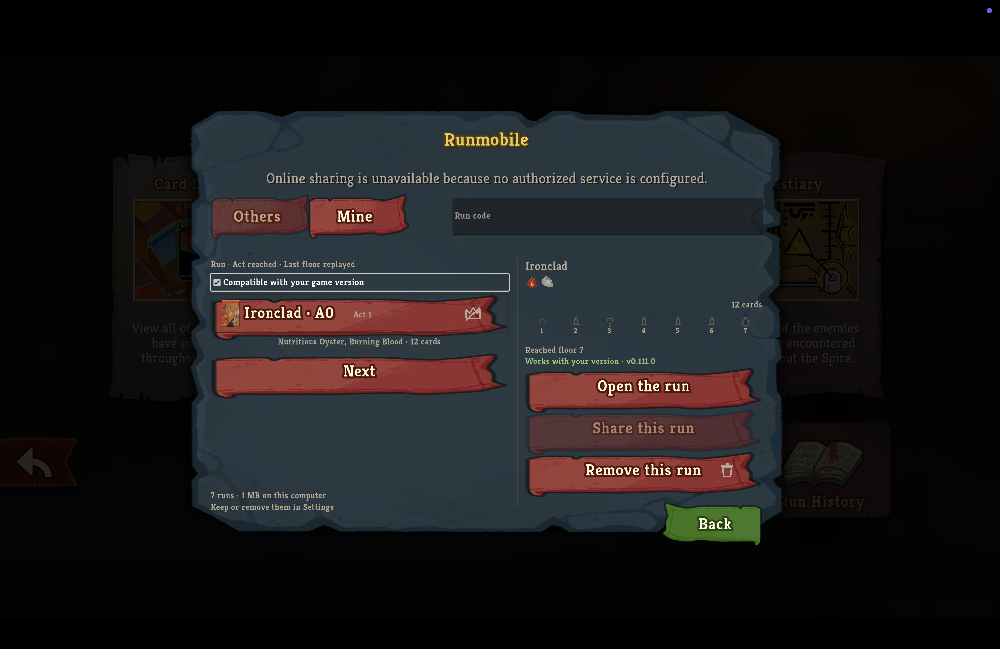
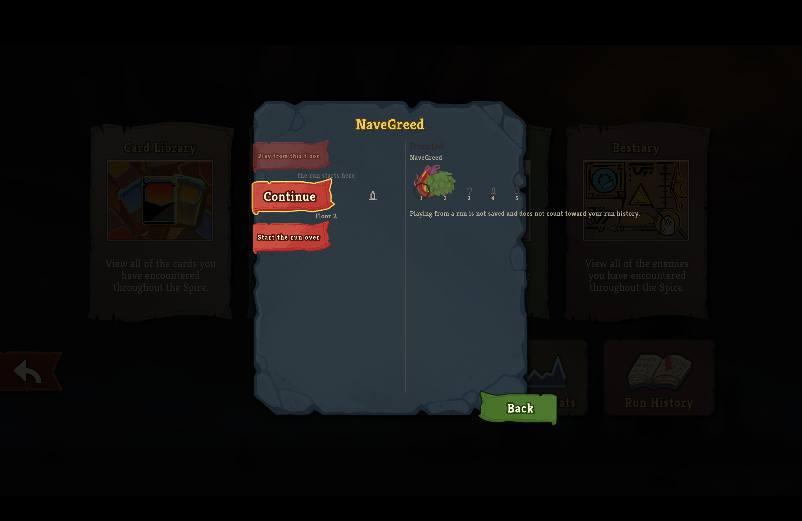
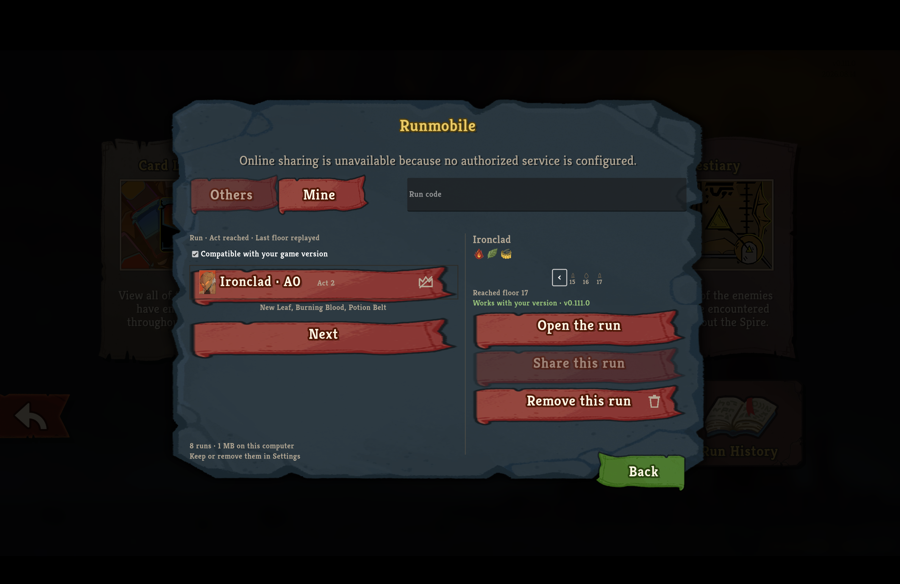
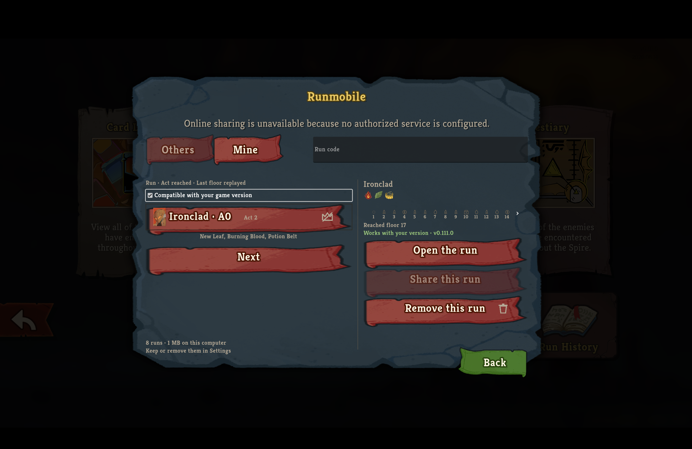

# Runmobile library in the retail client

The supported installer built and installed this branch for the v0.111.0 retail client.
The client was launched directly with `--force-steam=off`, without invoking Steam.
These captures replace the earlier screenshots rather than reusing them.
The commands below start in the retail Compendium with the game fullscreen on a 1512 × 982-point display.

```bash
screencapture -x runmobile-compendium-parchment.png
```

```output
```


```bash
cliclick c:766,720; sleep 2; screencapture -x runmobile-library-parchment.png
```

```output
```



```bash
cliclick c:538,326; sleep 2; screencapture -x runmobile-library-mine.png
```

```output
```



```bash
cliclick c:390,326; sleep 1; cliclick c:958,585; sleep 2; screencapture -x runmobile-library-open-run.png
```

```output
```



The game-present Mod, Replay, and Trainer suites passed without skips.
The concurrent Arbiter run hit its session timeout; an isolated rerun passed with a bounded thirty-minute budget and no skips.
The publication gate returned PUBLISHABLE.
[The local check record](runmobile-library-game-present-checks.json) names every environment-gated test and its executed cases.

## Keyboard floor-strip paging in the retail client

The v0.111.0 retail client ran commit `ab80d35e5312ae0574788322c3f2df027a7849db`, built and installed through `scripts/install-mod.sh`.
It was launched directly with `--force-steam=off` into the existing non-Steam test profile without driving the running Steam process.
The repository’s `synthetic-v0111-whole-act` fixture supplies the long strip; this is not player history.
The profile was unchanged and remained in mouse-and-keyboard mode, where E maps to `ui_confirm`, Space maps to `mega_peek`, and Enter is unbound.
The separate keyboard-only convention maps Enter to `ui_confirm` and Space to `ui_select`, but that mode was not exercised in this session.
Commands start at the fullscreen main menu on a 1512 × 982-point display.

```bash
cliclick c:608,799; sleep 2
cliclick c:766,720; sleep 2
cliclick c:538,326; sleep 2
cliclick kp:arrow-right; sleep 1
cliclick kp:arrow-right; sleep 1
screencapture -x runmobile-confirm-next-ready.png
```

```output
```

```bash {image}
runmobile-confirm-next-ready.png
```


```bash
osascript -e 'tell application "System Events" to key code 14'
sleep 1
screencapture -x runmobile-confirm-next-activated.png
```

```output
```

```bash {image}
runmobile-confirm-next-activated.png
```


Pressing the profile’s E confirm binding on focused Next displayed floors 15–17.

```bash
cliclick kp:arrow-right; sleep 1
screencapture -x runmobile-confirm-previous-ready.png
```

```output
```

```bash {image}
runmobile-confirm-previous-ready.png
```



```bash
osascript -e 'tell application "System Events" to key code 14'
sleep 1
screencapture -x runmobile-confirm-previous-activated.png
```

```output
```

```bash {image}
runmobile-confirm-previous-activated.png
```



Pressing E on focused Previous returned to floors 1–14.
Both directions used the profile’s real `ui_confirm` binding rather than mouse clicks on the pager.
The captures show the strip and controls contained within the parchment pane without clipping.
The built and installed Runmobile assemblies had matching SHA-256 digests.
The owned retail process and bounded awake assertion were released after the session.
The protected-files comparison reported no protected-file or Runmobile-store changes; only the game’s logs changed.
Physical-controller activation remains unproved and deferred to PC testing.
