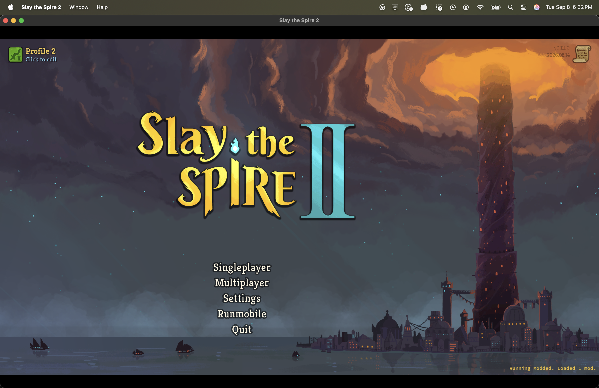
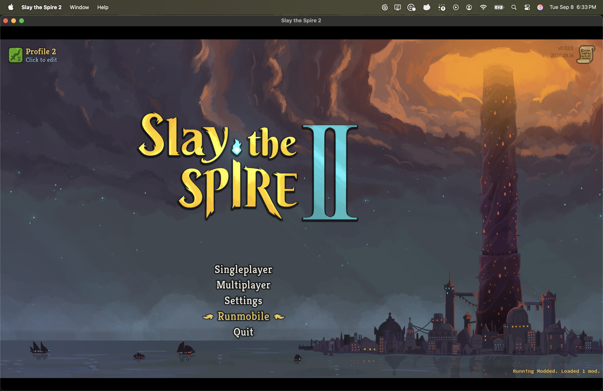
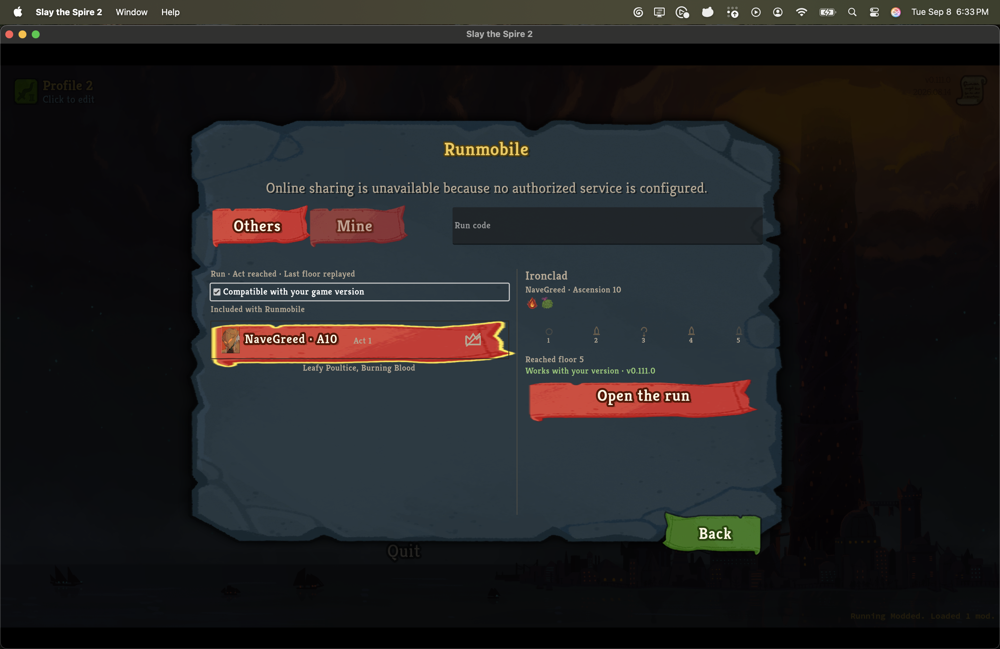
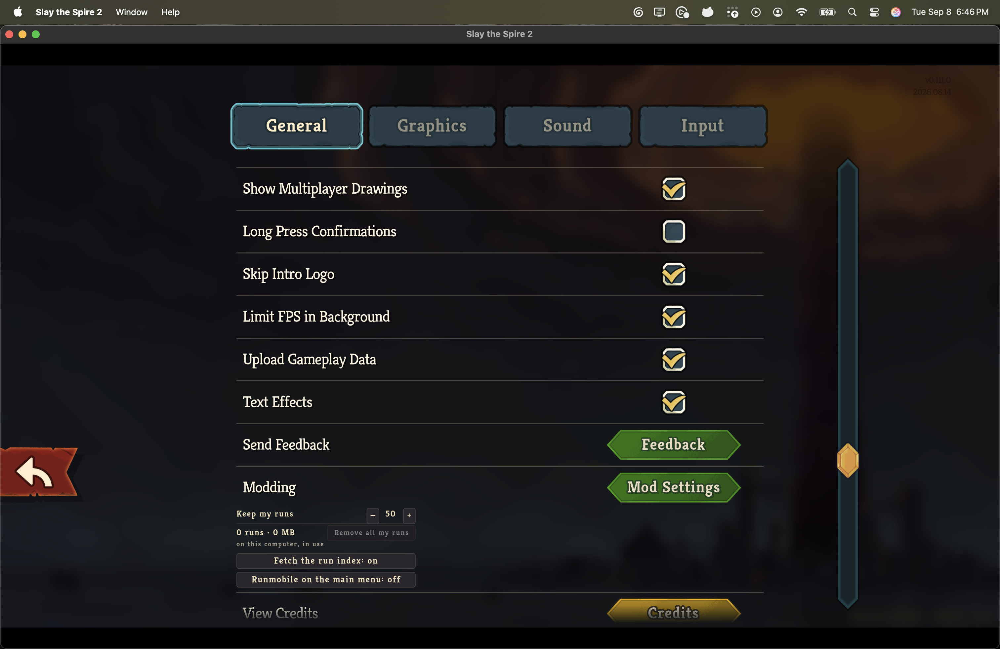
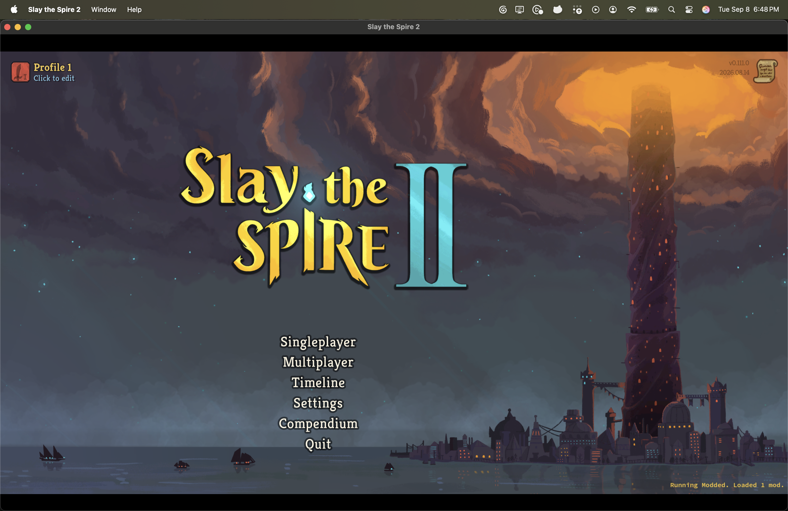
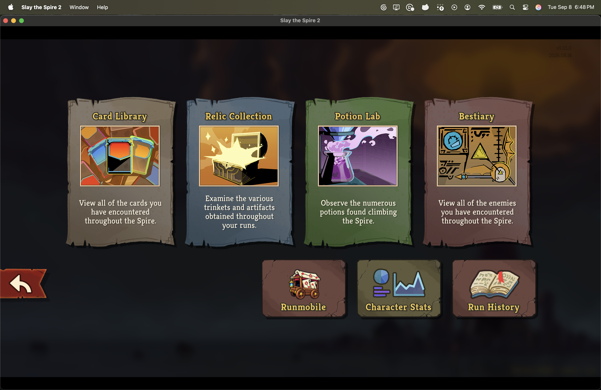

# Runmobile on the main menu, for a player who has never finished a run

*2026-09-09T01:52:13Z by Showboat 0.6.1*
<!-- showboat-id: 83483ea8-f515-496b-b3ce-6f0ddaf2e0f0 -->

The supported installer built and installed this branch for the v0.111.0 retail client.
The client was launched directly with `--force-steam=off`, without invoking Steam.

The reported blocker: the game sends a player with no finished run from Singleplayer straight to character select, and `SaveManager.IsCompendiumAvailable` is false for them, so the Compendium button is on neither the main menu nor the first run's pause menu.
Both of the run library's existing ways in - the Compendium card and the run-history plate - hang off surfaces that player never sees.

Two save profiles in an isolated non-Steam tree carry the two cases.
Save Profile 2 reports `Playtime 00:00` in the game's own picker and its `progress.save` holds `wins 0, losses 0, floors_climbed 0`; Save Profile 1 reports `Playtime 115:48:06`.
Neither profile had ever written `show_main_menu_row`, so every capture below is the default rule deciding rather than a stored choice, except where one is set on purpose and said so.

## A new player now has a route

Singleplayer, Multiplayer, Settings, **Runmobile**, Quit.
The row takes the slot directly under the game's own Compendium button, which is hidden for this player.

```bash {image}
runmobile-new-player-main-menu.png
```



It is the game's own furniture: the button is duplicated from `MainMenuTextButtons/CompendiumButton`, so the font, the cream-to-gold hover, the reticle brackets and the disabled treatment are MegaCrit's.
`ConnectMainMenuTextButtonFocusLogic` runs inside `NMainMenu._Ready`, before a postfix can add anything, so the row connects the two private reticle handlers itself.
This is that wiring working, under the pointer.

```bash {image}
runmobile-new-player-row-focused.png
```



Pressing it opens the existing browser - Others and Mine, the run-code field, the compatibility filter, the bundled NaveGreed run, the pane, and `Open the run`.
No new screen was built and there is still one playback path.

```bash {image}
runmobile-new-player-library.png
```



The game's own log recorded the moment the engine was taken, and it is the press rather than the menu's construction:

```
[INFO] [Runmobile] adopted the running game: 1660 models registered
```

## The player decides, and the settings row says which

Runmobile's settings row carries a fourth control.
It states what the menu is currently doing rather than what a press would do next.

```bash {image}
runmobile-settings-block.png
```



Turning it off wrote one member and left the rest of the file as it stood:

```
{
  "schema": "sts2-pilot-trainer/runmobile-settings/v1",
  "record_my_runs": true,
  "fetch_run_index": true,
  "sharing_service_url": null,
  "keep_recent_runs": 50,
  "purge_my_runs": false,
  "show_main_menu_row": false
}
```

Leaving Settings, the row is gone - in the same sitting, without relaunching.

```bash {image}
runmobile-row-hidden.png
```


## A player with run history does not get it by default

Save Profile 1 has 115 hours and its own Compendium.
No Runmobile row: the default is off for a player who can already reach the library, and turning it on is the same control.

```bash {image}
runmobile-progressed-main-menu.png
```



The Compendium card is untouched.
This is the disconfirming control that matters most here.
The first build of this change adopted the running game at `NMainMenu._Ready`, where the startup phase is still `Essential`, and `RunmobileMod.Adopt` latches its refusal for the process - so that build silently cost the Compendium card and the recorder as well as the row, while every test stayed green.

```bash {image}
runmobile-compendium-intact.png
```



## What these captures establish, and what they do not

Established in the retail client:

- A zero-run profile's main menu carries the row, and it opens the existing library.
- The row takes focus and draws the game's own reticle.
- The settings control writes `show_main_menu_row` and touches no other member.
- Turning it off removes the row on the next return to the menu, in the same sitting.
- A stored choice survives a relaunch and outranks the run count.
- A progressed profile has no row by default, and its Compendium card still works.
- Runmobile's settings block no longer overlaps the game's Modding heading or the credits row.

Not established here: anything about a run played from the row.
Entering a recorded fight is `RECORDED-FIGHT-ENTRY.md`'s, and nothing on that path changed.

