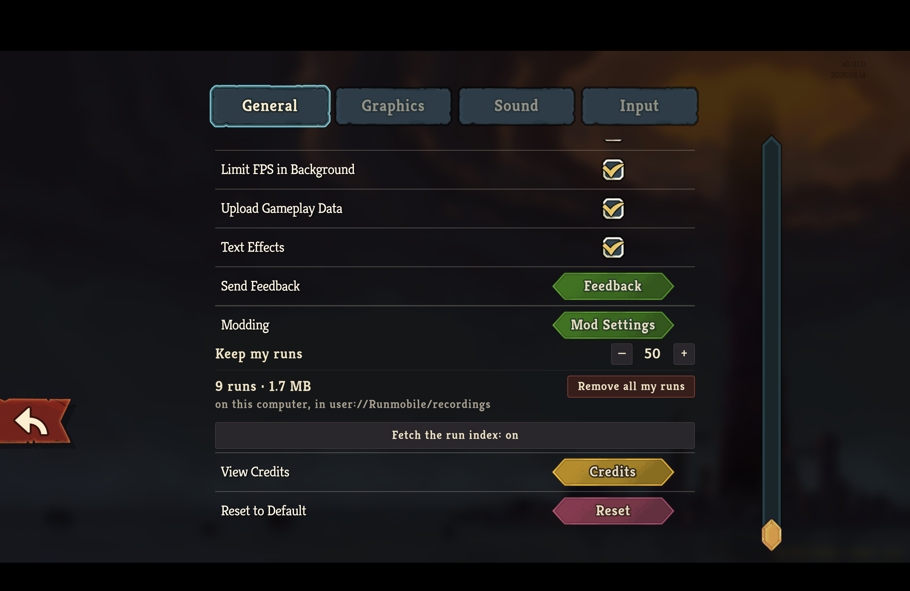

# Runmobile at the game's own font and size

The v0.111.0 retail client ran this branch, built and installed through `scripts/install-mod.sh`.
It was launched directly with `--force-steam=off` into the existing non-Steam test profile without driving the running Steam process.
The console lock state was read into a variable from `IOConsoleLocked` and was unlocked before the drive; the machine was held awake with `caffeinate` bound to the game process and released when it quit.
The installed `Runmobile.dll` had the same SHA-256 digest as the packaged build.
Commands start at the fullscreen main menu on a 1512 × 982-point display.

Every surface below draws its words at a size read off a native element beside it rather than at a number written down in this mod.
What that reference is per surface, and the three roles derived around it, are in [../docs/mod-ui-direction.md](../docs/mod-ui-direction.md) under "Type: the game's own, at the game's own size".

## The settings row, beside the game's own rows

```bash
cliclick c:610,758; sleep 3
cliclick dd:1279,242 m:1279,400 m:1279,650 m:1279,900 du:1279,900; sleep 2
screencapture -x runmobile-settings-row-native.png
```

```output
```



"Keep my runs" is drawn at the size of "Send Feedback" and "Text Effects" directly above it, its stepper sits at the column's right edge where the game puts its own controls, and the row follows the game's own Modding row as one more row of that column.

Three readings were taken before this one was right, and each is why the code says what it says.
Sizing the row from `%ModdingButton` clipped its words mid-word - "Keep my r" - because that button is a fraction of the column wide and its stepper took the rest once the text was the game's size.
Walking up the tree for something wider instead reached the screen and dragged every one of the game's own rows out to its edge, because a child's minimum width is a demand on its container.
The row is now a child of `NSettingsPanel.Content`, the `VBoxContainer` the game keeps one node per settings row in, read off the game's own code rather than guessed; it asks that container for height and never for width, and takes the width it is given once the container has sorted.

## The run library, on the game's own parchment

```bash
cliclick c:610,799; sleep 4; cliclick c:764,718; sleep 4
screencapture -x runmobile-library-native-type.png
```

```output
```


Every line Runmobile writes here - the list header, the row's second line, "NaveGreed · Ascension 10", "Reached floor 5", "Works with your version" - is the size of the popup's own description above them, which is the native element each of them stands in for.
"Ironclad" is the step above that: a heading over the pane, and deliberately not the size of "Runmobile", because the parchment's title is the screen's and two titles on one parchment is not a hierarchy.

```bash
cliclick c:535,327; sleep 3
screencapture -x runmobile-library-mine-native-type.png
```

```output
```


The strip's floor numerals and the counts under card tiles take the step below the supporting line, because they are marks on a glyph rather than lines of text.

## What this run did not cover

The playback tag and the fight result panel take their size from what the screen behind them draws ordinary text at, and neither was exercised here: both need a recorded fight walked in the client, which this session did not have the retail copy long enough to do.
Their headless containment is asserted across three surfaces and three text sizes by `FightResultPanelTests.FitsInsideTheSurfaceItIsGiven` and `PlaybackTransportStripTests.TheTagIsDrawnAtTheGamesOwnSizeAndGrowsWithIt`, which is a weaker claim than a capture and is stated as such.
