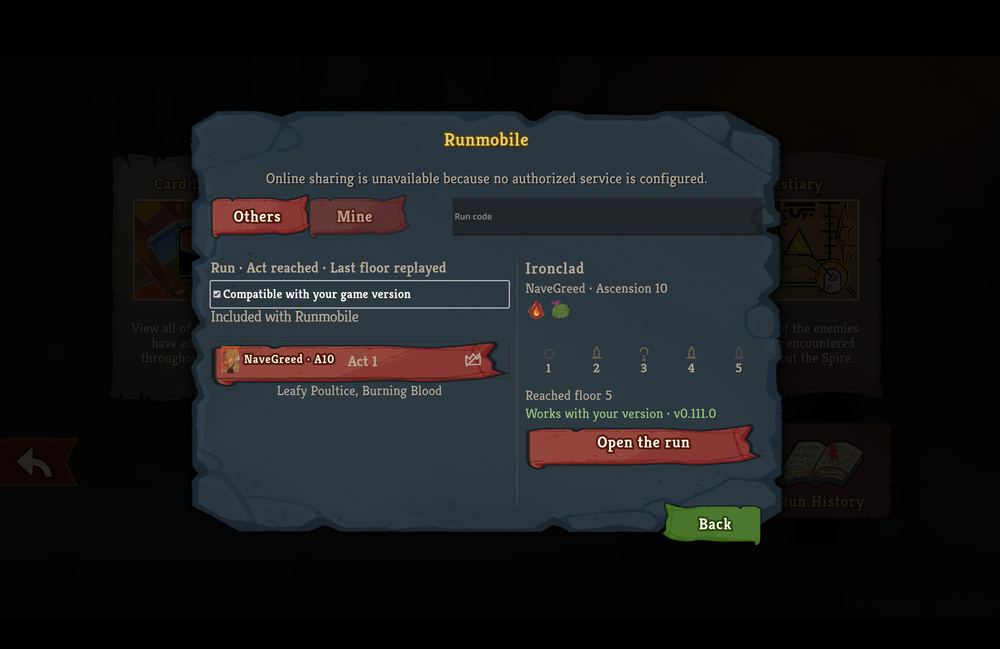
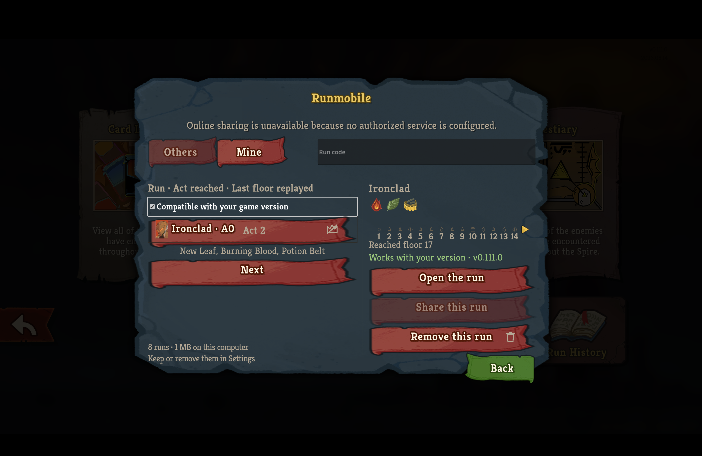
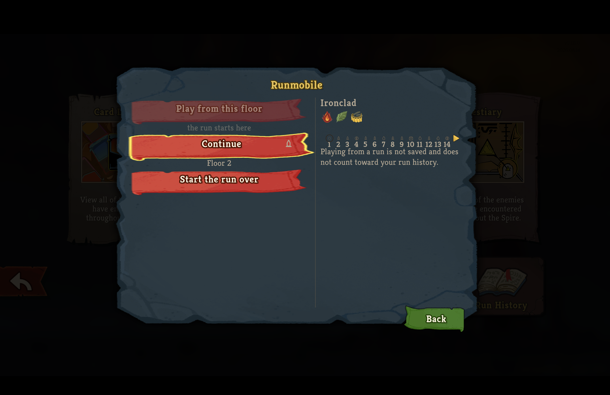
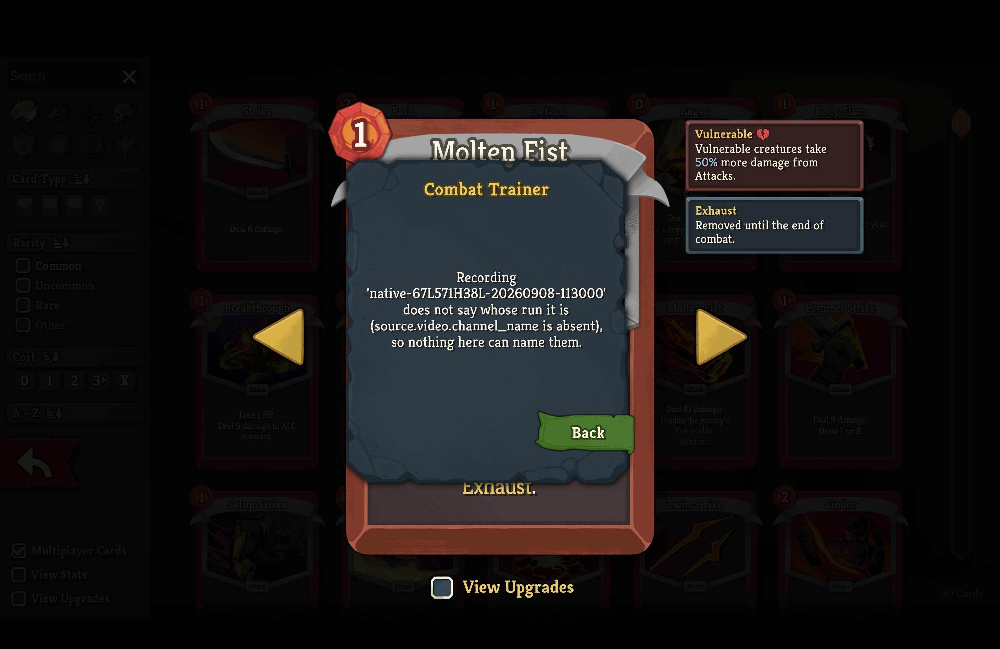
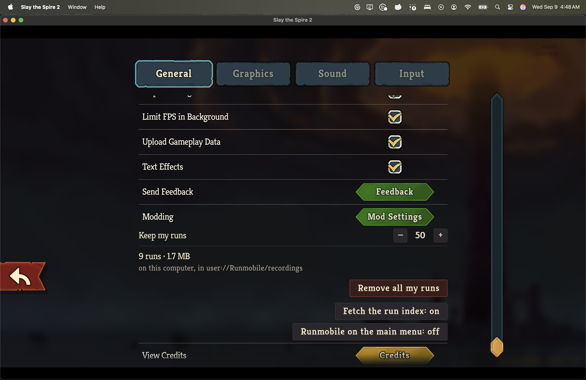
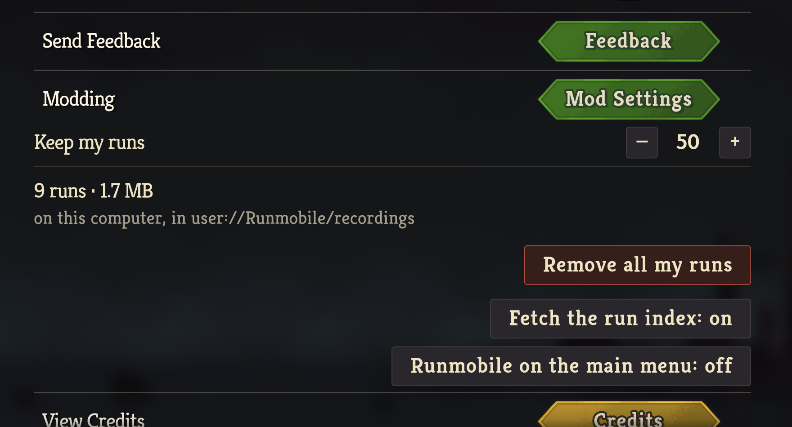

# Runmobile native-type capture

These screenshots show named-role typography in the v0.111.0 retail client.
The installed archives matched their builds' SHA-256 digests and ran fullscreen on the game's 1512 × 982 reference surface with `--force-steam=off`.

## Library Others tab

The library heading, supporting text, tabs, input, list headings, filters, run rows, facts, numerals, and buttons use the mapped native roles for their kinds.

## Library Mine tab

The Mine view shows the same named-role typography and the run strip pager's own gold arrow art from the game rather than a text chevron.

## Opened run pane

The selected run's identity, description, floor numerals, facts, and action use their mapped native roles.

## Refusal popup

The mod's refusal popup uses its mapped R1 title, R2 body, and R3 button roles.

## My Runs settings row

The row's label, readings, and controls take the full native settings column using the mapped roles for a settings row label, a settings value, and a button caption.
Its controls share the same right edge as the game's own controls on that screen.

## What these captures prove

The retail captures prove the library parchment's Others, Mine, and opened-run states at named-role typography, the run strip's native gold arrow art, the mod's refusal popup at its R1, R2, and R3 roles, and the My Runs settings row at its mapped native roles and full native column width.

The playback transport, fight-result panel, chronology paging, look-back ledger paging, and the restoring notice shown while a run is being restored are also not proven in the client.
Programmatic navigation was attempted and did not reach those surfaces, so they require manual navigation for a retail capture.
The restoring notice is the newest of them: it was added after the restore route's own retail proof was captured, so no capture covers the plate it draws, and an in-client capture of it is still owed.
This change covers them with automated paging and layout tests instead.
Those tests do not read the game's scene files, and the look-back ledger's role named a node v0.111.0 has not: the role table is now held against the shipped pack, which `docs/in-game-host.md` owns.
