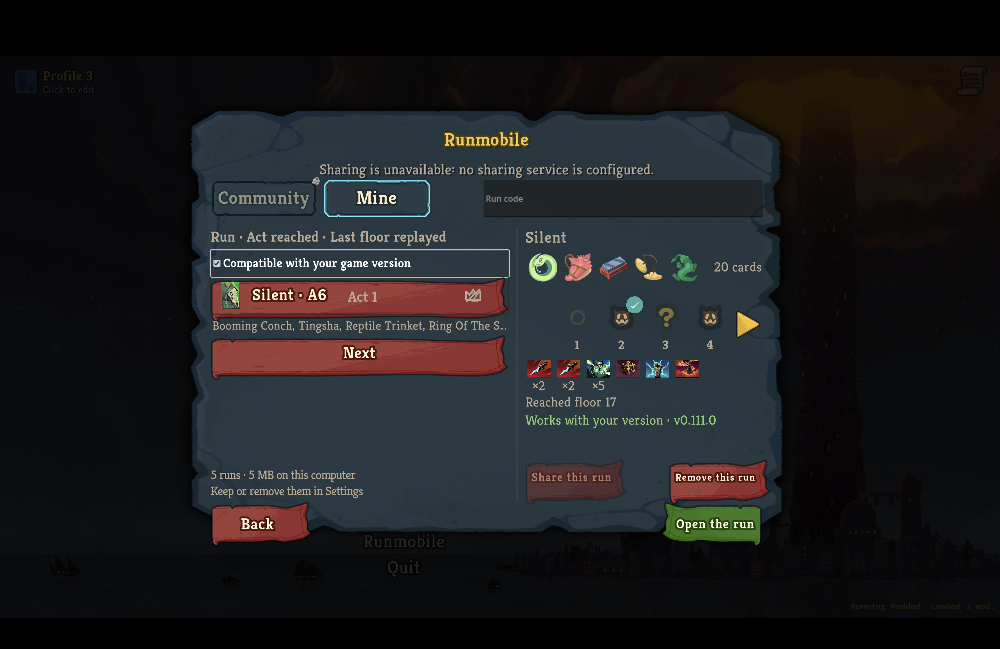
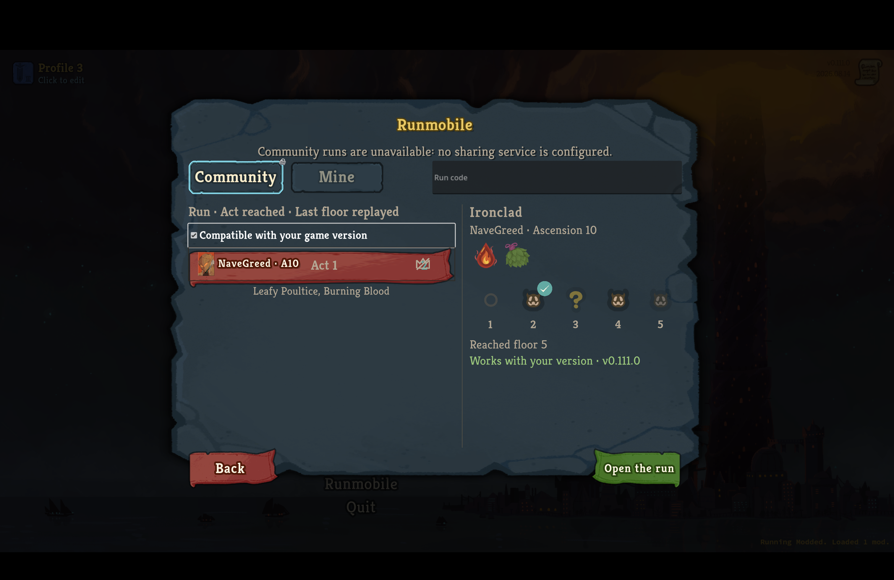
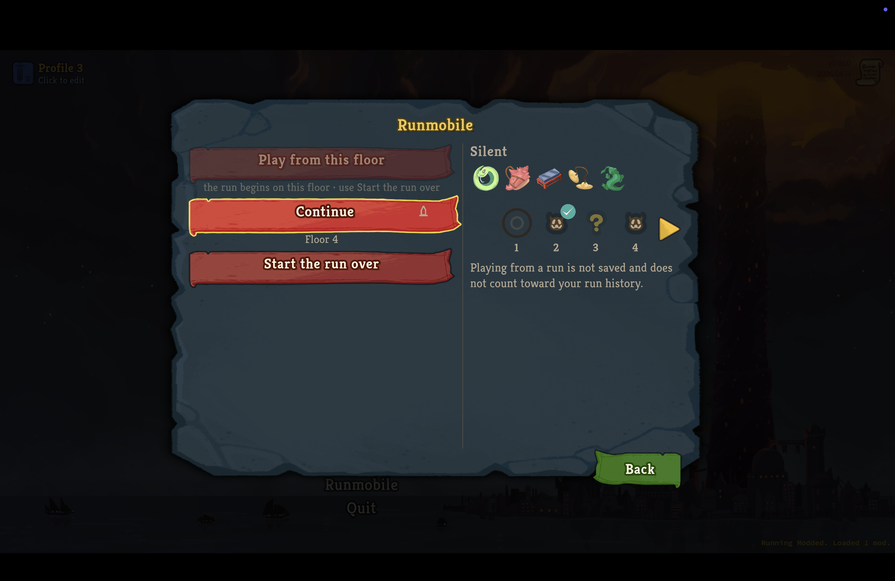

# Runmobile native-type capture

These screenshots show named-role typography in the v0.111.0 retail client.
The installed archives matched their builds' SHA-256 digests and ran fullscreen on the game's 1512 × 982 reference surface with `--force-steam=off`.

## Library Others tab

The library heading, supporting text, tabs, input, list headings, filters, run rows, facts, numerals, and buttons use the mapped native roles for their kinds.

## Library Mine tab

The Mine view shows the same named-role typography and the run strip pager's own gold arrow art from the game rather than a text chevron.

## Opened run pane

The selected run's identity, description, floor numerals, facts, and action use their mapped native roles.

## Refusal popup

The mod's refusal popup uses its mapped R1 title, R2 body, and R3 button roles.

## My Runs settings row

The row's label, readings, and controls take the full native settings column using the mapped roles for a settings row label, a settings value, and a button caption.
Its controls share the same right edge as the game's own controls on that screen.

Both settings captures predate the change that put the row under a `Runmobile` heading, gave its controls the game's own images, and corrected the General list's scroll extent.
They show the captions under the short extent that hid View Credits and the settings below it, and the community-runs control under an earlier caption.
What they still stand for is the roles and the column width, which that change did not move; `demo/RUNMOBILE-SETTINGS-SECTION.md` holds the section as it stands.

## The library after the run-history sizing pass

Taken 2026-09-16 on the v0.111.0 retail client, launched with `--force-steam=off` on the isolated non-Steam save tree's third profile, fullscreen on the 1512 × 982 display, with this branch built and installed through `scripts/install-mod.sh`.
Every click checked that the game was the frontmost application first and refused otherwise; `scripts/protected-files.sh compare` afterwards reported the installed mod, that profile's own settings and the game's logs, and nothing under `user://Runmobile/`.

The floor markers are the run-history entry's own icon at its own size, with the strip paged at the paginator's arrow.
The deck tiles and their counts sit above the two fact lines, the Share and Remove ribbons sit under them at the ribbon's own width, and "Open the run" is the panel's primary ribbon below the pane.
The list's second line is at the dense-line role and trims with an ellipsis; the footer's two lines clear the Back ribbon.
The Community tab's lock is a half-size badge on the tab's corner, and the line over the tabs names the cause: no sharing service is configured.

The captures above them predate this pass and show the strip's markers capped at a multiple of the floor numeral, the lock centred across the Community label, the pane's own "Open the run" ribbon, and the row note at the secondary role; what they still stand for is the named-role typography, which the pass did not move.
`docs/mod-ui-direction.md` owns the layout as it now stands.
The pass's first retail capture found one more collision: the Remove ribbon's bin glyph, placed at the row's end, sat on the word "this" once the ribbon was drawn at its own width rather than the pane's, so the plate's ribbons carry no glyph, as the game's own do.

## What these captures prove

The retail captures prove the library parchment's Others, Mine, and opened-run states at named-role typography, the run strip's native gold arrow art, the mod's refusal popup at its R1, R2, and R3 roles, and the My Runs settings row at its mapped native roles and full native column width as that row stood when the capture was taken.

The playback transport's hanging tag is captured in the client - `demo/RUNMOBILE-RESTORE-IN-CLIENT.md` holds it, in the fight a player was stood in by restoring their own recording.
The recorder's bookmark tag, which hangs from the same anchor in the same material, draws no text and asks no role; its in-client capture on v0.111.0 - on the loot screen, on the card-reward screen behind it, and on a real death screen after a lost fight - is `RUNMOBILE-BOOKMARK.md`, taken 2026-09-10.
Its expanded strip, the fight-result panel, chronology paging, and look-back ledger paging are not.
Programmatic navigation was attempted and did not reach those surfaces, so they require manual navigation for a retail capture.
This change covers them with automated paging and layout tests instead.
Those tests do not read the game's scene files, and the look-back ledger's role named a node v0.111.0 has not: the role table is now held against the shipped pack, which `docs/in-game-host.md` owns.
The settings section under its heading and the corrected General scroll extent that reaches Reset to Default are captured in `demo/RUNMOBILE-SETTINGS-SECTION.md`.

The restoring notice shown while a run is being restored is captured: `demo/RUNMOBILE-RESTORE-IN-CLIENT.md` holds it, taken a second and a half after Continue was pressed on the player's own recording, with the plate over the Compendium screen and its line at the native heading role.
