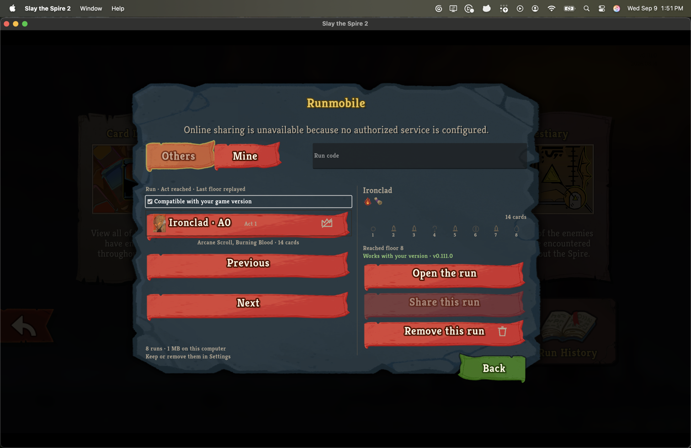
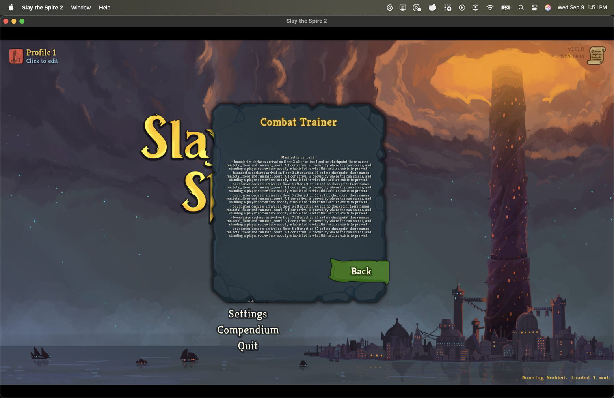
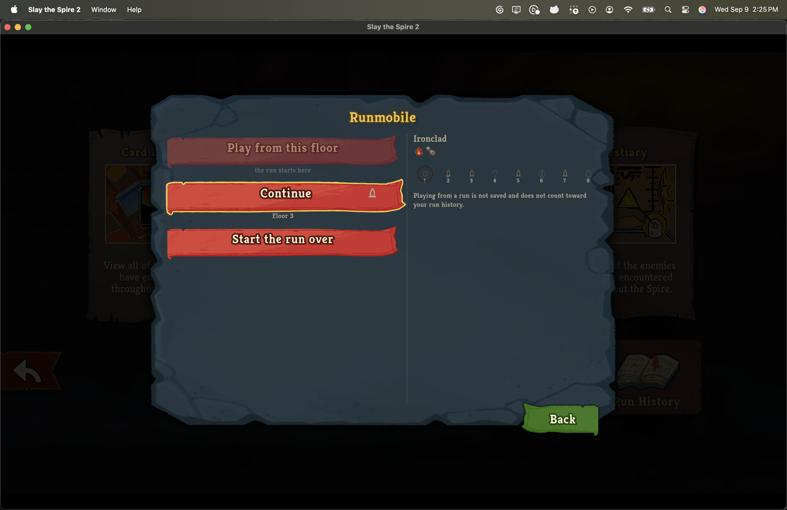
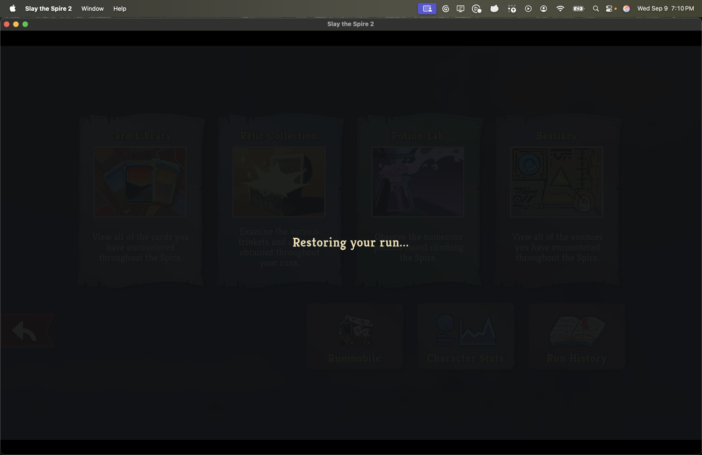
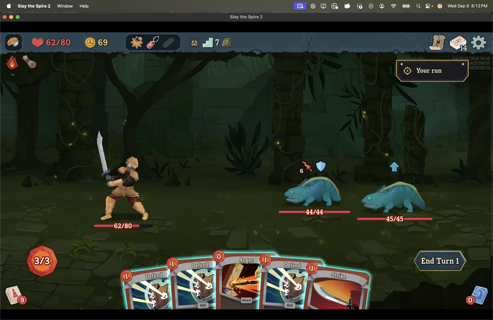

# Continue into a later fight, restored from the recording's own save

*2026-09-09T21:29:29Z by Showboat 0.6.1*
<!-- showboat-id: 54bb340e-9574-4278-b98f-195d7bab1abf -->

The supported installer built and installed this branch for the v0.111.0 retail client, four times: once at the head that brought restore into the client, once after each of the two defects below was fixed, and once at the head this branch ends on.
The client was launched directly with `--force-steam=off`, without invoking Steam, on an isolated non-Steam save tree.
Save Profile 1's Mine tab holds eight recordings the recorder wrote of runs played on this machine; the one under test is `native-3LACFJ5NJ371-20260906-015901`, as the recorder wrote it - a version-5 file, byte for byte what is in the store, never migrated.
The committed copy under `manifests/` is the migrated one, which is the difference this session found.

```bash {image}
runmobile-mine-own-run-selected.png
```



## First press: the library offered a file the entry refused

At the first head, Continue offered fight 1 on floor 2 and the entry refused it with the validator's own sentence, seven times over: every floor arrival the file declares had no checkpoint naming `run.total_floor` and `run.map_coord`.
A version-5 recorder sampled no map coordinate, so no file it wrote has one; the validator has required one since the floor cross-checks went in; and the committed copy had been repaired once by `migrate-manifest --derive-boundaries`, so every headless test - the restore tripwire included - was green over a file no player has.

```bash {image}
runmobile-continue-refused-version-5.png
```



The fix is in the version-5 in-memory read: `ManifestJson.MigrateFromVersion5` now derives the arrival checkpoint at every floor arrival a native file declares, through `FloorArrival` - the one owner of that derivation - marked inferred with its reasoning, exactly as the validator re-derives it.
No action, boundary or digest changes, and `migrate-manifest --derive-boundaries` on this very store file had already reproduced the committed manifest byte for byte, so the reading and the repair agree.
`OwnRunPlaybackTests` now drives the library's offer from the recorder's own form as well - rebuilt from the committed copy by undoing what the migration adds - game-free for the offer and the validator, and through the engine for one walked and one restored fight.

## Second press: the packaged arbiter stood still

With that fix installed, Continue offered floor 3, the mod found nothing cached and asked the packaged arbiter for the arrival's save, and then nothing happened for the mod's whole fifteen-minute timeout.
Both arbiter processes - `floor-snapshot` and the `--phase capture` child it starts - had a quarter of a second of CPU after eight minutes, and a stack sample put the child's main thread inside a type initializer.
Run from a terminal with the same arguments and environment, the same binary did not stand still: it died.
Without the game's `SENTRY_GODOT_LIB_PATH` it threw from `Godot.HeadlessSandbox`'s type initializer, which resolved its default root by finding the worktree, and a game installation has none; with that variable, which the running game sets in its own process and every child inherits, the game assembly's own initializer loaded Sentry's native library into a process with no Godot in it and the process died with a segmentation fault.
Every headless run of the arbiter this repository had ever made happened inside a worktree with a shell's environment, which is why neither was red.
The sandbox root is now resolved on first use, `PackagedArbiter.StartInfo` leaves every `SENTRY_`-prefixed variable out of the child's environment, and `PackagedArbiterTests` in both suites hold each: the arbiter suite runs the built arbiter from a copy laid out as the package is, outside any worktree, and the mod suite holds the spawned child's environment against a process that has the variable set.
A third defect surfaced on the reinstall and never reached a player: the directory-taking form of `StartInfo` had been an overload, every argument of the mod's own calls is a string, and they bound to it in expanded form with the workspace as the arbiter directory - "The installed local replay arbiter is unavailable".
It is a differently named entry point now, with a test through the installed path.

## Third press: Continue, restored

The mod's progress file recorded a press rather than an entry at the time, so the two refused presses had moved Continue on to floor 5.
That rule is gone: progress is written when the boundary is proved, in `RecordedFightRun`'s hand-over, so a press that is refused or cannot restore its run now leaves Continue exactly where it was.
It was reset by hand to fight 1 played and floor 2 last loaded, which is the state the proof was specified from.
With the head that carries both fixes installed, Continue offered floor 3, the fight the recording's second map move dealt.

```bash {image}
runmobile-continue-offers-floor-3.png
```



Pressing it, the mod asked the packaged arbiter for the arrival's save, which replayed the sixteen decisions before it, restored the save in a fresh process and wrote the cache only once the restored state reproduced the digest the recording declares - a little under a minute - and then continued the run through the retail continue handler's own sequence and the public `NGame.LoadRun`.

That minute is `JourneyPhase.Preparing`, and this is what a player looks at while it passes: the mod's own plate over the Compendium screen the press came from, with the notice centred on it.

```bash {image}
runmobile-restoring-your-run.png
```



That press entered fight 2 at `combat_start:2`, `sha256:0079692657a84fd564e0ed3ea9d0f3c57aad9bc7cc4a59447803f84849297d38`, on 2026-09-09 at `4886ef7` - the first in-client entry, taken before this branch was rebased onto main; the press below on the fixed head proves the same thing at a later fight, so its log and capture are the ones kept.

## Proved again on the fixed head

The ledger-role hotfix merged to main as #57 and is this branch's base commit, `6a5ace5`.
The same installer built and installed this branch's head at that point, `d0baf52`, on 2026-09-10, and the same isolated profile pressed Continue again on the player's own recording - now offering floor 7, fight 4, because the presses above had each recorded the fight they opened and nothing else.
The arrival's save was already in the cache from an earlier press, so there was no wait: the run continued from it, the fight opened, and the mod stood in it at the digest the recording declares.

```
[Runmobile] continuing the recording's run from its save at floor 7, verified at sha256:38f1fb65d17250e306cfa01d66f5f2b626b77b30dec57bdba3d08f832dbb22a7
[Runmobile] docked the transport under GlobalUi (viewport (1920, 1080), anchor (1824, 108.938866), strip (0, 0), (1920, 1080), visible True)
[Runmobile] restored your run to floor 7 from the game's own save; 0 recorded decision(s) left to watch before the fight
[Runmobile] letting the fight open; room=Monster, combat manager=in progress, player combat state=None, turn=1
[Runmobile] after letting the game run; the fight opened; room=Monster, combat manager=in progress, player combat state=Play, turn=1
[Runmobile] standing in the recorded fight; canonical state at combat start is sha256:38f1fb65d17250e306cfa01d66f5f2b626b77b30dec57bdba3d08f832dbb22a7
[Runmobile] capturing the player's fight from its combat start
```

That digest is `combat_start:4` in the recording.
No abandon, and the transport docked past the role read that refused before.

```bash {image}
runmobile-fight-4-restored-fixed-head.png
```



Fight 4 as the player is stood in it on the fixed head: the Ironclad at 62/80 with 69 gold against two lizards, a hand of five at 3 of 3 energy, End Turn 1, the `Your run` tag, and the overlay naming the seed and `MODDED (1)`.
After it, the mod's progress for this run read fights 1 to 4 played and nothing more: the fight was recorded once it had opened.
`./scripts/protected-files.sh compare` against a ledger taken before that launch reported nothing changed among the protected files; under the store, only `progress.json`.

## Residual R1, as measured

The retail continue handler calls `ReactionContainer.InitializeNetworking(new NetSingleplayerGameService())` immediately before `LoadRun`, and so does the mod's restore route.
With that call in place the run loaded, the fight opened and the digest matched.
Whether the call is necessary - whether a container initialised at the main menu would have served - was not measured, because measuring it means shipping a build that does not mirror the handler; what is recorded is that the handler's own sequence works in the client, and the mod keeps doing what the handler does.

## What the session changed

`./scripts/protected-files.sh compare` against the ledger taken before the second launch, with the user's home replaced by `~`:

```
protected files (must not change):
  changed  mods/Runmobile/Runmobile.dll
  changed  mods/Runmobile/Sts2PilotTrainer.Engine.dll
  changed  mods/Runmobile/Sts2PilotTrainer.IO.dll
  changed  mods/Runmobile/Sts2PilotTrainer.Replay.dll
  changed  mods/Runmobile/Sts2PilotTrainer.Trainer.dll
  changed  mods/Runmobile/arbiter/… (the arbiter's own assemblies, pdbs and prepared-assembly.json)

user://Runmobile/ (this mod's own store):
  added    user/Runmobile/default/1/modded/profile1/snapshots/cache/v0.111.0_standard_CHARACTER.IRONCLAD_a0_3LACFJ5NJ371_1568834832_seq16_8270d9e5…/floor-entry-snapshot.json
  added    user/Runmobile/default/1/modded/profile1/snapshots/cache/v0.111.0_standard_CHARACTER.IRONCLAD_a0_3LACFJ5NJ371_1568834832_seq16_8270d9e5…/run-save.json
  changed  user/Runmobile/default/1/modded/profile1/progress.json

the game's own churn (written on any launch, mod or not):
  added/removed/changed  user/logs/godot*.log
```

Every changed protected file is one this branch's installer wrote, twice more after the ledger; the game's own saves, profiles and run history did not move.
Under the store, the cache holds exactly the one verified snapshot the press materialised, and the progress file is the hand reset above plus the press.
The recording in the store is untouched: still the version-5 file the recorder wrote.
