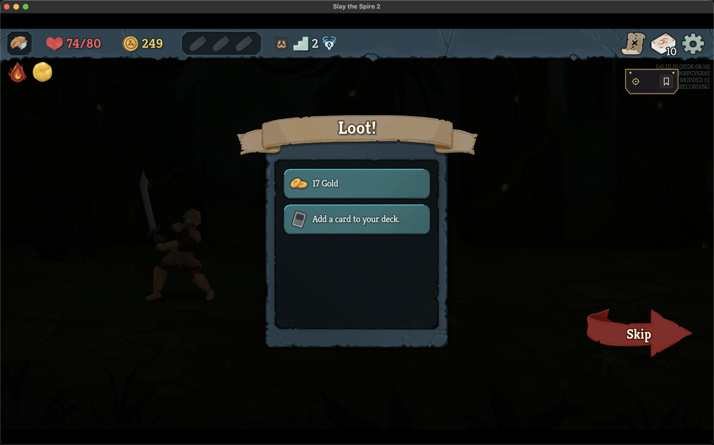
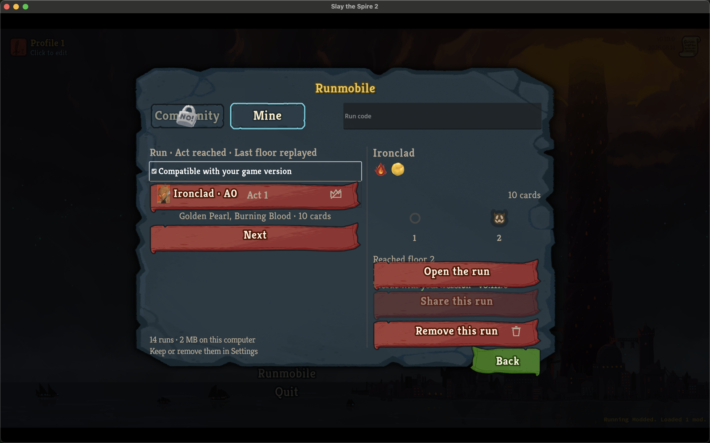
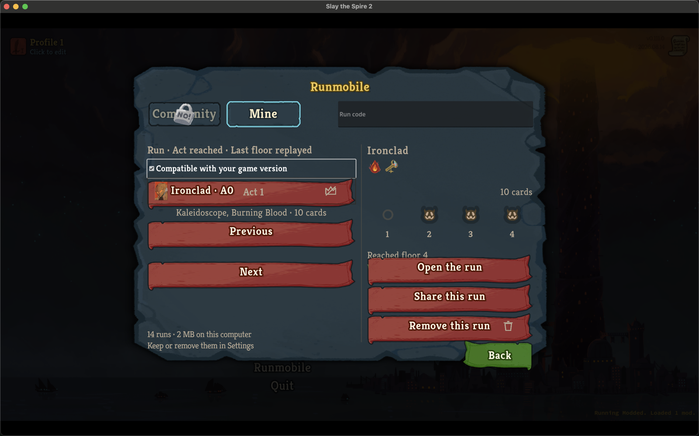
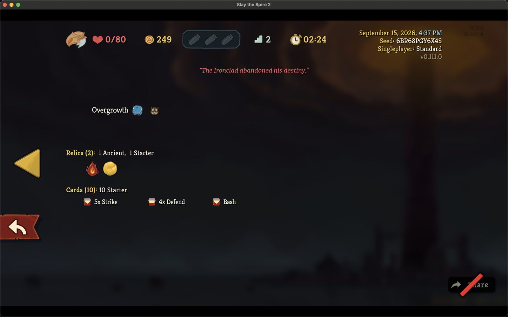

# A run restored to an earlier point is not offered for sharing; the game's own Save and Quit still is

*2026-09-16T00:20:26Z by Showboat 0.6.1*
<!-- showboat-id: fa4e32ba-be10-469c-b3f1-d8764eefef05 -->

The Mine pane and the run-history plate refuse their Share row off the recording's own `continuity`, and nothing else: a Continue at the game's latest automatic save is `continuous` and stays shareable, however long ago it was taken, and only a resume the recorder places behind that save - an older backup, a cloud copy - is `rewound`. The refused row says `Restored to an earlier point in the run; this run can't be shared.` before the player reaches the sharing form; the gate's `continuity` condition stays behind it. Both paths are held headlessly first, on the real engine: the recorder's classification, then each surface off the fact.

```bash
cd .. && dotnet test tests/Sts2PilotTrainer.Mod.Tests -c Release --nologo --no-build --filter "FullyQualifiedName~RecorderContinueTests.AnHonestContinueOnTheMapAfterTheRewardsIsContinuousAtTheFightWonSave|FullyQualifiedName~RecorderContinueTests.AContinueFromAnOlderSaveThanTheLatestIsARewind|FullyQualifiedName~RecorderContinueTests.EverySaveContinueAndGiveUpScenarioLeavesTheRecordingItSaysItDoes" 2>&1 | grep -E "^(Passed!|Failed!)"; dotnet test tests/Sts2PilotTrainer.Replay.Tests -c Release --nologo --no-build --filter "FullyQualifiedName~RunCaptureTests.AReturnToTheLatestSaveWeeksLaterIsStillTheGamesOwnRollback|FullyQualifiedName~RunCaptureTests.AReturnToAnOlderSaveThanTheLatestIsAReload" 2>&1 | grep -E "^(Passed!|Failed!)"; dotnet test tests/Sts2PilotTrainer.Trainer.Tests -c Release --nologo --no-build --filter "FullyQualifiedName~RunHistoryPlateTests|FullyQualifiedName~RunBrowserTests" 2>&1 | grep -E "^(Passed!|Failed!)"
```

```output
Passed!  - Failed:     0, Passed:    26, Skipped:     0, Total:    26, Duration: 59 s - Sts2PilotTrainer.Mod.Tests.dll (net9.0)
Passed!  - Failed:     0, Passed:     2, Skipped:     0, Total:     2, Duration: 68 ms - Sts2PilotTrainer.Replay.Tests.dll (net9.0)
Passed!  - Failed:     0, Passed:    52, Skipped:     0, Total:    52, Duration: 18 ms - Sts2PilotTrainer.Trainer.Tests.dll (net9.0)
```

## The retail client

The v0.111.0 client ran this branch on 2026-09-15, built and installed through `scripts/install-mod.sh`, launched directly with `--force-steam=off` and never through Steam, on the isolated non-Steam save tree's first profile; the profile pointer was put back to where it was and the temporary `settings.json` that named a non-resolving HTTPS sharing endpoint (`https://runmobile.invalid/`, index fetch off, so the Share row could be offered without a request leaving the machine) was removed afterwards. `./scripts/protected-files.sh compare` reported nothing changed outside this branch's own install directory, the mod's own store and the isolated profiles' own saves. Screenshots are the 1512 × 982-point window scaled to 1600 pixels wide.

Two of the player's own recordings carry the two cases. `native-AA002GCMU2G8-20260915-085317` is the run from RECORDER-SAVE-AND-QUIT.md: Save and Quit and Continue at three moments, every one the game's own return to its latest save, `continuity continuous`. `native-6BR68PGY6X4S-20260915-233711` is a genuine rewind made for this proof: Ironclad, Golden Pearl at Neow, the first fight won, its gold claimed, the map move to floor 2 - the arrival save the game took there is the run's latest - then Save and Quit, the game closed, the older fight-won `current_run.save` copied over the arrival's, the game relaunched and Continue pressed. The recorder placed that resume at decision 7 behind its latest save after decision 10 and logged `the game returned this run to decision 7 by a reload of an older save; 3 decision(s) made after it are kept as a discarded branch`, then `This is not the game's own return to its latest save (after decision 10), so the recording can no longer be shared`, and went on recording; the run was given up on the restored loot screen.

```bash {image}

```



```bash
cd .. && jq -c "{manifest_version, continuity:.source.native.continuity, integrity:.source.native.integrity, save_points:(.source.native.save_points|map(.after_seq)), discarded:(.source.native.discarded|map({to:.rollback_to_seq, reload:.reload, verbs:(.actions|map(.verb))}))}" build/retail-proof-rewound/native-6BR68PGY6X4S-20260915-233711.replay.json; ./scripts/arbiter validate build/retail-proof-rewound/native-6BR68PGY6X4S-20260915-233711.replay.json 2>&1 | grep -E "^(integrity|structure)"
```

```output
{"manifest_version":8,"continuity":"rewound","integrity":"complete","save_points":[0,1,7],"discarded":[{"to":7,"reload":true,"verbs":["ClaimReward","SkipRewards","MapMove"]}]}
integrity: complete
structure: VALID
```

## The Mine pane

The rewound run selected: `Share this run` is refused, `Open the run` and `Remove this run` are not, and the recording is still the player's to play from. The reason line is drawn between `Reached floor 2` and the verdict line - and on this build it is under the plate: the pane pulls its three rows up over the facts when they do not fit, which is a layout defect of the pane and not of the row, is set aside for the Mine-pane task with a patch, and is the same occlusion the continuous run's `Reached floor 4` shows below.

```bash {image}

```



The continuous Save-and-Quit run selected: `Share this run` is offered, with no reason line, three honest Continues later.

```bash {image}

```



## The run-history plate

Compendium → Run History, the rewound run's fight pressed. On this build no plate appears: the press handler is typed to the library's `NButton` and the entry is an `NClickableControl`, so the signal's trampoline throws `InvalidCastException` before `RunHistoryPlateHost.Show` runs, on every build since the plate was written. The plate's derivation - `RunHistoryPlate.For`, which refuses the Share row with the same sentence - is held by `RunHistoryPlateTests` above; the one-line fix and its test are set aside with the pane's layout patch for the Mine-pane task, where the plate also needs re-parenting into the screen's vertical layout rather than the history's own margin container.

```bash {image}

```



```bash
cd .. && ./scripts/arbiter gate build/retail-proof-rewound/native-6BR68PGY6X4S-20260915-233711.replay.json --out build/retail-proof-rewound/gate 2>&1 | grep -E "^  (pass|FAIL)  continuity|PUBLISHABLE"
```

```output
  FAIL  continuity       The recorder's account of the run was never rewound by a reload behind what it had recorded.
NOT PUBLISHABLE - see the failing condition above
```

The gate stays behind the row as defence in depth: the rewound recording validates, plays, and is refused for publication at `continuity`.
