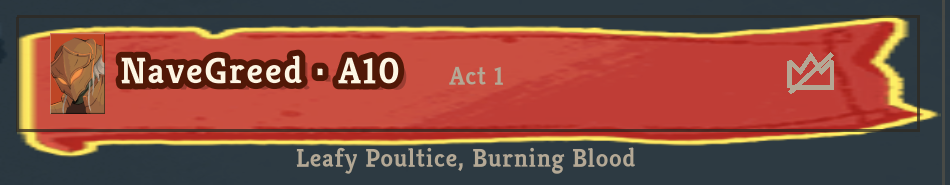
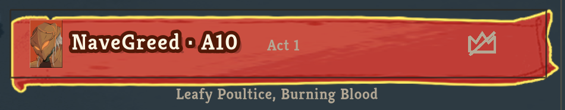
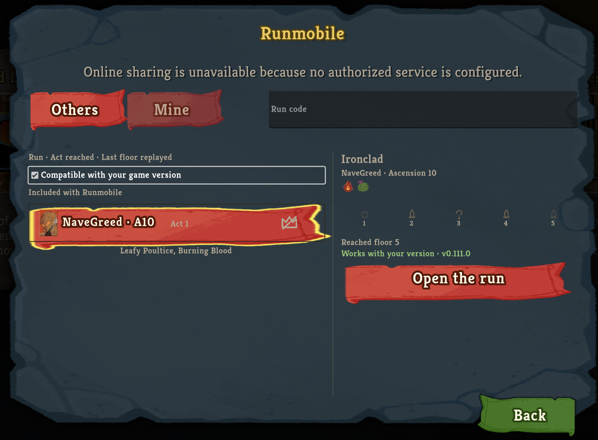

# Run-library ribbon sharpness

The selected run row keeps the retail painted ribbon, with native-width ends instead of a texture stretched across the whole row.
The gold focus outline surrounds the ribbon, and the selected run retains its separate ink outline.

## Before



## After



These are matching native-resolution crops from the retail client, without resampling or image sharpening.
Only the game panel is retained; desktop chrome is excluded.

## Full panel




## Reproduction

The baseline is `86a9073f9ba79039c2743fc6f5122d53302f3d3e`; the corrected build is `32ce50bfbfb7dd501649c30de7f027942c460e2c`.
Each was built from its own git archive and installed through the packaged installer.
The packaged and installed `Runmobile.dll` digests matched for each capture.
The retail client ran v0.111.0 with `--force-steam=off --clientId=1`, using the existing isolated non-Steam test profile.
The console lock reading was stored in a variable and reported unlocked before launch.

From the main menu on the captured display, open Compendium, then Runmobile, and hover the selected included run:

```bash
cliclick c:610,813
sleep 2
cliclick c:770,725
sleep 3
cliclick m:525,515
sleep 1
screencapture -x selected-row.png
```

The same navigation and pointer position were used for both captures.
The final session also clicked the row and moved the pointer away to check selection independently of hover.
The client was quit through its own confirmation, and its bound awake assertion exited with it.
The final protected-files comparison found no protected-file or Runmobile-store changes; only the game's logs changed.
Both baseline and corrected startup logs reported the packaged arbiter's `release_info.json` as a potential mod manifest lacking an id; neither prevented the library from opening.

The first nine-patch attempt was rejected during retail verification because the image and outline no longer aligned.
Their atlas textures have different padding, which must be restored before nine-slicing.
The corrected renderer reconstructs those logical textures in memory, retains the retail materials and writes no game art to disk.

[Capture receipt](../.no-mistakes/evidence/run-row-highlight/receipt.json) records the tested commits, assembly digests and image hashes.
[Protected-files result](../.no-mistakes/evidence/run-row-highlight/protected-files.txt) records the final session's comparison without host paths.
