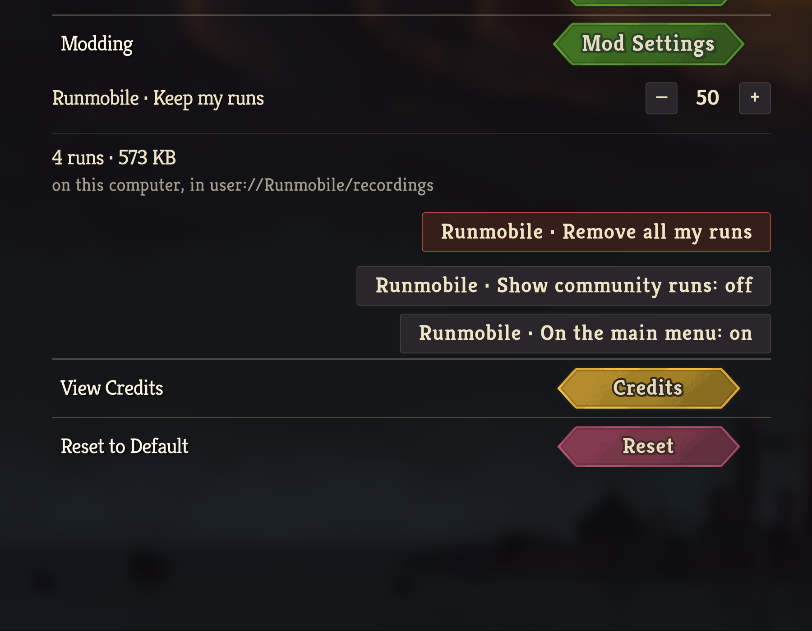
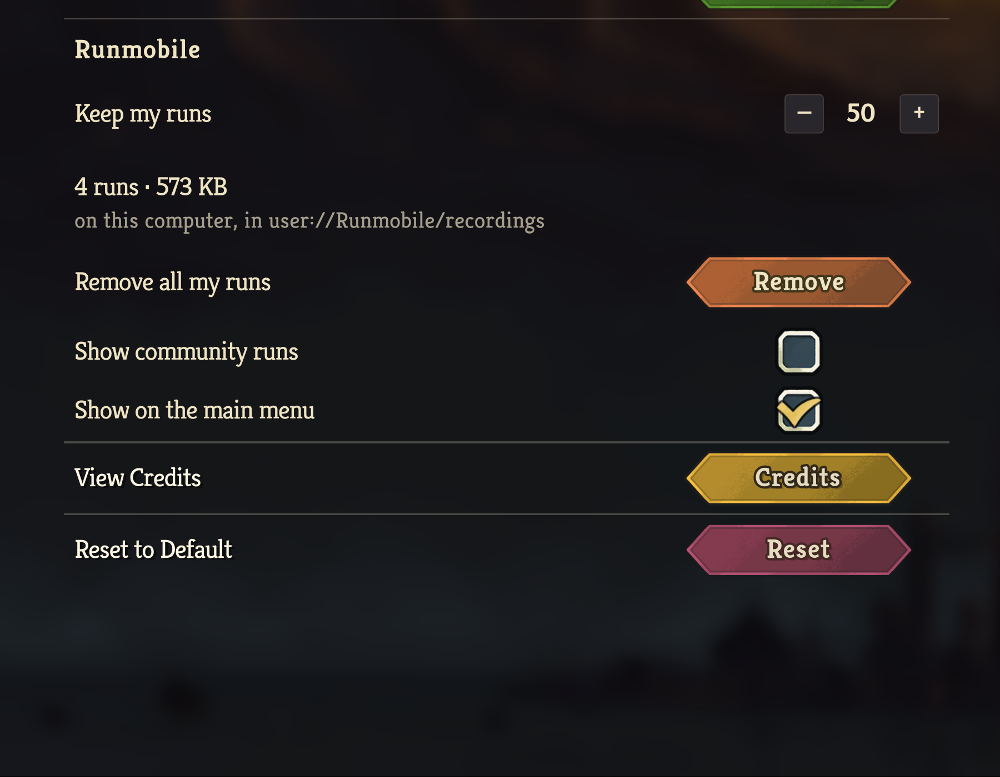
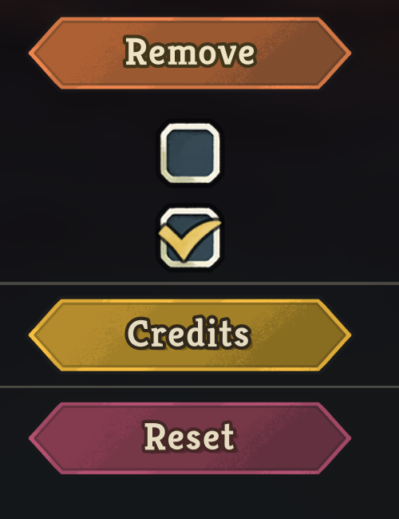
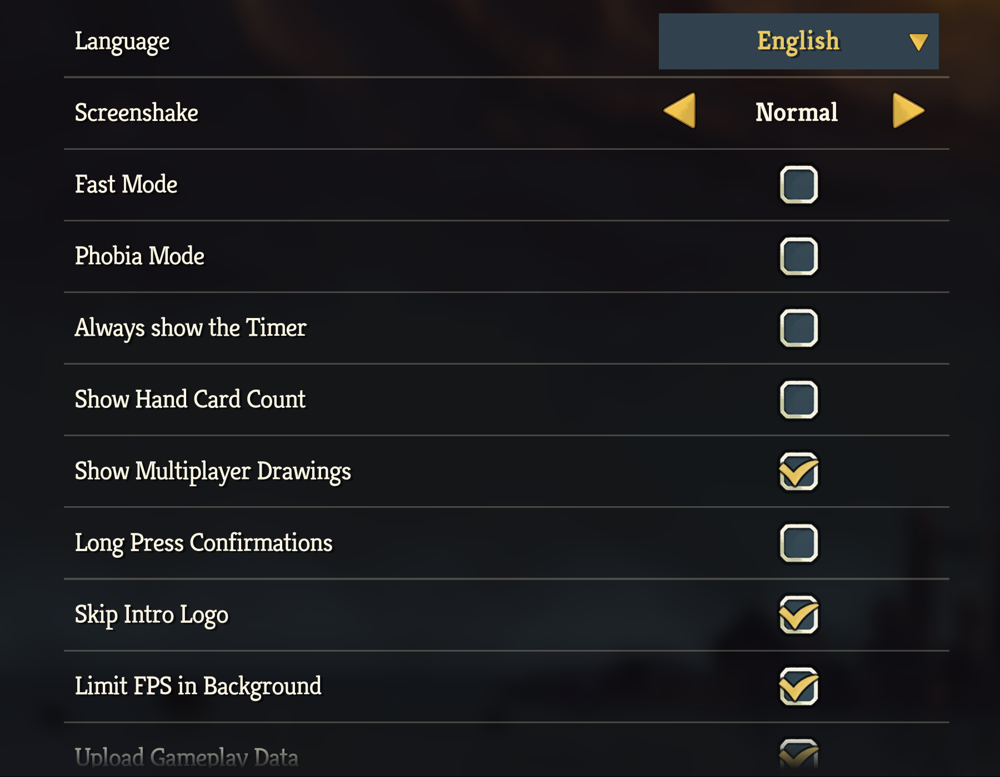
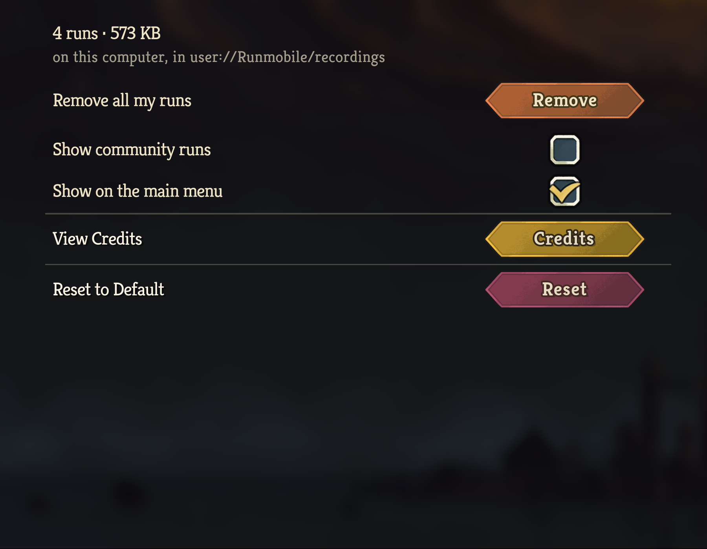

# Runmobile's settings section, in the General settings

*2026-09-10T22:57:51Z by Showboat 0.6.1*
<!-- showboat-id: f4748a59-2cf8-4191-9aeb-f1be1aca096e -->

The supported installer built and installed this branch for the v0.111.0 retail client, and the flagged head before it (`586a175`) for the before capture.
The client was launched directly with `--force-steam=off` on the isolated non-Steam save tree, without invoking Steam, in a 1512 × 982 window.
Every capture is the settings column cropped from a full-window screenshot; nothing else on the screen was changed between them.

## Before: the flagged design

Each caption carried a `Runmobile` prefix, the destructive action was a plain rectangle beside two toggles drawn the same way, and each toggle's state was a second clause in its own caption.

```bash {image}

```



## After: one heading, native controls

A left-aligned `Runmobile` heading at the settings row label role scopes the section under the divider that closes the game's own Modding row.
Nothing under it repeats the name.
The two switches are the game's own ticked and unticked images in the native controls column, with a plain caption on the left as every native switch has.
The removal follows the Credits and Reset rows: the caption `Remove all my runs` on the left, and a short `Remove` inside the native beveled button image, tinted through the same HSV material to a burnt orange between Credits' gold and Reset's maroon.
Its caption carries the native outline at the native thickness, in a colour turned from the anchor's dark green to a dark shade of the button's own hue the way the shader turns the face.

```bash {image}

```



```bash {image}

```



## The list opens clean and scrolls to its end

The first open of the screen after launch, with the mouse parked in the list: no tooltip stands over the native rows.
An earlier build of this branch gave the controls Godot tooltips, and one appeared here at first open wherever the mouse was before the column sorted the row into place, in the engine's default theme; the tooltips are gone.

```bash {image}

```



Scrolled to the end with the wheel: Reset to Default is reached, the scroll extent this branch corrected.

```bash {image}

```



## What the session changed

`./scripts/protected-files.sh compare` against a ledger taken after the branch build was installed and before the first launch: the protected files that changed are the mod's own under `mods/Runmobile`, from reinstalling the two builds; `user://Runmobile/` reported nothing; the game's own churn was its log rotation.
The isolated tree's `settings.save` and the whole Runmobile store are byte-identical to the copies taken before the first launch.
Each client was stopped with TERM and exited within a second.
