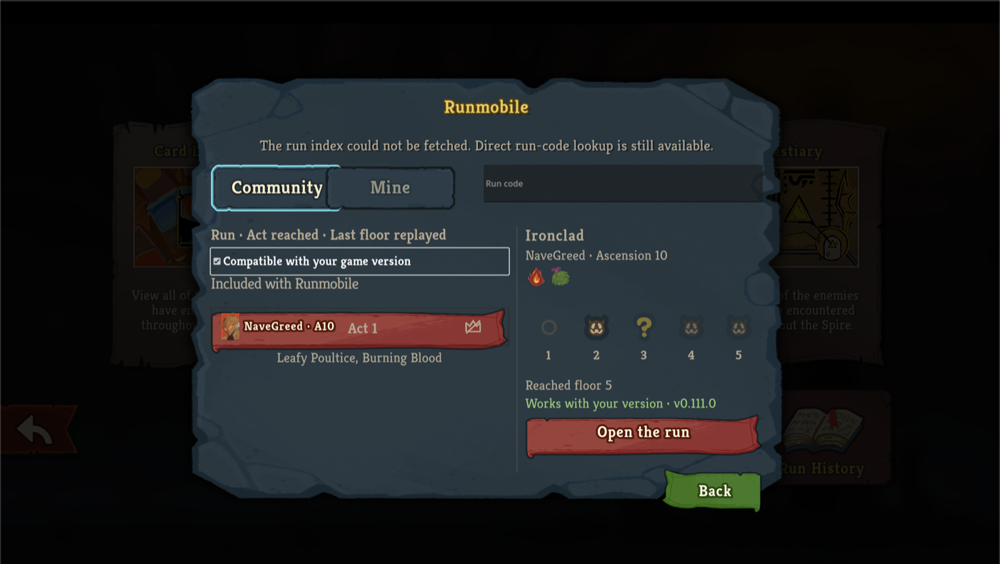
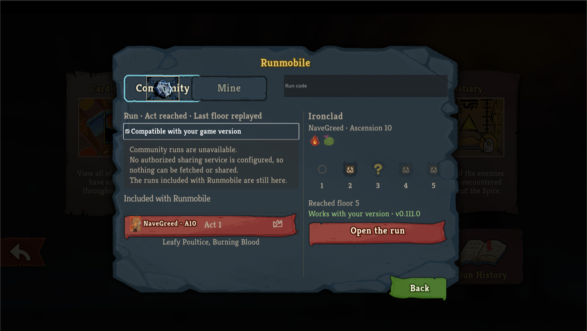
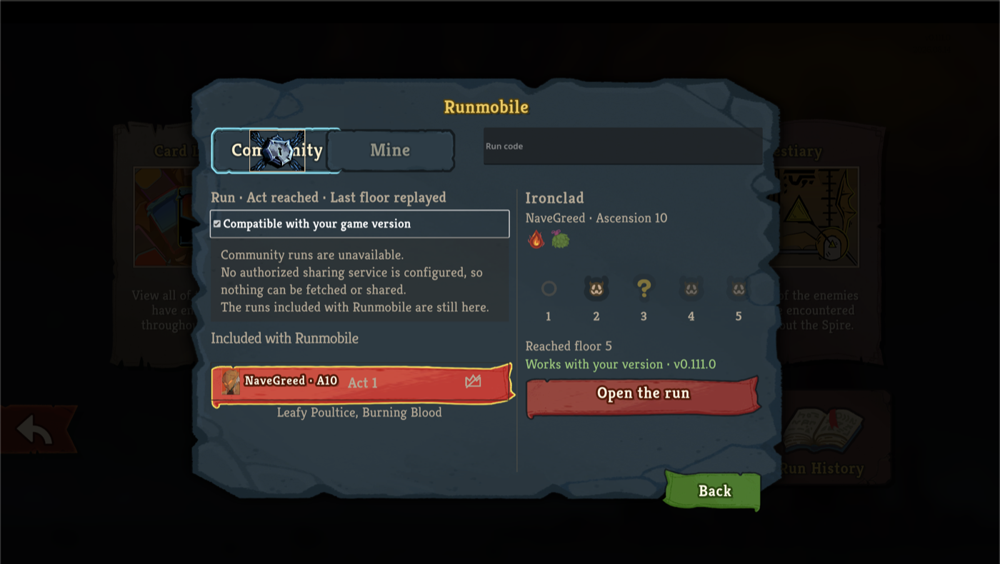
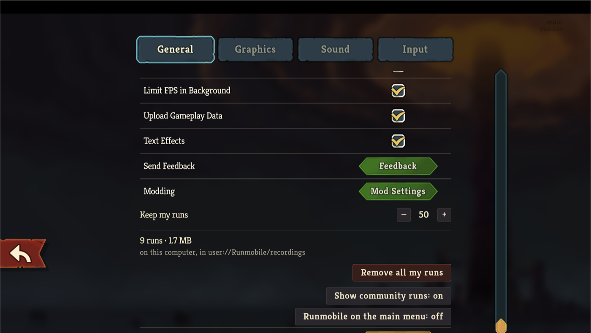
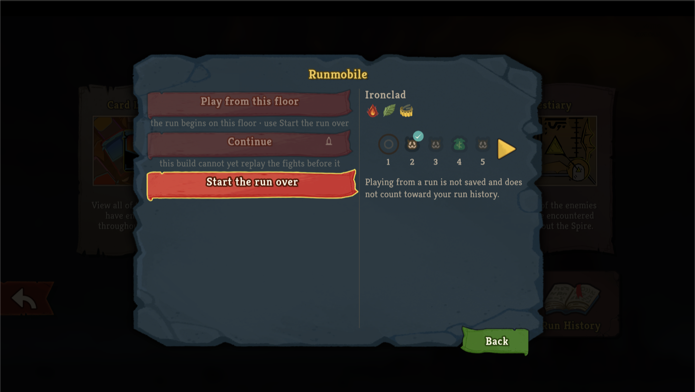

# Runmobile native UI pass, in the retail client

Captured on v0.111.0 with `--force-steam=off` into the isolated non-Steam profile, Runmobile the only mod loaded.
The self-contained review page with every state and caption is [RUNMOBILE-UI-NATIVE-PASS.html](RUNMOBILE-UI-NATIVE-PASS.html).

## Tabs and the locked Community tab

## A hover lights only the control it acts on

## The settings row

## The floor strip

## What these captures prove

The Community and Mine tabs are the game's `NSettingsTab`; Community wears the stats screen's lock in both locked states with a tooltip and a plate; a row hover no longer lights the tab or the pane's ribbon; the settings row reads "Show community runs" with the stepper standing off its dividers; and the strip's markers, badge, ring and numerals do not overlap.
Not captured: a controller walking the band, and the run-code lookup while locked, which needs a reachable service.
