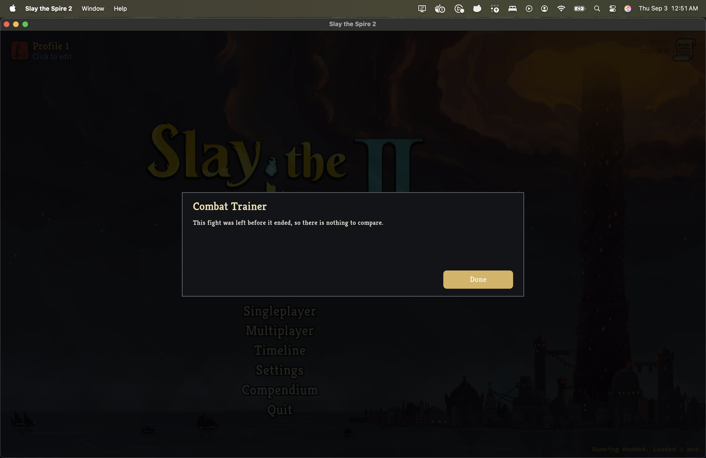

# The result, drawn

*2026-09-03T06:26:02Z by Showboat 0.6.1*
<!-- showboat-id: 3a3fbb41-c758-415f-a0b2-40a0d1f31c75 -->

This document is the S6 slice of [the proof-of-concept path](../docs/proof-of-concept-path.md):
the post-fight result, drawn. Every code block below was executed; the output under it is
that run's output. `showboat --workdir .. verify VISUAL-COMPARISON.md` re-runs the lot and
diffs; the blocks are repo-root commands, which is what the working directory is for.

**The claim being tested.** After the captain played the recorded fight in S5, he read the
result and reported that prose describing how his fight differed from NaveGreed's, on a
large modal, was not the interface. So: can the same comparison be shown as pictures - the
summary as figures, the turn chronology as the game's own card art in the order it was
played, and the chart `docs/comparison-direction.md` wrote down - without the presentation
inventing a single value the projection cannot derive?

Three parts. The chart's derivation, which is arithmetic over the comparison and is tested
on a machine with no game. The panel, which is assembled from stock Godot nodes and can
therefore be built and interrogated node by node in the same game-free process. And the
retail client, with a person playing a line that is deliberately not the recording's, so
the two sides of the panel are actually different.

## What the chart is, and what it refuses

`FightResultChart` derives the chart from a `CombatComparison` and nothing else: one point
per turn per line for enemy health lost and for player health lost, one ceiling both plots
and both lines are drawn against, and the potions marked at the turn they were spent by
their stable model ids. It lives in `Sts2PilotTrainer.Trainer` beside the wording rather
than in the comparison contract, because what a comparison *says* is still an interface
question and a chart baked into the contract would be an answer nothing could revisit.

The cases worth naming are the ones a chart is tempted to invent. A turn one line never
reached carries no point on that line - not a point on the axis, which would claim the turn
was fought and cost nothing. A card play that carries no card id is refused outright rather
than drawn as a blank icon. Both are tested, with no game present.

```bash
set -o pipefail; dotnet test tests/Sts2PilotTrainer.Trainer.Tests -c Release --nologo --filter "FullyQualifiedName~FightResultChartTests" --logger "console;verbosity=normal" 2>&1 | grep -E "^  Passed " | sed "s/ \[.*\]//" | sort
```

```output
  Passed Sts2PilotTrainer.Trainer.Tests.FightResultChartTests.AFightThatCostNeitherSideAnythingStillHasItsTurns
  Passed Sts2PilotTrainer.Trainer.Tests.FightResultChartTests.AScreenWithoutAComparisonHasNothingToDraw
  Passed Sts2PilotTrainer.Trainer.Tests.FightResultChartTests.ATurnALineNeverReachedHasNoValueRatherThanAZero
  Passed Sts2PilotTrainer.Trainer.Tests.FightResultChartTests.KeepsThePlayersLineAndTheRecordingsApart
  Passed Sts2PilotTrainer.Trainer.Tests.FightResultChartTests.MarksAPotionAtTheTurnItWasUsed
  Passed Sts2PilotTrainer.Trainer.Tests.FightResultChartTests.PlotsBothMeasuresForBothLinesAgainstTheTurn
  Passed Sts2PilotTrainer.Trainer.Tests.FightResultChartTests.ScalesBothMeasuresAndBothLinesAgainstOneCeiling
```

## The panel, built and interrogated without a game

`FightResultPanel` in the mod draws it, out of stock Godot nodes. That is not a stylistic
choice: this assembly compiles without Godot's source generators, so a `Control` subclass
of ours would carry no generated bridge and none of its overrides would ever be called.
The consequence worth having is that the whole panel can be assembled in a process with no
game and asked what it drew - the fixture below is three turns against two, with a potion
on the player's second turn and the recording's fight ending on its own second.

The assertions are about what is drawn rather than where. Coordinates are arithmetic over
whatever surface the panel is given, and pinning them would make every future spacing
change a test failure about nothing.

```bash
set -o pipefail; dotnet test tests/Sts2PilotTrainer.Mod.Tests -c Release --nologo --filter "FullyQualifiedName~FightResultPanelTests" --logger "console;verbosity=normal" 2>&1 | grep -E "^  Passed " | sed "s/ \[.*\]//" | sort
```

```output
  Passed Sts2PilotTrainer.Arbiter.Tests.FightResultPanelTests.AFightWithNoComparisonIsTheNoticeAndTheButton
  Passed Sts2PilotTrainer.Arbiter.Tests.FightResultPanelTests.ANoticeIsWrappedInsideAPanelTheSizeOfASentence
  Passed Sts2PilotTrainer.Arbiter.Tests.FightResultPanelTests.ArtworkIsDrawnAtTheSizeOfItsChipRatherThanOfItsTexture
  Passed Sts2PilotTrainer.Arbiter.Tests.FightResultPanelTests.CarriesTheApprovedWordingAndNothingElse
  Passed Sts2PilotTrainer.Arbiter.Tests.FightResultPanelTests.DrawsACardForEveryCardPlayedAndAPotionWhereOneWasSpent
  Passed Sts2PilotTrainer.Arbiter.Tests.FightResultPanelTests.DrawsEachPointsOwnNumeral
  Passed Sts2PilotTrainer.Arbiter.Tests.FightResultPanelTests.DrawsTheGamesArtworkWhereThereIsSomeAndTheNameWhereThereIsNot
  Passed Sts2PilotTrainer.Arbiter.Tests.FightResultPanelTests.FitsInsideTheSurfaceItIsGiven
  Passed Sts2PilotTrainer.Arbiter.Tests.FightResultPanelTests.KeepsTheTwoLinesApartByColourAndByShape
  Passed Sts2PilotTrainer.Arbiter.Tests.FightResultPanelTests.MarksAPotionOnTheChartAtTheTurnItWasSpent
  Passed Sts2PilotTrainer.Arbiter.Tests.FightResultPanelTests.PlotsAPointForEveryTurnALineReachedAndNoneWhereItDidNot
  Passed Sts2PilotTrainer.Arbiter.Tests.FightResultPanelTests.SaysSoWhereALineHadAlreadyFinished
  Passed Sts2PilotTrainer.Arbiter.Tests.FightResultPanelTests.TheOneControlIsTheButtonAndItIsWhatLeavesTheFight
```

## The same model, printed

The client draws the model; a terminal can only print it. `enter-fight --play` does that,
with the recording standing in for the player, so the whole loop below is the one the
client runs: the run is constructed, the recording's two decisions are made, the boundary
is proved against the shipped snapshot digest, the recording's own nine fight actions go
through the player-side capture, and the result is the panel's own model.

Both sides are identical here, and that is what this block is for rather than a limitation
of it - a line that came through the capture and did not match the engine's own replay of
the same actions would be a defect in the capture. The two sides being *different* is what
the retail session below shows.

```bash
set -o pipefail; ./scripts/arbiter enter-fight manifests/navegreed-OJ-6QXhNgdg.replay.json --play 2>&1 | grep -vE '^SentryGodotInitializer|^\[INFO\]|^\[WARN\]|^\[ERROR\]|^   at ' | sed -n '/Your fight/,$p'
```

```output
[Your fight and NaveGreed's]
  Both fights started from the same position.

                        You           NaveGreed
  Outcome               Won           Won
  Turns                 4             4
  Health at the start   64            64
  Health at the end     57            57
  Net health change     -7            -7
  Potions used          none          none
  Cards removed         none          none

  Turn by turn
  Turn   You                                 NaveGreed
     1   Hellraiser, Defend Ironclad         Hellraiser, Defend Ironclad
     2   Defend Ironclad, Defend Ironclad    Defend Ironclad, Defend Ironclad
     3   Hellraiser                          Hellraiser
     4   Bash                                Bash

  Health lost each turn
         Enemy health lost         Health lost               Potions used
  Turn   You          NaveGreed    You          NaveGreed
     1   8            8            4            4
     2   24           24           2            2
     3   6            6            7            7
     4   4            4            0            0

  This states differences. It does not say which fight was better.
  Health lost counts only health that came off. Damage absorbed by block is not counted.
  [Done]

report: build/evidence/enter-fight.json
```

## The retail client, with a line that is deliberately not the recording's

The mod was installed with `./scripts/install-mod.sh` and the game launched with only
Combat Trainer enabled. The fight was entered from the mode card and played by the agent
driving the client through screenshots and synthetic clicks, rather than by a person: the
point of this session is that the two sides of the panel differ, and playing a line
chosen to differ is what produces that.

NaveGreed's recorded line blocks: Hellraiser and Defend, then two more Defends, then
Hellraiser, then Bash - four turns, seven health lost. The line played here attacks
instead: Bash and Strike, then two Strikes and one Defend, then three Strikes - three
turns, ten health lost, and the fight over a turn before his.

```bash {image}
![The Combat Trainer result panel over the darkened loot screen. Title "Your fight and NaveGreed's" with "Both fights started from the same position." beneath it. A gold You swatch and a blue NaveGreed swatch head two columns of figures: Outcome Won and Won, Turns 3 and 4, Health at the start 64 and 64, Health at the end 54 and 57, Net health change -10 and -7, Potions used none and none, Cards removed none and none. Under them the two caveats. On the right, "Turn by turn" lists four turns as rows of the game's own card art with health-lost numerals: turn 1 two cards and -9 against two cards and -4; turn 2 three cards and -7 against two cards and -2; turn 3 three cards and 0 against one card and -7; turn 4 reads "fight over" against one card and 0. Below, "Health lost each turn" plots two lines against the turn: enemy health lost with gold squares at 17, 12, 13 and blue diamonds at 8, 24, 6, 4; health lost with gold at 9, 7, 0 and blue at 4, 2, 7, 0. A gold Done button.](in-game-result-panel.png)
```

![The Combat Trainer result panel over the darkened loot screen. Title "Your fight and NaveGreed's" with "Both fights started from the same position." beneath it. A gold You swatch and a blue NaveGreed swatch head two columns of figures: Outcome Won and Won, Turns 3 and 4, Health at the start 64 and 64, Health at the end 54 and 57, Net health change -10 and -7, Potions used none and none, Cards removed none and none. Under them the two caveats. On the right, "Turn by turn" lists four turns as rows of the game's own card art with health-lost numerals: turn 1 two cards and -9 against two cards and -4; turn 2 three cards and -7 against two cards and -2; turn 3 three cards and 0 against one card and -7; turn 4 reads "fight over" against one card and 0. Below, "Health lost each turn" plots two lines against the turn: enemy health lost with gold squares at 17, 12, 13 and blue diamonds at 8, 24, 6, 4; health lost with gold at 9, 7, 0 and blue at 4, 2, 7, 0. A gold Done button.](529825ff-2026-09-03.png)

Read against the recording, the panel says what the fight cost: the chart's upper plot
has the played line ahead on turn 1 (17 against 8) and behind on turn 2 (12 against 24),
the lower plot has it losing 9 and 7 where NaveGreed lost 4 and 2, and the fourth turn is
his alone - drawn as a gap in the gold line and said in words as "fight over". Nothing on
the panel says which line was better, and the two caveats under the figures are the ones
the comparison contract carries.

## The paths with no comparison, in the client

Neither of these had been seen in the retail client before: both were proved on the
game-free capture and screen only. Both appeared in this session.

A fight left before it ended: the run was given up from the game's own pause menu, and
the trainer's notice came up over the main menu once the return finished, on a panel the
size of its sentence.

```bash {image}

```



A capture that could not be completed: on the first attempt of this session the panel
showed the capture's own refusal instead of a comparison - "A 'EndTurn' began while the
'PlayCard' before it had not been sampled afterwards, so the capture cannot say what each
of them did." That is the capture refusing rather than guessing, and it is correct, but
what produced it is worth writing down. In this client a number key *selects* a card and
a click plays it; the agent pressed a number and then clicked End Turn, so that one click
both played the held card and ended the turn, and the two actions began within
milliseconds of each other. A person who holds a card and then clicks End Turn can reach
the same state. The capture's rule is not at fault and is not changed here; that the
window exists at all is recorded in [the in-game host's limits](../docs/in-game-host.md).

## What this session changed on disk

SHA-256 over 154 files before the mod was installed and after the last Done: every
profile, progress, prefs, save, run-history and replay file, every mod config, and every
file of BaseLib, Hindsight and STS2_MCP. 152 are byte identical, including all 120 run
history files and both profiles' `progress.save`.

Two differ, and both are worth naming. `modded/profile1/replays/latest.mcr` is the game's
own combat replay scratch file, which the engine rewrites at the end of every fight; S4
and S5 recorded it differing the same way. `modded/profile1/saves/progress.save.backup`
now holds a byte-for-byte copy of the current `progress.save`, whose own content is
unchanged: the game copies a file to its backup inside its own IO layer, below the
`SaveManager` methods `ProfileWriteBarrier` suppresses, and the give-up path reaches that
copy. No progress was gained, lost or altered - what changed is that a backup which held
an older snapshot now holds the current one. The barrier's list does not cover that path,
which is a finding for the barrier's owner rather than something this slice changes.
